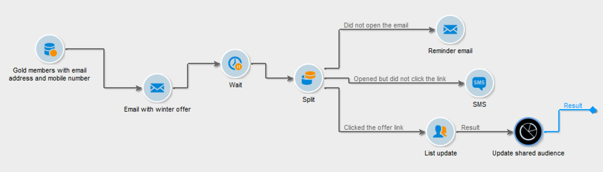
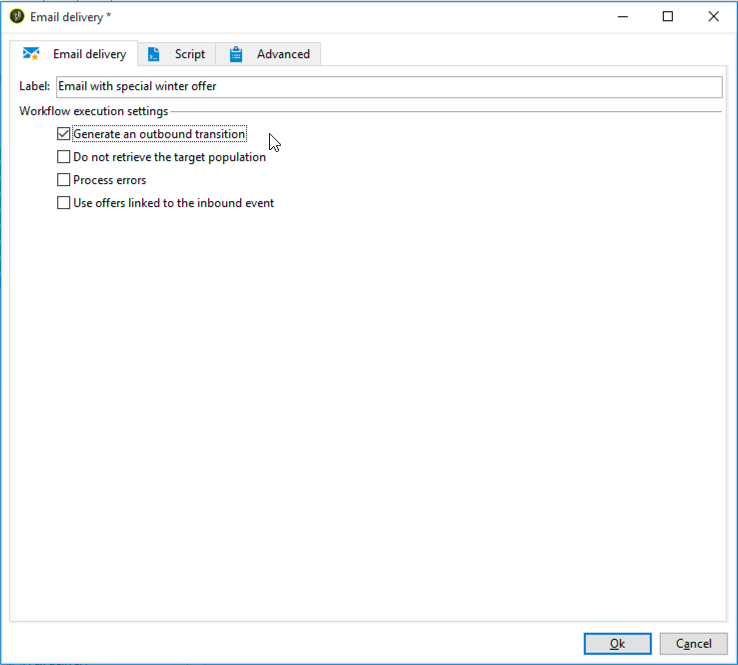
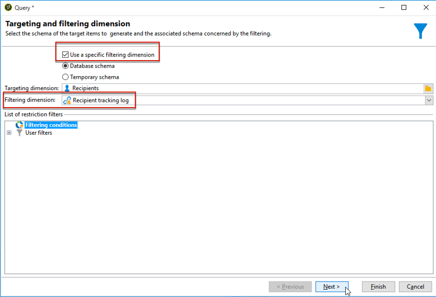

# Arbetsflöde för leveranser över flera kanaler{#cross-channel-delivery-workflow}

I det här användningsexemplet visas ett exempel med ett arbetsflöde för flerkanalsleverans. Det allmänna konceptet för flerkanalsleveranser presenteras i [det här avsnittet](cross-channel-deliveries.md).

Målet är att segmentera en målgrupp från mottagarna av databasen i olika grupper i syfte att skicka ett e-postmeddelande till en grupp och ett SMS-meddelande till en annan grupp.

De huvudsakliga implementeringsstegen för det här fallet är följande:

1. Skapar en **[!UICONTROL Query]**-aktivitet för målgruppen.
1. Skapar en **[!UICONTROL Email delivery]**-aktivitet som innehåller en länk till ett erbjudande.
1. Använder en **[!UICONTROL Split]**-aktivitet för att:

   * Skicka ytterligare ett e-postmeddelande till mottagare som inte öppnade det första e-postmeddelandet.
   * Skicka ett SMS till mottagarna som öppnade e-postmeddelandet men inte klickade på länken till erbjudandet.
   * Lägg till mottagarna som öppnade e-postmeddelandet i databasen och klickade på länken.

## Steg 1: Målgruppsanpassning {#step-1--targeting-the-audience}

Om du vill definiera målet skapar du en fråga som identifierar mottagarna.

1. Skapa en kampanj. Mer information om detta finns i [det här avsnittet](../../campaign/using/setting-up-marketing-campaigns.md#creating-a-campaign).
1. Lägg till en **Query**-aktivitet i arbetsflödet på fliken **[!UICONTROL Targeting and workflows]** i kampanjen. Mer information om hur du använder den här aktiviteten finns i [det här avsnittet](query.md).
1. Definiera de mottagare som ska ta emot leveranserna. Välj till exempel Guldmedlemmar som måldimension.
1. Lägg till filtervillkor i frågan. I det här exemplet väljer du mottagare som har en e-postadress och ett mobilnummer.

   

1. Spara ändringarna.

## Steg 2: Skapa ett e-postmeddelande med ett erbjudande {#step-2--creating-an-email-including-an-offer}

1. Skapa en **[!UICONTROL Email delivery]**-aktivitet och dubbelklicka på den i arbetsflödet för att redigera den. Mer information om hur du skapar e-postmeddelanden finns i [det här avsnittet](../../delivery/using/about-email-channel.md).
1. Designa meddelandet och infoga en länk med ett erbjudande i innehållet.

   

   Mer information om hur du integrerar ett erbjudande i brödtexten för ett meddelande finns i [det här avsnittet](../../interaction/using/integrating-an-offer-via-the-wizard.md#delivering-with-a-call-to-the-offer-engine).

1. Spara ändringarna.
1. Högerklicka på aktiviteten **[!UICONTROL Email delivery]** för att öppna den.
1. Välj alternativet **[!UICONTROL Generate an outbound transition]** om du vill återställa ifyllningen och spårningsloggarna.

   

   På så sätt kan du använda den här informationen för att skicka ytterligare leveranser beroende på mottagarnas beteenden när du tar emot det första e-postmeddelandet.

1. Lägg till en **[!UICONTROL Wait]**-aktivitet så att mottagarna kan öppna e-postmeddelandet några dagar.

   

## Steg 3: Segmentera målgruppen {#step-3--segmenting-the-resulting-audience}

När målet har identifierats och första leveransen har skapats måste du segmentera målet i olika populationer med filtervillkoren.

1. Lägg till en **delad**-aktivitet i arbetsflödet och öppna den. Mer information om hur du använder den här aktiviteten finns i [det här avsnittet](split.md).
1. Skapa tre segment från populationen som beräknas uppströms i frågan.

   

1. För den första delmängden markerar du alternativet **[!UICONTROL Add a filtering condition on the inbound population]** och klickar på **[!UICONTROL Edit]**.

   

1. Välj **[!UICONTROL Recipients of a delivery]** som begränsningsfilter och klicka på **[!UICONTROL Next]**.

   

1. I filterinställningarna väljer du **[!UICONTROL Recipients who have not opened or clicked (email)]** i listrutan **[!UICONTROL Behavior]** och väljer e-postmeddelandet med erbjudandet som du vill skicka från leveranslistan. Klicka på **[!UICONTROL Finish]**.

   

1. Fortsätt på samma sätt för den andra delmängden och välj **[!UICONTROL Recipients who have not clicked (email)]** i listrutan **[!UICONTROL Behavior]**.

   

1. För den tredje delmängden väljer du alternativet **[!UICONTROL Use a specific filtering dimension]** när du har markerat **[!UICONTROL Add a filtering condition on the inbound population]** och klickat på **[!UICONTROL Edit]**.
1. Välj **[!UICONTROL Recipient tracking log]** i listrutan **[!UICONTROL Filtering dimension]**, markera **[!UICONTROL Filtering conditions]** i **[!UICONTROL List of restriction filters]** och klicka på **[!UICONTROL Next]**.

   

1. Välj filtervillkoren enligt följande:

   

1. Klicka på **[!UICONTROL Finish]** om du vill spara ändringarna.

## Steg 4: Slutför arbetsflödet {#step-4--finalizing-the-workflow}

1. Lägg till de relevanta aktiviteterna i arbetsflödet efter de tre deluppsättningarna som är resultatet av aktiviteten **[!UICONTROL Split]**:

   * Lägg till en **[!UICONTROL Email delivery]**-aktivitet för att skicka ett påminnelsemeddelande via e-post till den första delmängden.
   * Lägg till en **[!UICONTROL Mobile delivery]**-aktivitet för att skicka ett SMS-meddelande till den andra delmängden.
   * Lägg till en **[!UICONTROL List update]**-aktivitet för att lägga till motsvarande mottagare i databasen.

1. Dubbelklicka på leveransaktiviteterna i arbetsflödet för att redigera dem. Mer information om hur du skapar ett e-postmeddelande och ett SMS finns i [E-postkanal](../../delivery/using/about-email-channel.md) och [SMS-kanal](../../delivery/using/sms-channel.md).
1. Dubbelklicka på aktiviteten **[!UICONTROL List update]** och välj alternativet **[!UICONTROL Generate an outbound transition]**.

   Du kan sedan exportera de resulterande mottagarna från Adobe Campaign till Adobe Experience Cloud. Du kan till exempel använda målgruppen i Adobe Target genom att lägga till en **[!UICONTROL Update shared audience]**-aktivitet i arbetsflödet. Mer information finns i [Exportera en målgrupp](../../integrations/using/importing-and-exporting-audiences.md#exporting-an-audience).

1. Klicka på knappen **Start** i åtgärdsfältet för att köra arbetsflödet.

Populationen som är mål för aktiviteten **Fråga** segmenteras för att ta emot ett e-postmeddelande eller en SMS-leverans enligt mottagarnas beteenden. Den återstående populationen läggs till i databasen med aktiviteten **[!UICONTROL List update]**.
