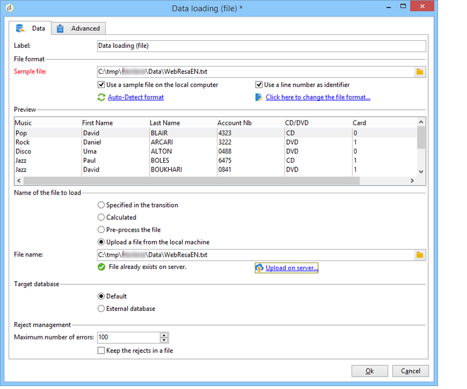

# Datalivscykel {#data-life-cycle}

## Arbetsregister {#work-table}

I arbetsflöden lagras data som transporteras från en aktivitet till en annan i en temporär arbetstabell.

Dessa data kan visas och analyseras genom att högerklicka på lämplig övergång.


Välj den relevanta menyn för att göra detta:

* Visa målet

   På den här menyn visas tillgängliga data om målpopulationen samt arbetstabellens struktur (**[!UICONTROL Schema]** flik).

   

   Mer information finns i [Arbetstabeller och arbetsflödesschema](../../workflow/using/monitoring-workflow-execution.md#worktables-and-workflow-schema).

* Analysera målet

   På den här menyn kan du komma åt guiden för beskrivande analys där du kan ta fram statistik och rapporter om övergångsdata.

   For more on this, refer to this [section](../../reporting/using/using-the-descriptive-analysis-wizard.md).

Måldata rensas när arbetsflödet körs. Endast den sista arbetstabellen är tillgänglig. Du kan konfigurera arbetsflödet så att alla arbetsregister förblir tillgängliga: markera alternativet i arbetsflödesegenskaperna. **[!UICONTROL Keep the result of interim populations between two executions]**

Vi rekommenderar dock att du undviker att aktivera det här alternativet om det finns stora mängder data.


## Måldata {#target-data}

De data som lagras i arbetsflödets arbetstabell är tillgängliga i personaliseringsfälten.

På så sätt kan du använda data som samlats in via en lista eller baserat på svar på en enkät i en leverans. Använd följande syntax:

```
%= targetData.FIELD %
```

**[!UICONTROL Target extension]** (targetData)-typografiska element är inte tillgängliga för riktade arbetsflöden. Leveransmålet måste byggas in i arbetsflödet och anges i leveransens ingående övergång.

Om du vill skapa leveranskorrektur måste korrekturmålet byggas baserat på **[!UICONTROL Address substitution]** läget så att personaliseringsdata kan anges. For more on this, refer to this [section](../../delivery/using/steps-defining-the-target-population.md#using-address-substitution-in-proof).

I följande exempel ska vi samla in en lista med information om kunderna som ska användas i ett personaliserat e-postmeddelande.

Använd följande steg:

1. Skapa ett arbetsflöde för att samla in information, stämma av den med data som redan finns i databasen och starta sedan en leverans.

   

   I vårt exempel är filinnehållet följande:

   ```
   Music,First name,Last name,Account,CD/DVD,Card
   Pop,David,BLAIR,4323,CD,0
   Rock,Daniel,ARCARI,3222,DVD,1
   Disco,Uma,ALTON,0488,DVD,0
   Jazz,Paul,BOLES,6475,CD,1
   Jazz,David,BOUKHARI,0841,DVD,1
   [...]
   ```

   Så här läser du in filen:

   

1. Konfigurera **[!UICONTROL Enrichment]** typaktiviteten för att stämma av insamlade data med data som redan finns i Adobe Campaign-databasen.

   Här är avstämningsnyckeln kontonumret:

   

1. Konfigurera sedan **[!UICONTROL Delivery]**: skapas baserat på en mall och mottagarna anges av den inkommande övergången.

   

   >[!CAUTION]
   >
   >Endast data i övergången får användas för att anpassa leveransen. **anpassningsfält av typen targetData** är bara tillgängliga för den inkommande populationen av **[!UICONTROL Delivery]** aktiviteten.

1. Använd de fält som samlats in i arbetsflödet i leveransmallen.

   Det gör du genom att infoga **[!UICONTROL Target extension]** typanpassningsfält.

   

   Här vill vi infoga kundens favoritmusikgenre och medietyp (CD eller DVD) enligt den fil som samlas in i arbetsflödet.

   Dessutom kommer vi att lägga till en kupong för förmånskortinnehavare, dvs. mottagare för vilka &#39;kortet&#39; är lika med 1.

   

   **[!UICONTROL Target extension]** Data av typen targetData infogas i leveranser med samma egenskaper som alla personaliseringsfält. De kan också användas i ämnet, länketiketterna eller själva länkarna.

   Meddelanden adresserade till insamlade mottagare kommer att innehålla följande data:

   
