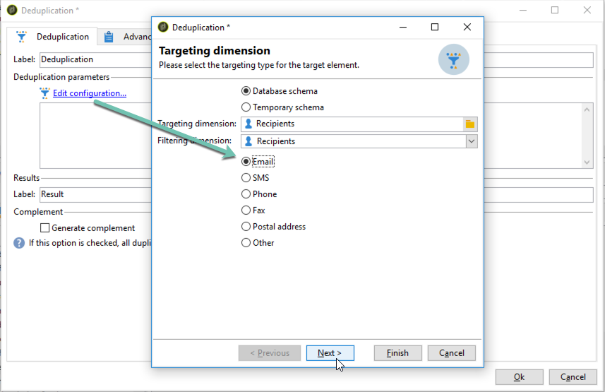

# Använda sammanfogningsfunktionen för aktiviteten Deduplicering {#deduplication-merge}

## Om det här användningsfallet {#about-this-use-case}

Det här användningsexemplet beskriver hur du använder **[!UICONTROL Merge]** i **[!UICONTROL Deduplication]** aktivitet.

Mer information om den här funktionen finns i [det här avsnittet](deduplication.md#merging-fields-into-single-record).

The **[!UICONTROL Deduplication]** används för att ta bort dubblettrader från en datauppsättning. I det här fallet dupliceras de data som visas nedan baserat på fältet E-post.

| Senaste ändringsdatum | Förnamn | Efternamn | E-post | Mobiltelefon | Telefon |
|-----|------------|-----------|-------|--------------|------|
| 5/19/2020 | Robert | Tisner | bob@mycompany.com | 444-444-444 | 777-777-777 |
| 7/22/2020 | Bobby | Tisner | bob@mycompany.com | | 777-777-777 |
| 10/03/2020 | Bob |  | bob@mycompany.com | | 888-888-8888 |

Med dedupliceringsaktivitetens **[!UICONTROL Merge]** kan du konfigurera en uppsättning regler för borttagning av dubbletter för att definiera en grupp med fält som ska sammanfogas till en enda resulterande datapost. Om du till exempel har en uppsättning dubblettposter kan du välja att behålla det äldsta telefonnumret eller det senaste namnet.

## Aktivera sammanfogningsfunktionen {#activating-merge}

Om du vill aktivera sammanfogningsfunktionen måste du först konfigurera **[!UICONTROL Deduplication]** aktivitet. Följ dessa steg för att göra detta:

1. Öppna aktiviteten och klicka sedan på **[Redigera konfiguration]** länk.

1. Välj det avstämningsfält som ska användas för dedupliceringen och klicka sedan på **[!UICONTROL Next]**. I det här exemplet vill vi ta bort dubbletter baserat på e-postfältet.

   

1. Klicka på **[!UICONTROL Advanced parameters]** länk, aktivera sedan **[!UICONTROL Merge records]** och **[!UICONTROL Use several record merging criteria]** alternativ.

   

1. The **[!UICONTROL Merge]** -fliken läggs till i **[!UICONTROL Deduplication]** konfigurationsskärmen. Vi använder den här fliken för att ange de data som ska sammanfogas när vi utför borttagning av dubbletter.

## Konfigurera fälten som ska sammanfogas {#configuring-rules}

Här är de regler vi vill använda för att sammanfoga data till en enda post:

* Behåll det senaste namnet (för- och efternamnsfält).
* Behåll den senaste mobiltelefonen
* Behåll det äldsta telefonnumret,
* Alla fält i en grupp måste vara icke-null för att vara kvalificerade för den sista posten.

Så här konfigurerar du de här reglerna:

1. Öppna **[!UICONTROL Merge]** klickar du på **[!UICONTROL Add]** -knappen.

   

1. Ange identifieraren och etiketten för gruppen med fält som ska sammanfogas.

   

1. Ange villkoren för att välja de poster som ska beaktas.

   

1. Sortera på det senaste ändringsdatumet för att välja det senaste namnet.

   

1. Markera de fält som ska sammanfogas. I det här exemplet vill vi behålla fälten för förnamn och efternamn.

   

1. Fälten läggs till i uppsättningen med data som ska sammanfogas och ett nytt element läggs till i arbetsflödesschemat.

   Upprepa de här stegen för att konfigurera fälten för mobiltelefon och telefon.

   

   

## Resultat {#results}

När dessa regler har konfigurerats tas följande data emot i slutet av **[!UICONTROL Deduplication]** aktivitet.

| Ändringsdatum | Förnamn | Efternamn | E-post | Mobiltelefon | Telefon |
|-----|------------|-----------|-------|--------------|------|
| 5/19/2020 | Robert | Tisner | bob@mycompany.com | 444-444-444 | 777-777-777 |
| 7/22/2020 | Bobby | Tisner | bob@mycompany.com | | 777-777-777 |
| 10/03/2020 | Bob |  | bob@mycompany.com | | 888-888-8888 |

Resultatet sammanfogas från de tre posterna enligt reglerna som konfigurerats tidigare. Efter jämförelsen dras slutsatsen att det senaste namnet och mobiltelefonen används tillsammans med det ursprungliga telefonnumret.

| Förnamn | Efternamn | E-post | Mobiltelefon | Telefon |
|------------|-----------|-------|--------------|------|
| Bobby | Tisner | bob@mycompany.com | 444-444-4444 | 888-888-8888 |

>[!NOTE]
>
> Observera att förnamnet som har sammanfogats är &quot;Bobby&quot;, eftersom vi har konfigurerat en &quot;Name&quot;-regel som består av både för- och efterfälten.
>
>Därför gick det inte att ta hänsyn till&quot;Bob&quot; (det senaste förnamnet) eftersom det associerade efternamnsfältet var tomt. Den senaste kombinationen av för- och efternamn sammanfogades i den sista posten.
