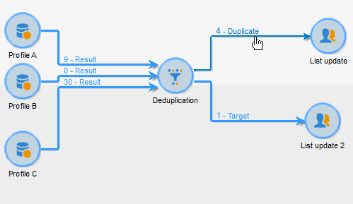

# Deduplicering{#deduplication}

Borttagning av dubbletter tar bort dubbletter från resultatet av inkommande aktiviteter. Deduplicering kan utföras på e-postadressen, telefonnumret eller något annat fält.

## God praxis {#best-practices}

Vid borttagning av dubbletter behandlas inkommande flöden separat. Om till exempel mottagare A hittas i resultatet av fråga 1 och i resultatet av fråga 2, kommer de inte att dedupliceras.

Denna fråga måste åtgärdas på följande sätt:

* Skapa en **Union**-aktivitet för att förena varje inkommande flöde.
* Skapa en **borttagning av dubbletter**-aktivitet efter aktiviteten **Union**.

## Konfiguration {#configuration}

Om du vill konfigurera en borttagning av dubbletter anger du dess etikett, metod, borttagningsvillkor och alternativ för resultatet.

Klicka på länken **[!UICONTROL Edit configuration...]** för att definiera dedupliceringsläget.

1. Målval

   Välj måltyp för den här aktiviteten (som standard gäller borttagning av dubbletter mottagare) och vilket kriterium som ska användas, dvs. fältet där identiska värden gör att du kan identifiera dubbletter: e-postadress, mobil- eller telefonnummer, faxnummer eller direkte-postadress.

   

   >[!NOTE]
   >
   >Om du använder externa data som indata, till exempel från en extern fil, måste du markera alternativet **[!UICONTROL Temporary schema]**.
   >
   >I nästa steg kan du med **[!UICONTROL Other]**-alternativet välja vilket eller vilka kriterier som ska användas:

   

1. Dedupliceringsmetoder

   I listrutan väljer du den borttagningsmetod som ska användas och anger antalet kopior som ska behållas.

   

   Följande metoder är tillgängliga:

   * **[!UICONTROL Choose for me]**: Markerar slumpmässigt den post som ska hållas utanför dubbletterna.
   * **[!UICONTROL Following a list of values]**: Låter dig definiera en värdeprioritet för ett eller flera fält. Om du vill definiera värdena markerar du ett fält eller skapar ett uttryck och lägger sedan till värdena i rätt tabell. Om du vill definiera ett nytt fält klickar du på knappen **[!UICONTROL Add]** ovanför listan med värden.

      

   * **[!UICONTROL Non-empty value]**: Låter dig behålla poster där värdet för det valda uttrycket inte är tomt som prioritet.

      

   * **[!UICONTROL Using an expression]**: I kan du behålla poster med det lägsta (eller högsta) värdet för det angivna uttrycket.

      
   Klicka på **[!UICONTROL Finish]** för att godkänna den valda borttagningsmetoden.

   I fönstrets mellersta del sammanfattas den definierade konfigurationen.

   I det nedre avsnittet av aktivitetsredigeringsfönstret kan du ändra etiketten för den utgående övergången för det grafiska objektet och ange en segmentkod som ska associeras med aktivitetens resultat. Den här koden kan senare användas som riktningskriterium.

   

   Markera alternativet **[!UICONTROL Generate complement]** om du vill utnyttja den återstående populationen. Komplementet består av alla dubbletter. Därefter kommer ytterligare en övergång att läggas till i aktiviteten enligt följande:

   

## Exempel: Identifiera dubbletterna före en leverans {#example--identify-the-duplicates-before-a-delivery}

I följande exempel gäller borttagningen av dubbletter kombinationen av tre frågor.

Målet med arbetsflödet är att definiera målet för en leverans genom att utesluta dubbletter så att det inte skickas till samma mottagare flera gånger.

De identifierade dubbletterna kommer också att integreras i en dedikerad dubblettlista som kan återanvändas om det behövs.

1. Lägg till och länka de olika aktiviteter som krävs för att arbetsflödet ska fungera enligt ovan.

   Unionsaktiviteten används här för att&quot;sammanfoga&quot; de tre frågorna till en enda övergång. Det innebär att borttagning av dubbletter inte fungerar för varje fråga separat, utan för hela frågan. Mer information om det här ämnet finns i [Bästa praxis](#best-practices).

1. Öppna dedupliceringsaktiviteten och klicka sedan på länken **[!UICONTROL Edit configuration...]** för att definiera dedupliceringsläget.
1. Välj **[!UICONTROL Database schema]** i det nya fönstret.
1. Välj **Mottagare** som mål- och filtreringsdimensioner.
1. Markera ID-fältet för dubbletterna **[!UICONTROL Email]** om du bara vill skicka leveransen en gång till varje e-postadress och sedan klicka på **[!UICONTROL Next]**.

   Om du vill basera dubblett-ID:n på ett specifikt fält väljer du **[!UICONTROL Other]** för att få tillgång till listan med tillgängliga fält.

1. Välj om du bara vill behålla en post när samma e-postadress identifieras för flera mottagare.
1. Välj borttagningsläget **[!UICONTROL Choose for me]** så att de poster som sparas om dubbletter identifieras väljs slumpmässigt och klicka sedan på **[!UICONTROL Finish]**.

När arbetsflödet körs exkluderas alla mottagare som identifieras som dubbletter från resultatet (och därmed leveransen) och läggs till i dubblettlistan. Den här listan kan användas igen i stället för att du behöver identifiera dubbletterna igen.

## Indataparametrar {#input-parameters}

* tableName
* schema

Varje inkommande händelse måste ange ett mål som definieras av dessa parametrar.

## Utdataparametrar {#output-parameters}

* tableName
* schema
* recCount

Den här uppsättningen med tre värden identifierar det mål som skapas av borttagningen av dubbletter. **[!UICONTROL tableName]** är namnet på tabellen som sparar målidentifierare,  **[!UICONTROL schema]** är populationens schema (vanligtvis nms:mottagare) och  **[!UICONTROL recCount]** är antalet element i tabellen.

Övergången som är associerad med komplementet har samma parametrar.
