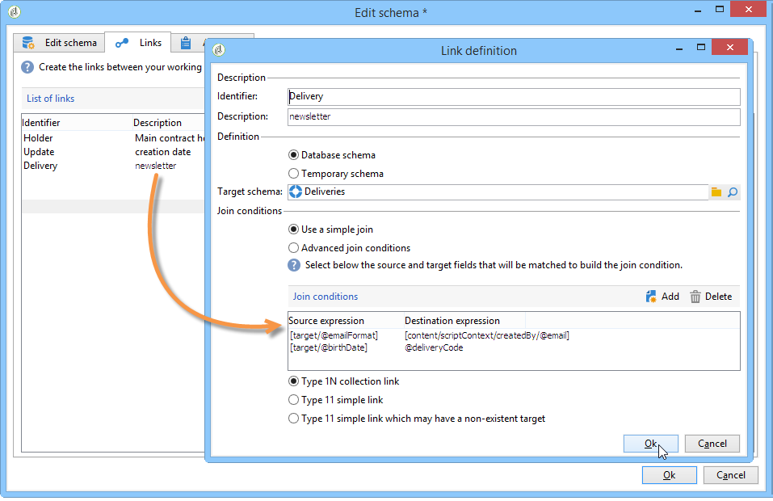

# Redigera schema{#edit-schema}

Data kan omformas, normaliseras och vid behov berikas i arbetsflödet med **[!UICONTROL Edit schema]** aktivitet. Det används vanligtvis för att normalisera datastrukturen: Du kan byta namn på utdatakolumnerna eller ändra deras innehåll genom att till exempel beräkna medelvärdena för ett fält eller en mängd.

Den här aktiviteten ändrar inte data i arbetstabellen, utan ändrar bara dess schema, dvs. den logiska vyn av data.

Du kan också skapa kopplingar med andra arbetstabeller via **[!UICONTROL Links]** -fliken.

I det nedre avsnittet kan du konfigurera listan med föreningsvillkor, dvs. villkoren som används för att stämma av data från de två tabellerna.
