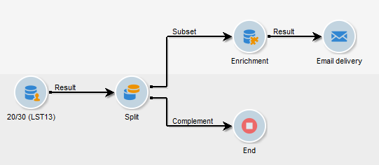

# E-postberikning med anpassade datumfält{#email-enrichment-with-custom-date-fields}

I det här exemplet vill vi skicka ett e-postmeddelande med anpassade datafält till mottagare som kommer att fira sina födelsedagar den här månaden. E-postmeddelandet innehåller en kupong som är giltig en vecka före och efter deras födelsedagar.

Vi måste inrikta oss på mottagare från en lista som kommer att fira sina födelsedagar den här månaden med en **[!UICONTROL Split]** aktivitet. När du sedan använder aktiviteten fungerar det anpassade datafältet som giltighetsdatum i e-postmeddelandet för kundens specialerbjudande. **[!UICONTROL Enrichment]**


Så här skapar du det här exemplet:

1. Dra och släpp en aktivitet på fliken **[!UICONTROL Targeting and workflows]** **[!UICONTROL Read list]** i kampanjen för att ange en lista över mottagare som mål.
1. Listan som ska bearbetas kan anges explicit, beräknas av ett skript eller lokaliseras dynamiskt enligt de alternativ som valts och parametrar som definierats här.

   

1. Lägg till en **[!UICONTROL Split]** aktivitet för att skilja mottagare som kommer att fira sina födelsedagar den här månaden från andra mottagare.
1. Om du vill dela listan väljer du **[!UICONTROL Filtering of selected records]** i **[!UICONTROL Add a filtering condition on the inbound population]** kategorin. Klicka sedan på **[!UICONTROL Edit]**.

   

1. Markera **[!UICONTROL Filtering conditions]** och klicka sedan på **[!UICONTROL Edit expression]** knappen för att filtrera månaden för mottagarens födelsedag.

   

1. Klicka **[!UICONTROL Advanced Selection]** sedan **[!UICONTROL Edit the formula using an expression]** och lägg till följande uttryck: Month(@bornDate).
1. Markera i **[!UICONTROL Operator]** kolumnen **[!UICONTROL equal to]**.
1. Du kan filtrera villkoret ytterligare genom att lägga till **[!UICONTROL Value]** månaden för aktuellt datum: Month(GetDate()).

   Detta skickar en fråga till mottagare vars födelsedag motsvarar den aktuella månaden.

   

1. Klicka **[!UICONTROL Finish]**. Klicka sedan på fliken **[!UICONTROL General]** i **[!UICONTROL Split]** aktiviteten **[!UICONTROL Generate complement]** i **[!UICONTROL Results]** kategorin.

   Med **[!UICONTROL Complement]** resultatet kan du lägga till en leveransaktivitet eller uppdatera en lista. Här har vi just lagt till en **[!UICONTROL End]** aktivitet.

   

Nu måste du konfigurera din **[!UICONTROL Enrichment]** aktivitet:

1. Lägg till en **[!UICONTROL Enrichment]** aktivitet efter din delmängd för att lägga till anpassade datumfält.

   

1. Öppna din **[!UICONTROL Enrichment]** aktivitet. Klicka på i **[!UICONTROL Complementary information]** kategorin **[!UICONTROL Add data]**.

   

1. Välj **[!UICONTROL Data linked to the filtering dimension]** sedan **[!UICONTROL Data of the filtering dimension]**.
1. Klicka på **[!UICONTROL Add]** knappen.

   

1. Lägg till en **[!UICONTROL Label]**. Klicka sedan i **[!UICONTROL Expression]** kolumnen **[!UICONTROL Edit expression]**.

   

1. Först måste vi rikta in veckan före födelsedatumet som **giltighetsstartdatum** med följande **[!UICONTROL Expression]**: `SubDays([target/@birthDate], 7)`.

   

1. Om du sedan vill skapa det anpassade datumfältet **Giltighetsslutdatum** som är målveckan efter födelsedatumet måste du lägga till **[!UICONTROL Expression]**: `AddDays([target/@birthDate], 7)`.

   Du kan lägga till en etikett i uttrycket.

   

1. Klicka **[!UICONTROL Ok]**. Din berikning är nu klar.

Efter din **[!UICONTROL Enrichment]** aktivitet kan du lägga till en leverans. I det här fallet har vi lagt till en e-postleverans för att skicka ett specialerbjudande med giltighetsdatum till kunder som firar sina födelsedagar den här månaden.

1. Dra och släpp en **[!UICONTROL Email delivery]** aktivitet efter din **[!UICONTROL Enrichment]** aktivitet.

   

1. Dubbelklicka på din **[!UICONTROL Email delivery]** aktivitet för att börja personalisera leveransen.
1. Lägg till en **[!UICONTROL Label]** till leveransen och klicka på **[!UICONTROL Continue]**.
1. Klicka **[!UICONTROL Save]** för att skapa e-postleveransen.
1. Kontrollera på fliken **[!UICONTROL Approval]** för e-postleveransen **[!UICONTROL Properties]** att **[!UICONTROL Confirm delivery before sending option]** kryssrutan är markerad.

   Starta sedan arbetsflödet för att berika den utgående övergången med målinformationen.

   

Nu kan du börja designa din e-postleverans med de anpassade datumfälten som skapas i **[!UICONTROL Enrichment]** aktiviteten.

1. Dubbelklicka på din **[!UICONTROL Email delivery]** aktivitet.
1. Lägg till måltilläggen i e-postmeddelandet. Den ska finnas i följande uttryck för att konfigurera formatet för dina giltighetsdatum:

   ```
   <%=
           formatDate(targetData.alias of your expression,"%2D.%2M")  %>
   ```

1. Klicka på  . Välj **[!UICONTROL Target extension]** sedan de tidigare skapade anpassade giltighetsdatumen med aktiviteten för **[!UICONTROL Enrichment]** att lägga till tillägget i formatetDate-uttrycket.

   

1. Konfigurera e-postinnehållet efter behov.

   

1. Förhandsgranska din e-post för att kontrollera om dina anpassade datumfält är korrekt konfigurerade

   

Din e-postadress är nu klar. Du kan börja skicka dina korrektur och bekräfta leveransen för att skicka dina födelsedag via e-post.
