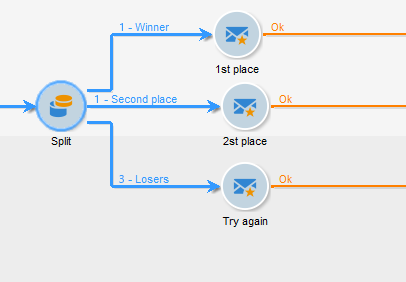

# Berika data{#enriching-data}

## Om att förbättra data {#about-enriching-data}

Här finns information om möjliga användningar av **[!UICONTROL Enrichment]**-aktiviteten i ett målarbetsflöde. Mer information om hur du använder aktiviteten **[!UICONTROL Enrichment]** finns i: [Berikning](enrichment.md).

Det finns också ett användningsexempel om hur du kan förbättra e-postleveransen med anpassade datum i [det här avsnittet](email-enrichment-with-custom-date-fields.md).

Kontakterna i marknadsföringsdatabasen får en inbjudan att delta i en tävling via ett webbprogram. Konkurrensresultaten återvinnas i tabellen **[!UICONTROL Competition results]**. Den här tabellen är länkad till kontakttabellen (**[!UICONTROL Recipients]**). Tabellen **[!UICONTROL Competition results]** innehåller följande fält:

* Konkurrensnamn (@game)
* Utvärderingsnummer (@trial)
* Poäng (@score)

En kontakt som hittas i tabellen **[!UICONTROL Recipients]** kan länkas till flera rader i tabellen **[!UICONTROL Competition results]**. Relationen mellan de här två tabellerna är av typen 1-n. Här är ett exempel på resultatloggarna för en mottagare:

Syftet med detta är att skicka personaliserade leveranser till personer som deltog i den senaste tävlingen beroende på deras högsta poäng. Mottagaren med högsta poäng får första pris, mottagaren med näst högsta poäng får ett tröstpris och alla andra får ett meddelande som önskar dem bättre lycka till nästa gång.

Vi har skapat följande arbetsflöde för målinriktning för att konfigurera det här användningsexemplet:

Så här skapar du arbetsflödet:

1. Två **[!UICONTROL Query]**-aktiviteter och en **[!UICONTROL Intersection]**-aktivitet läggs till för nya prenumeranter som gick in sist i tävlingen.
1. Med aktiviteten **[!UICONTROL Enrichment]** kan vi lägga till data som lagras i tabellen **[!UICONTROL Competition results]**. Fältet **[!UICONTROL Score]** som vår leveranspersonalisering ska utföras på läggs till i arbetsflödets arbetsregister.
1. Med typaktiviteten **[!UICONTROL Split]** kan vi skapa delmängder av mottagare baserat på poängvärden.
1. För varje delmängd läggs en **[!UICONTROL Delivery]**-typaktivitet till.

## Steg 1: Målinriktning {#step-1--targeting}

Den första frågan gör att vi kan rikta in oss på mottagare som lagts till i databasen under de senaste sex månaderna.

Den andra frågan gör att vi kan rikta in oss på de mottagare som deltog i den senaste tävlingen.

En **[!UICONTROL Intersection]**-typaktivitet läggs sedan till för de mottagare som lagts till i databasen under de senaste sex månaderna och som gick in i den sista tävlingen.

## Steg 2: Berikning {#step-2--enrichment}

I det här exemplet vill vi anpassa leveranser enligt fältet **[!UICONTROL Score]** som lagras i tabellen **[!UICONTROL Competition results]**. Den här tabellen har en 1:n-typrelation med mottagartabellen. Med aktiviteten **[!UICONTROL Enrichment]** kan vi lägga till data från en tabell som är länkad till filtreringsdimensionen i arbetsflödets arbetsregister.

1. Välj **[!UICONTROL Add data]**, **[!UICONTROL Data linked to the filtering dimension]** och klicka på **[!UICONTROL Next]** på redigeringsskärmen för anrikningsaktiviteten.

   

1. Välj sedan alternativet **[!UICONTROL Data linked to the filtering dimension]**, markera tabellen **[!UICONTROL Competition results]** och klicka på **[!UICONTROL Next]**.

   

1. Ange ett ID och en etikett och välj alternativet **[!UICONTROL Limit the line count]** i fältet **[!UICONTROL Data collected]**. I fältet **[!UICONTROL Lines to retrieve]** väljer du 1 som ett värde. För varje mottagare läggs en rad från tabellen **[!UICONTROL Competition results]** till i arbetsflödets arbetsregister. Klicka på **[!UICONTROL Next]**.

   

1. I det här exemplet vill vi återfå mottagarens högsta poäng, men bara för den sista tävlingen. Det gör du genom att lägga till ett filter i fältet **[!UICONTROL Competition name]** för att exkludera alla rader som hör till tidigare tävlingar. Klicka på **[!UICONTROL Next]**.

   

1. Gå till skärmen **[!UICONTROL Sort]** och klicka på knappen **[!UICONTROL Add]**, markera fältet **[!UICONTROL Score]** och markera kryssrutan i kolumnen **[!UICONTROL descending]** för att sortera objekt i **[!UICONTROL Score]**-fälten i fallande ordning. För varje mottagare läggs en rad till i anrikningsaktiviteten som matchar den högsta poängen för det senaste spelet. Klicka på **[!UICONTROL Next]**.

   

1. Dubbelklicka på fältet **[!UICONTROL Score]** i fönstret **[!UICONTROL Data to add]**. För varje mottagare läggs endast fältet **[!UICONTROL Score]** till i anrikningsaktiviteten. Klicka på **[!UICONTROL Finish]**.

   

Högerklicka på den inkommande övergången för anrikningsaktiviteten och välj **[!UICONTROL Display the target]**. Arbetstabellen innehåller följande data:

Det länkade schemat är:

Förnya den här åtgärden vid utgående övergång av anrikningsaktiviteten. Vi ser att data som är länkade till mottagarpoängen har lagts till. Den högsta poängen för varje mottagare har återställts.

Det matchande schemat har också berikats.

## Steg 3: Dela och leverera {#step-3--split-and-delivery}

Om du vill sortera mottagarna baserat på deras poäng läggs en **[!UICONTROL Split]**-aktivitet till efter anrikningen.

1. En första (**vinnare**) delmängd har definierats så att den innehåller mottagaren med det högsta poängtalet. Det gör du genom att definiera en begränsning av antalet poster, tillämpa en fallande sortering på poängen och begränsa antalet poster till 1.

   

1. Den andra delmängden (**Andra plats**) innehåller mottagaren med det näst högsta poängtalet. Konfigurationen är densamma som för den första delmängden.

   

1. Den tredje delmängden (**losers**) innehåller alla andra mottagare. Gå till fliken **[!UICONTROL General]** och markera kryssrutan **[!UICONTROL Generate complement]** för att ange alla mottagare som inte uppnådde de två högsta poängen som mål.

   

1. Lägg till en **[!UICONTROL Delivery]**-typaktivitet för varje delmängd, med olika leveransmallar för varje.

   
