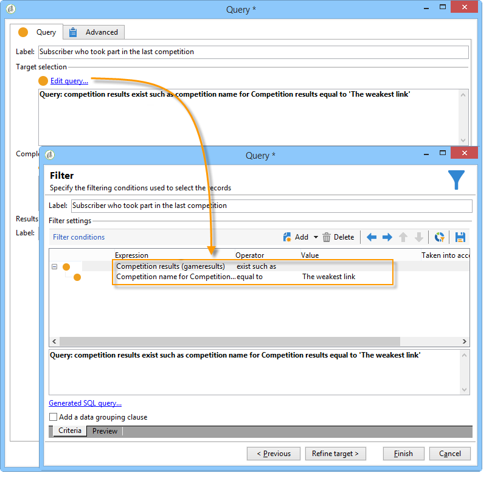
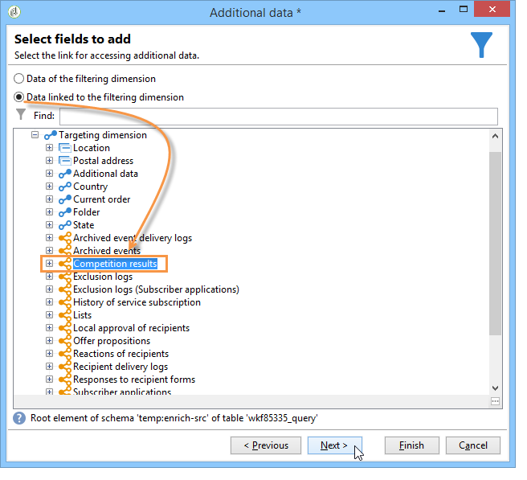

# Förbättra data{#enriching-data}

## Om att förbättra data {#about-enriching-data}

Här finns information om möjliga användningar av aktiviteten i ett målarbetsflöde **[!UICONTROL Enrichment]** . Mer information om hur du använder **[!UICONTROL Enrichment]** aktiviteten finns i: [Berikning](../../workflow/using/enrichment.md).

Det finns också ett användningsexempel om hur man förbättrar e-postleveransen med anpassade datum i [det här avsnittet](../../workflow/using/email-enrichment-with-custom-date-fields.md).

Kontakterna i marknadsföringsdatabasen får en inbjudan att delta i en tävling via ett webbprogram. Konkurrensresultaten återvinnas i **[!UICONTROL Competition results]** tabellen. Det här registret är länkat till kontakttabellen (**[!UICONTROL Recipients]**). Tabellen **[!UICONTROL Competition results]** innehåller följande fält:

* Konkurrensnamn (@game)
* Utvärderingsnummer (@trial)
* Poäng (@score)

En kontakt som hittas i **[!UICONTROL Recipients]** tabellen kan länkas till flera rader i **[!UICONTROL Competition results]** tabellen. Relationen mellan de här två tabellerna är av typen 1-n. Här är ett exempel på resultatloggarna för en mottagare:

Syftet med detta är att skicka personaliserade leveranser till personer som deltog i den senaste tävlingen beroende på deras högsta poäng. Mottagaren med högsta poäng får första pris, mottagaren med näst högsta poäng får ett tröstpris och alla andra får ett meddelande som önskar dem bättre lycka till nästa gång.

Vi har skapat följande arbetsflöde för målinriktning för att konfigurera det här användningsexemplet:

Så här skapar du arbetsflödet:

1. Två **[!UICONTROL Query]** aktiviteter och en **[!UICONTROL Intersection]** aktivitet läggs till för att inrikta sig på nya prenumeranter som gick in sist i tävlingen.
1. Med den här **[!UICONTROL Enrichment]** aktiviteten kan vi lägga till data som lagras i **[!UICONTROL Competition results]** tabellen. Det **[!UICONTROL Score]** fält som vår leveranspersonalisering ska äga rum på läggs till i arbetsflödets arbetsregister.
1. Med typaktiviteten kan vi **[!UICONTROL Split]** skapa delmängder av mottagare baserat på poängvärden.
1. För varje delmängd läggs en **[!UICONTROL Delivery]** typaktivitet till.

## Steg 1: Målinriktning {#step-1--targeting}

Den första frågan gör att vi kan rikta in oss på mottagare som lagts till i databasen under de senaste sex månaderna.

Den andra frågan gör att vi kan rikta in oss på de mottagare som deltog i den senaste tävlingen.

Därefter läggs en **[!UICONTROL Intersection]** typaktivitet till för att rikta sig till de mottagare som lagts till i databasen under de senaste sex månaderna och som gick in i den sista tävlingen.

## Steg 2: Berikning {#step-2--enrichment}

I det här exemplet vill vi anpassa leveranser enligt det **[!UICONTROL Score]** fält som lagras i **[!UICONTROL Competition results]** tabellen. Den här tabellen har en 1:n-typrelation med mottagartabellen. Med den här **[!UICONTROL Enrichment]** aktiviteten kan vi lägga till data från en tabell som är länkad till filtreringsdimensionen i arbetsflödets arbetsregister.

1. Markera **[!UICONTROL Add data]** och klicka sedan **[!UICONTROL Data linked to the filtering dimension]** på **[!UICONTROL Next]** redigeringsskärmen för anrikningsaktiviteten.

   

1. Markera sedan **[!UICONTROL Data linked to the filtering dimension]** alternativet, markera **[!UICONTROL Competition results]** tabellen och klicka på **[!UICONTROL Next]**.

   

1. Ange ett ID och en etikett och välj sedan **[!UICONTROL Limit the line count]** alternativet i **[!UICONTROL Data collected]** fältet. Välj 1 som värde i **[!UICONTROL Lines to retrieve]** fältet. För varje mottagare läggs en rad från tabellen till arbetsflödets arbetsregister i anrikningsaktiviteten från **[!UICONTROL Competition results]** tabellen. Klicka på **[!UICONTROL Next]**.

   

1. I det här exemplet vill vi återfå mottagarens högsta poäng, men bara för den sista tävlingen. Det gör du genom att lägga till ett filter i **[!UICONTROL Competition name]** fältet så att alla rader som hör till tidigare tävlingar utesluts. Klicka på **[!UICONTROL Next]**.

   

1. Gå till **[!UICONTROL Sort]** skärmen och klicka på **[!UICONTROL Add]** knappen, markera **[!UICONTROL Score]** fältet och markera kryssrutan i **[!UICONTROL descending]** kolumnen för att sortera objekt i **[!UICONTROL Score]** fälten i fallande ordning. För varje mottagare läggs en rad till i anrikningsaktiviteten som matchar den högsta poängen för det senaste spelet. Klicka på **[!UICONTROL Next]**.

   

1. Dubbelklicka på **[!UICONTROL Data to add]** fältet i **[!UICONTROL Score]** fönstret. För varje mottagare läggs bara **[!UICONTROL Score]** fältet till i anrikningsaktiviteten. Klicka på **[!UICONTROL Finish]**.

   

Högerklicka på den inkommande övergången för anrikningsaktiviteten och välj **[!UICONTROL Display the target]**. Arbetstabellen innehåller följande data:

Det länkade schemat är:

Förnya den här åtgärden vid utgående övergång av anrikningsaktiviteten. Vi ser att data som är länkade till mottagarpoängen har lagts till. Den högsta poängen för varje mottagare har återställts.

Det matchande schemat har också berikats.

## Steg 3: Dela och leverera {#step-3--split-and-delivery}

Om du vill sortera mottagarna baserat på deras poäng läggs en aktivitet till efter **[!UICONTROL Split]** anrikningen.

1. En första delmängd (**vinnare**) har definierats så att den innehåller mottagaren med det högsta poängtalet. Det gör du genom att definiera en begränsning av antalet poster, tillämpa en fallande sortering på poängen och begränsa antalet poster till 1.

   

1. Den andra delmängden (**andra platsen**) innehåller mottagaren med det näst högsta poängtalet. Konfigurationen är densamma som för den första delmängden.

   

1. Den tredje (**förlorare**) delmängden innehåller alla andra mottagare. Gå till **[!UICONTROL General]** fliken och markera **[!UICONTROL Generate complement]** rutan för att ange alla mottagare som inte uppnådde de två högsta poängen som mål.

   

1. Lägg till en **[!UICONTROL Delivery]** typaktivitet för varje delmängd med olika leveransmallar för varje.

   

