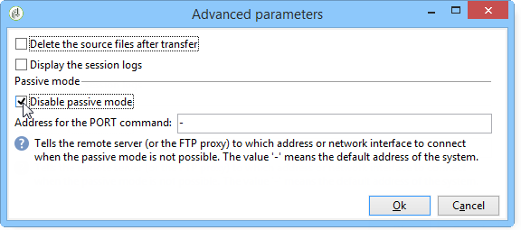

# Filöverföring{#file-transfer}

Med **filöverföringsaktiviteten** kan du ta emot eller skicka filer, testa om det finns filer eller lista med filer på en server. Protokollet som används är antingen Amazon Simple Storage Service (S3), FTP eller SFTP.
Med S3- eller SFTP-anslutning kan ni även importera segmentdata till Adobe Campaign med Adobes kunddataplattform i realtid. Mer information finns i den här [dokumentationen](https://docs.adobe.com/content/help/en/experience-platform/rtcdp/destinations/destinations-cat/adobe-destinations/adobe-campaign-destination.html).

## Egenskaper {#properties}

Använd listrutan för **[!UICONTROL Action]** fältet för att välja åtgärd för aktiviteten.

Konfigurationen beror på den valda åtgärden.

1. **Tar emot filer**

   Om du vill ta emot filer som lagras på en fjärrserver markerar du **[!UICONTROL File download]** i **[!UICONTROL Action]** fältet. Du måste ange dess URL i det relevanta fältet.

   

   Markera **[!UICONTROL Use an external account]** om du vill välja ett konto bland de S3-, FTP- eller SFTP-konton som är konfigurerade i trädnoden **[!UICONTROL Administration > Platform > External accounts]** . Ange sedan vilken katalog på servern som innehåller de filer som ska hämtas.

   

1. **Filöverföring**

   Om du vill skicka en fil till en server väljer du **[!UICONTROL File upload]** i **[!UICONTROL Action]** fältet. Du måste ange målservern i redigerarens **[!UICONTROL Remote server]** avsnitt. Parametrarna är desamma som för inkommande filer. Se ovan.

   Källfilen kan komma från föregående aktivitet. I det här fallet måste du välja **[!UICONTROL Use the file generated by the previous activity]** alternativet.

   

   Detta kan även gälla en eller flera andra filer. Om du vill markera dem avmarkerar du alternativet och klickar sedan på **[!UICONTROL Insert]**. Ange åtkomstsökvägen till filen som ska skickas. Klicka **[!UICONTROL Insert]** igen om du vill lägga till en annan fil. Filerna har nu sina egna flikar.

   

   Använd pilarna för att ändra tabbordningen. Detta gäller den ordning som filerna skickas till servern i.

   Med **[!UICONTROL Keep history of files sent]** alternativet kan du spåra skickade filer. Den här historiken är tillgänglig från katalogen.

1. **Testa om filen finns**

   Om du vill testa om det finns en fil väljer du **[!UICONTROL Test to see if file exists]** alternativet i **[!UICONTROL Action]** fältet. Konfigurationen för fjärrservern är densamma som för filhämtning. Mer information finns i det här [avsnittet](#properties).

   

1. **Lista över filer**

   Om du vill visa en lista över filerna väljer du **[!UICONTROL File listing]** alternativet i **[!UICONTROL Action]** fältet. Konfigurationen för fjärrservern är densamma som för mottagande filer. Mer information finns i det här [avsnittet](#properties).

   Med **[!UICONTROL List all files]** alternativet, som är tillgängligt när du väljer **[!UICONTROL File listing]** åtgärden, kan du lagra alla filer som finns på servern i händelsvariabeln **vars filnamn** avgränsas med `\n` tecken.

Det finns två möjliga alternativ för alla filöverföringsalternativ:

* Alternativet lägger **[!UICONTROL Process missing file]** till en övergång som aktiveras om ingen fil hittas i den angivna katalogen.
* Alternativet **[!UICONTROL Process errors]** beskrivs närmare i [Bearbetningsfel](../../workflow/using/monitoring-workflow-execution.md#processing-errors).

Med hjälp av **[!UICONTROL Advanced parameters...]** länken kommer du åt följande alternativ:

* **[!UICONTROL Delete the source files after transfer]**

   Raderar filerna på fjärrservern.

* **[!UICONTROL Use SSL]**

   Gör att du kan använda en säker anslutning via SSL-protokollet under filöverföringar.

* **[!UICONTROL Display the session logs]**

   Gör att du kan återställa loggarna för S3-, FTP- eller SFTP-överföringen och inkludera dem i arbetsflödesloggarna.

* **[!UICONTROL Disable passive mode]**

   Gör att du kan ange anslutningsporten som ska användas för dataöverföring.

Med den här **[!UICONTROL File historization settings...]** länken får du tillgång till de alternativ som beskrivs i [Webbnedladdning](../../workflow/using/web-download.md) (**[!UICONTROL File historization]** steg).

## Indataparametrar {#input-parameters}

* filnamn

   Den skickade filens fullständiga namn.

## Utdataparametrar {#output-parameters}

* filnamn

   Fullständigt namn på mottagen fil om **[!UICONTROL Use the file generated by the previous activity]** alternativet är markerat.

