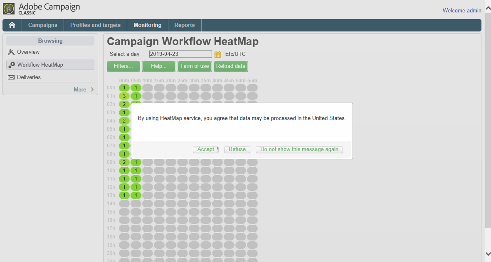
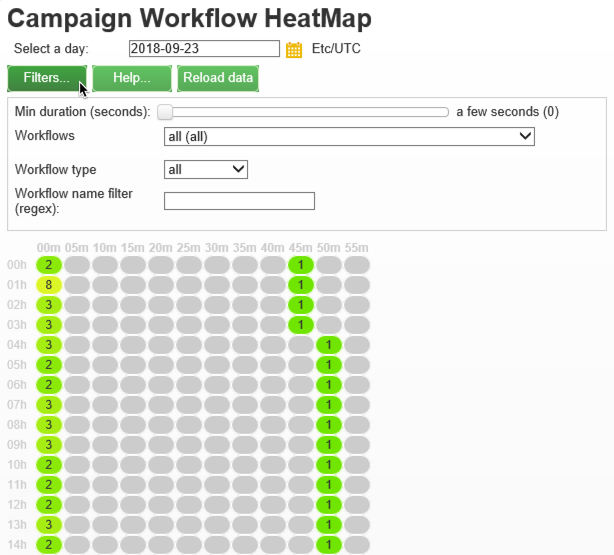
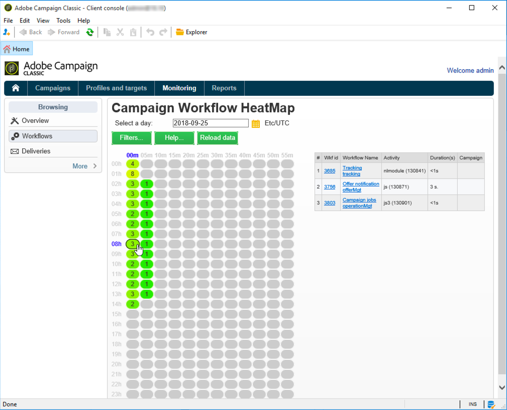

# Värmekarta för arbetsflöde {#workflow-heatmap}

Adobe Campaign Workflow HeatMap består av en färgkodad grafisk representation av alla arbetsflöden som körs. Den är endast tillgänglig för instansen Administratörer.

Ytterligare sätt att övervaka olika Campaign-processer presenteras på [den här sidan](https://helpx.adobe.com/campaign/kb/acc-maintenance.html).

## Om HeatMap för arbetsflöde {#about-the-workflow-heatmap}

Genom att ge en snabb översikt över antalet samtidiga arbetsflöden gör Workflow HeatMap det möjligt för Adobe Campaign-plattformsadministratörer att övervaka belastningen på instansen och planera arbetsflödena utifrån detta.

Mer exakt hjälper det plattformsadministratörerna att:

* Se och förstå samtidiga arbetsflöden
* Filtrera arbetsflöden efter varaktighet för att se vilka arbetsflöden som kan stöta på problem
* Filtrera aktiviteter efter varaktighet för att se vilka aktiviteter som kan stöta på problem
* Hitta enkelt enskilda arbetsflöden och alla relaterade aktiviteter (med varaktigheten)
* Sök efter arbetsflödestyp ([tekniska arbetsflöden](../../workflow/using/building-a-workflow.md#technical-workflows) eller [kampanjarbetsflöden](../../workflow/using/building-a-workflow.md#campaign-workflows))
* Leta efter ett specifikt arbetsflöde att analysera

>[!NOTE]
>
>Förutom **heatmap** för arbetsflöde kan du skapa ett arbetsflöde där du kan övervaka statusen för en uppsättning arbetsflöden och skicka återkommande meddelanden till arbetsledare. Mer information finns i det [dedikerade avsnittet](../../workflow/using/supervising-workflows.md).

Om du använder Workflow HeatMap måste du ha god förståelse för följande koncept: Bästa praxis för [arbetsflöden](../../workflow/using/about-workflows.md), [aktiviteter](../../workflow/using/about-activities.md) och [arbetsflöden](../../workflow/using/workflow-best-practices.md).

Workflow HeatMap är tillgängligt som standard i Adobe Campaign från och med version 18.10. Om du har ett build-värde mellan 8 700 och 8 977 (18,10) kan du också utnyttja den här funktionen. Kontakta [Adobes kundtjänst](https://support.neolane.net/) och följ instruktionerna från [den här sidan](https://helpx.adobe.com/campaign/kb/install-workflow-heatmap-package.html) för att få information om hur du installerar paketet.

När du först öppnar Workflow HeatMap visas följande popup-fönster. Avtalet tillåter överföring och lagring i USA som tillåter Adobe Campaign att:

* övervaka instanser för att undersöka eventuella prestandaproblem.
* samla in data för avvikelseidentifiering.

Observera att överföringen av dina data endast är tillgänglig för användare som ansluter till Adobe Campaign med sitt Adobe ID.

Tre alternativ är tillgängliga:

* **[!UICONTROL Accept]** : Genom att godkänna avtalet ger ni Adobe Campaign rätt att samla in era data och överföra dem till USA för att ni ska kunna hjälpa er om avvikelser upptäcks.
* **[!UICONTROL Refuse]** : Om du avböjer avtalet kommer dina data inte att överföras, men du kan fortfarande använda heatmap-kartan för arbetsflöde.
* **[!UICONTROL Do not show this message again]** : Genom att klicka på **[!UICONTROL Do not show this message again]** kommer popup-fönstret att sluta visas när du öppnar heatmap-kartan för arbetsflöde, men det är fortfarande tillgängligt från **[!UICONTROL Term of use]** knappen.

Det här alternativet är inte slutgiltigt. Du kan alltid ändra det genom att klicka på **[!UICONTROL Term of use]** knappen.

## Använda HeatMap {#using-the-heatmap}

>[!NOTE]
>
>Endast användare med administrationsbehörighet har åtkomst till HeatMap för kampanjarbetsflöde.

1. Gå till **[!UICONTROL Monitoring]** och klicka på **[!UICONTROL Workflow HeatMap]** länken för att visa **[!UICONTROL Campaign Workflow HeatMap]** sidan.

   

1. Klicka på kalendern för att välja en dag.

   Som standard visas arbetsflödesaktiviteten för den aktuella dagen på sidan. Du kan ändra den och välja vilken dag som helst i det förflutna.

   >[!NOTE]
   >
   >Endast de arbetsflöden som inte har tagits bort av **[!UICONTROL Database cleanup]** arbetsflödet visas. Mer information om arbetsflödet för databasrensning finns i [det här avsnittet](../../production/using/database-cleanup-workflow.md).\
   >Som standard är tidszonen för Workflow HeatMap den som är definierad för den aktuella administratörsanvändaren. Du kan till exempel vilja ändra den om du inte befinner dig inom samma område som de marknadsföringsanvändare du arbetar med.

1. Klicka på **[!UICONTROL Filters]** knappen.

   

1. Använd skjutreglaget för att ange den minsta längden från 0 sekund till 1 timme. På så sätt kan du bara söka efter arbetsflöden som körs i mer än ett visst antal sekunder eller minuter.

   

1. Du kan också välja ett specifikt arbetsflöde i **[!UICONTROL Workflows]** listan.

   

   >[!NOTE]
   >
   >Filtret används **[!UICONTROL Min duration]** . Om du inte kan hitta ett visst arbetsflöde återställer du den kortaste tiden till 0 så att alla arbetsflöden visas i listan.

1. Du kan också filtrera på **[!UICONTROL Workflow type]** :

   * **[!UICONTROL Technical]** : Endast [färdiga arbetsflöden](../../workflow/using/building-a-workflow.md#technical-workflows) och [datahanteringsarbetsflöden](../../workflow/using/targeting-data.md#data-management) visas.
   * **[!UICONTROL Marketing]** : Endast arbetsflöden som är kopplade till en marknadsföringskampanj, som kallas [kampanjarbetsflöden](../../workflow/using/building-a-workflow.md#campaign-workflows), visas.

1. Om du vill söka efter ett specifikt arbetsflöde efter namn kan du även använda **[!UICONTROL Workflow name filter]** fältet.

   

1. Om du har redigerat vissa arbetsflöden i tiden mellan dem kan du klicka på knappen för att uppdatera de data som visas i rutnätet. **[!UICONTROL Reload data]**

## Läsa HeatMap {#reading-the-heatmap}

The Campaign Workflow HeatMap är ett rutnät som är naturligt läsbart uppifrån vänster till nerifrån och ned, vilket gör att det går att hitta&quot;aktiva zoner&quot; med ett grönt till rött färgkodat intervall.

* De mörkare röda cellerna motsvarar punkter när ett stort antal arbetsflöden körs samtidigt.
* De grå cellerna motsvarar perioder när inget arbetsflöde körs.

Klicka på **[!UICONTROL Help]** knappen om du vill veta hur färgkoden används och hur du navigerar i HeatMap.

Varje rad representerar en timme på dagen och varje cell representerar fem minuter av den timmen.

I rutnätet visas alla arbetsflöden som körs samtidigt för var och en av dessa 5-minutersperioder.

I exemplet nedan körs tre arbetsflöden mellan 08:05 och 8:05 (oavsett hur långa de är):

1. Klicka på en färgad cell för att visa information om alla samtidiga arbetsflöden som körs under den här perioden.

   

   För varje arbetsflöde visas alla aktiviteter som det innehåller, med deras varaktighet.

1. Klicka på arbetsflödes-ID:t eller namnet för att öppna ett arbetsflöde direkt.
1. Om du vill gå tillbaka till **[!UICONTROL Campaign Workflow HeatMap]** vyn klickar du på **[!UICONTROL Home]** knappen.

## Användningsexempel: använda HeatMap för att utföra åtgärder {#use-cases--using-the-heatmap-to-take-actions}

Det finns två huvudfall där HeatMap för kampanjarbetsflödet kan vara användbart.

### Minska antalet samtidiga arbetsflöden {#reducing-the-number-of-concurrent-workflows}

Som Campaign-administratör kan Workflow HeatMap hjälpa dig att förstå belastningen på instansen och planera befintliga eller nya arbetsflöden vid lämpliga tidpunkter.

1. Klicka på **[!UICONTROL Campaign Workflow HeatMap]** knappen i **[!UICONTROL Filters]** vyn.
1. Ange en varaktighet på några sekunder eller några minuter.
1. Undvik de kortaste arbetsflödena som inte är signifikanta genom att öka varaktighetsfiltret.

   

1. Utforska resultaten för att förstå inläsningen av instansen och vidta lämpliga åtgärder:

   * Om du stöter på prestandaproblem och om en eller flera röda celler visas i stödrastret bör du ändra starttiderna för flera arbetsflöden. Be marknadsföringsanvändarna att flytta manuella arbetsflöden från upptagna (&quot;heta&quot;) perioder till mer tillgängliga tidsrymder. Detta bör upprätthålla en stabil aktivitetsnivå under dagen.
   * För att undvika toppar och förhindra att instansen överbelastas bör du titta på HeatMap innan du planerar nya arbetsflöden och välja den bästa tiden. Överväg tidsrymder som motsvarar grå eller gröna celler i rutnätet för att starta nya arbetsflöden.

### Hitta tidskrävande arbetsflöden som påverkar prestandan {#finding-long-running-workflows-that-impact-performance}

Som kampanjadministratör hjälper Workflow HeatMap dig att hitta de längsta arbetsflödena som kan göra aktiviteten långsammare.

1. Klicka på **[!UICONTROL Campaign Workflow HeatMap]** knappen i **[!UICONTROL Filters]** vyn.
1. Ange varaktighet till 1 timme.

   

1. Inkludera fler resultat genom att minska **[!UICONTROL Min duration]** filtret.
1. Utforska resultaten för att hitta de längsta arbetsflödena, som kan ha större effekt på server- och databasresurserna (CPU, RAM, nätverk, IOPS och så vidare).
1. Vidta lämpliga åtgärder:

   * Rekommendera marknadsföringsanvändare att dela upp de längsta arbetsflödena för att minska bearbetningstiden.
   * Starta en djupgående analys av specifika arbetsflöden och specifika aktiviteter (som JavaScript, import, export och så vidare) för att isolera problemen och lättare lösa dem.

## Exempel: Förbättra arbetsflödesplaneringen med HeatMap {#example--using-the-heatmap-to-improve-workflow-planning}

I exemplet nedan visas hur planering kan vara mer effektiv och hur prestanda kan förbättras när du använder HeatMap för arbetsflöde i Adobe Campaign.

I det här fallet klagar många användare över arbetsflödets prestanda. Du måste kontrollera vad som saktar ned aktiviteten och hur du löser problemet.

1. Gå till **[!UICONTROL Monitoring]** och klicka på **[!UICONTROL Workflows]** länken för att visa **[!UICONTROL Campaign Workflow HeatMap]** sidan.
1. Ställ in **[!UICONTROL Min duration]** filtret på 5 minuter.
1. Ställ in **[!UICONTROL Workflow type]** filtret på **[!UICONTROL Marketing]** .
1. I HeatMap-rutnätet bör du tänka på följande:

   

   * Kampanjarbetsflöden som varar femtio (mer än fem minuter) körs kl. 10.
   * De flesta har ett väntande läge (som standard är samtidighetsgränsen inställd på 20).
   * De väntande arbetsflödena måste startas om manuellt varje dag.
   * Prestandan är låg.

1. I stället för att ha femtio arbetsflöden från kl. 10 ska du distribuera arbetsflödenas starttider jämnt under resten av dagen.
1. Gå tillbaka till **[!UICONTROL Campaign Workflow HeatMap]** sidan och klicka på **[!UICONTROL Reload data]** knappen.
1. Observera följande:

   

   * Endast 18 långvariga arbetsflöden för kampanjer körs fortfarande kl. 10.
   * Det finns inga fler arbetsflöden som väntar (gränsen för samtidighet är fortfarande satt till 20).
   * Starttider för arbetsflöden är jämnt fördelade över hela dagen.
   * Inga fler användare klagar på prestandaproblem.
