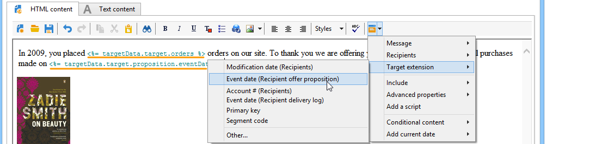

# Så använder du arbetsflödesdata{#how-to-use-workflow-data}

## Uppdaterar databasen {#updating-the-database}

Alla insamlade data kan användas för att uppdatera databasen eller i leveranser. Du kan till exempel utöka möjligheterna att personalisera innehåll i meddelanden (ange antalet kontrakt i meddelandet, ange den genomsnittliga kundvagnen under det senaste året, osv.) eller målgruppsanpassning (skicka ett meddelande till kontraktsparter, rikta in de 1 000 bästa abonnenterna på onlinetjänster osv.). Dessa data kan också exporteras eller arkiveras i en lista.

### Listor och direkta uppdateringar {#lists-and-direct-updates}

Data från Adobe Campaign-databasen och de befintliga listorna kan uppdateras med hjälp av två dedikerade aktiviteter:

* Med aktiviteten **[!UICONTROL List update]** kan du lagra arbetstabeller i en datalist.

   Du kan välja en befintlig lista eller skapa den. I det här fallet beräknas namnet och eventuellt postmappen.

   

   Se [Listuppdatering](../../workflow/using/list-update.md).

* Aktiviteten **[!UICONTROL Update data]** utför en massuppdatering av fälten i databasen.

   Mer information finns i [Uppdatera data](../../workflow/using/update-data.md).

### Hantering av prenumeration/avprenumeration {#subscription-unsubscription-management}

Om du vill veta mer om att prenumerera på och avsluta prenumerationer på en informationstjänst via ett arbetsflöde kan du läsa [Prenumerationstjänster](../../workflow/using/subscription-services.md).

## Skicka via ett arbetsflöde {#sending-via-a-workflow}

### Leveransaktivitet {#delivery-activity}

Leveransaktiviteten anges i [Delivery](../../workflow/using/delivery.md).

### Förbättra och målinrikta leveranser {#enriching-and-targeting-deliveries}

Leveranser kan bearbeta data från arbetsflöden för att anpassa innehåll eller inom ramen för valet av målpopulation.

Inom ramen för direktutskick kan du t.ex. inkludera ytterligare data som hämtats från dataändringar som utförts i arbetsflödet i extraheringsfilen:


Förutom de vanliga personaliseringsfälten kan du lägga till anpassningsfält från arbetsflödesfaser till leveransinnehållet. De ytterligare data som definieras i arbetsflödesaktiviteterna kan behållas och göras tillgängliga i leveransguiden, vilket visas i exemplet nedan, för att definiera namnet på utdatafilen inom ramen för direktmeddelandeleverans:


Data i arbetsflödestabellen identifieras med sitt namn: den alltid består av länken **targetData**. Mer information finns i [Måldata](../../workflow/using/data-life-cycle.md#target-data).

Inom ramen för e-postleverans kan personaliseringsfält även använda data från måltillägg som har utförts i arbetsflödesfaserna för målanpassning, vilket visas i exemplet nedan:



Om en segmentkod anges i en målaktivitet läggs den till i en specifik kolumn i arbetsflödestabellen och erbjuds tillsammans med anpassningsfälten. Om du vill visa alla anpassningsfält klickar du på länken **[!UICONTROL Target extension > Other...]** som är tillgänglig via personaliseringsknappen.


## Exportera data {#exporting-data}

### Zippa eller kryptera en fil {#zipping-or-encrypting-a-file}

Med Adobe Campaign kan du exportera komprimerade eller krypterade filer. När du definierar en export via en **[!UICONTROL Data extraction (file)]**-aktivitet kan du definiera en efterbearbetning för att komprimera eller kryptera filen.

Så här kan du göra:

1. Installera ett GPG-nyckelpar för instansen med [Kontrollpanelen](https://docs.adobe.com/content/help/en/control-panel/using/instances-settings/gpg-keys-management.html#encrypting-data).

   >[!NOTE]
   >
   >Kontrollpanelen är tillgänglig för alla kunder som har AWS som värd (med undantag för kunder som har sina marknadsföringsinstanser på plats).

1. Om din installation av Adobe Campaign ligger hos Adobe kontaktar du Adobe kundtjänst för att få de verktyg som behövs installerade på servern.
1. Om du har en installation av Adobe Campaign installerad installerar du verktyget som du vill använda (till exempel: GPG, GZIP) och nödvändiga nycklar (krypteringsnyckel) på programservern.

Du kan sedan använda kommandon eller kod på fliken **[!UICONTROL Script]** för aktiviteten eller i en **[!UICONTROL JavaScript code]**-aktivitet. Ett exempel visas i användningsexemplet nedan.

**Relaterade ämnen:**

* [Zippa upp eller dekryptera en fil före bearbetning](../../workflow/using/importing-data.md#unzipping-or-decrypting-a-file-before-processing)
* [Dataextraheringsaktivitet](../../workflow/using/extraction--file-.md).

### Användningsfall: Kryptera och exportera data med en tangent som är installerad på Kontrollpanelen {#use-case-gpg-encrypt}

I det här fallet skapar vi ett arbetsflöde för att kryptera och exportera data med en nyckel som är installerad på Kontrollpanelen.

 [Upptäck den här funktionen i en video](#video)

Så här utför du det här användningsfallet:

1. Generera ett GPG-nyckelpar (public/private) med ett GPG-verktyg och installera sedan den offentliga nyckeln på Kontrollpanelen. Detaljerade steg finns i [dokumentationen till kontrollpanelen](https://docs.adobe.com/content/help/en/control-panel/using/instances-settings/gpg-keys-management.html#encrypting-data).

1. Bygg ett arbetsflöde i Campaign Classic för att exportera data och kryptera dem med den privata nyckel som har installerats via Kontrollpanelen. För att göra detta ska vi skapa ett arbetsflöde enligt följande:

   

   * **[!UICONTROL Query]** aktivitet: I det här exemplet vill vi köra en fråga för att rikta data från den databas som vi vill exportera.
   * **[!UICONTROL Data extraction (file)]** aktivitet: Extraherar data till en fil.
   * **[!UICONTROL JavaScript code]** aktivitet: Krypterar de data som ska extraheras.
   * **[!UICONTROL File transfer]** aktivitet: Skickar data till en extern källa (i det här exemplet en SFTP-server).

1. Konfigurera aktiviteten **[!UICONTROL Query]** för att ange önskade data från databasen som mål. Mer information om detta finns i [det här avsnittet](../../workflow/using/query.md).

1. Öppna aktiviteten **[!UICONTROL Data extraction (file)]** och konfigurera den efter dina behov. Globala koncept för hur du konfigurerar aktiviteten finns i [det här avsnittet](../../workflow/using/extraction--file-.md).

   

1. Öppna aktiviteten **[!UICONTROL JavaScript code]** och kopiera och klistra sedan in kommandot nedan för att kryptera de data som ska extraheras.

   >[!IMPORTANT]
   >
   >Se till att du ersätter värdet **fingertryck** från kommandot med fingeravtrycket för den offentliga nyckeln som är installerad på kontrollpanelen.

   ```
   var cmd='gpg ';
   cmd += ' --trust-model always';
   cmd += ' --batch --yes';
   cmd += ' --recipient fingerprint';
   cmd += ' --encrypt --output ' + vars.filename + '.gpg ' + vars.filename;
   execCommand(cmd,true);
   vars.filename=vars.filename + '.gpg'
   ```

   

1. Öppna aktiviteten **[!UICONTROL File transfer]** och ange sedan den SFTP-server som du vill skicka filen till. Globala koncept för hur du konfigurerar aktiviteten finns i [det här avsnittet](../../workflow/using/file-transfer.md).

   

1. Du kan nu köra arbetsflödet. När den har körts exporteras datamål som omfattas av frågan till SFTP-servern till en krypterad GPG-fil.

### Självstudievideo {#video}

I den här videon visas hur du använder en GPG-nyckel för att kryptera data som även finns i

>[!VIDEO](https://video.tv.adobe.com/v/36399?quality=12)

Ytterligare Campaign Classic-instruktionsvideor finns [här](https://experienceleague.adobe.com/docs/campaign-classic-learn/tutorials/overview.html?lang=sv).
