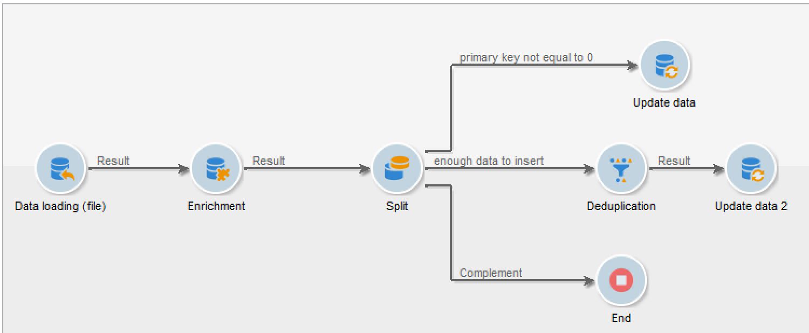

# Importera data{#importing-data}

## Hur man samlar in data {#how-to-collect-data}

### Använda data från en lista: Läslista {#using-data-from-a-list--read-list}

Data som skickas i ett arbetsflöde kan komma från listor där data har förberetts och strukturerats.

Den här listan kan ha skapats direkt i Adobe Campaign eller importerats med **[!UICONTROL Import a list]** alternativet. Mer information om det här alternativet finns på den här [sidan](../../platform/using/generic-imports-and-exports.md).

Mer information om hur du använder läslisteaktiviteten i ett arbetsflöde finns i [Läslista](../../workflow/using/read-list.md).

### Läsa in data från en fil {#loading-data-from-a-file}

Data som bearbetas i ett arbetsflöde kan extraheras från en strukturerad fil så att de kan importeras till Adobe Campaign.

En beskrivning av inläsningen av dataaktiviteten finns i avsnittet [Datainläsning (fil)](../../workflow/using/data-loading--file-.md) .

Exempel på strukturerad fil som ska importeras:

```
lastname;firstname;birthdate;email;crmID
Smith;Hayden;23/05/1989;hayden.smith@example.com;124365
Mars;Daniel;17/11/1987;dannymars@example.com;123545
Smith;Clara;08/02/1989;hayden.smith@example.com;124567
Durance;Allison;15/12/1978;allison.durance@example.com;120987
```

### Zippa upp eller dekryptera en fil före bearbetning {#unzipping-or-decrypting-a-file-before-processing}

Med Adobe Campaign kan du importera komprimerade eller krypterade filer. Innan de kan läsas in i en **[!UICONTROL Data loading (file)]** aktivitet kan du definiera en förbearbetning för att packa upp eller dekryptera filen.

Så här kan du göra:

* Om Adobe har Adobe som värd för din installation av Adobe Campaign: skicka en begäran till [supporten](https://support.neolane.net) om att få de nödvändiga verktygen installerade på servern.
* Om ni har Adobe Campaign lokalt: installera verktyget som du vill använda (till exempel: GPG, GZIP) och nödvändiga nycklar (krypteringsnyckel) på programservern.

1. Lägg till och konfigurera en **[!UICONTROL File transfer]** aktivitet i arbetsflödet.
1. Lägg till en **[!UICONTROL Data loading (file)]** aktivitet och definiera filformatet.
1. Markera **[!UICONTROL Pre-process the file]** alternativet.
1. Ange det förbehandlingskommando som du vill använda. Om du till exempel vill dekryptera en fil med PGP:

   ```
   <path-to_pgp_if-not_global_or_server/>pgp.exe --decrypt --input nl6/var/vp/import/filename.pgp --passphrase "your password" --recipient recipient @email.com --verbose --output nl6/var/vp/import/filename
   ```

1. Lägg till andra aktiviteter för att hantera data som kommer från filen.
1. Spara och kör arbetsflödet.

När du exporterar en fil kan du även komprimera eller kryptera den. Se [Zippa eller kryptera en fil](../../workflow/using/how-to-use-workflow-data.md#zipping-or-encrypting-a-file).

## Bästa tillvägagångssätt vid import av data {#best-practices-when-importing-data}

Genom att vara försiktig och följa de få enkla regler som beskrivs nedan kan du till stor del säkerställa att data är konsekventa i databasen och undvika vanliga fel under databasuppdatering eller dataexport.

### Använda importmallar {#using-import-templates}

De flesta importarbetsflöden bör innehålla följande aktiviteter: **[!UICONTROL Data loading (file)]**, **[!UICONTROL Enrichment]**, **[!UICONTROL Split]**, **[!UICONTROL Deduplication]**, **[!UICONTROL Update data]**..

Med importmallar är det mycket bekvämt att förbereda liknande importer och säkerställa att data är konsekventa i databasen. Lär dig hur du skapar arbetsflödesmallar i [avsnittet Arbetsflödesmallar](../../workflow/using/building-a-workflow.md#workflow-templates) .

I många projekt byggs importen utan **[!UICONTROL Deduplication]** aktivitet eftersom filerna som används i projektet inte har några dubbletter. Det kan ibland visas dubbletter när du importerar olika filer. Det är då svårt att deduplicera. Därför är ett borttagningssteg en bra försiktighetsåtgärd i alla importarbetsflöden.

Ta det lugnt om du utgår ifrån att inkommande data är konsekventa och korrekta, eller att IT-avdelningen eller Adobe Campaign-administratören kommer att ta hand om dem. Under projektet bör du tänka på datarensningen. Ta bort dubbletter, stämma av och bibehåll enhetligheten när du importerar data.

Ett exempel på en importmall finns i avsnittet [Konfigurera en återkommande import](#setting-up-a-recurring-import) .

### Använda platta filformat {#using-flat-file-formats}

Det mest effektiva formatet för import är platta filer. Platta filer kan importeras i gruppläge på databasnivå.

Till exempel:

* Avgränsare: tabb eller semikolon
* Första raden med rubriker
* Ingen strängavgränsare
* Datumformat: YYYY/MM/DD HH:mm:SS

Adobe Campaign kan inte importera XML-filer med vanliga filimportaktiviteter. Det går att importera XML-filer med JavaScript, men bara med små volymer: mindre än 10 000 poster per fil.

### Använda komprimering och kryptering {#using-compression-and-encryption}

Använd zippade filer för import och export när det är möjligt.

I Linux går det att packa upp en fil och importera samtidigt med hjälp av en kommandorad. Till exempel:

```
zcat nl6/var/vp/import/filename.gz
```

Det är också bra att kryptera filer som skickas över nätverket om de inte är säkra. GPG kan användas för detta.

### Läsa in data i grupp från filer {#loading-data-in-batch-from-files}

Att läsa in data batchvis från en fil är effektivare än att läsa in en rad i taget och i realtid (till exempel via en webbtjänst).

Import med webbtjänster är inte effektivt. Det är bäst att använda filer när det är möjligt.

Att anropa externa webbtjänster för att berika profiler i realtid är också känt för att orsaka prestandaproblem och minnesläckor, eftersom det fungerar på radnivå.

Om du behöver importera data är det bättre att göra det gruppvis, med ett arbetsflöde än i realtid, med ett webbprogram eller en webbtjänst.

### Använda datahantering {#using-data-management}

Inläsning i iterativt läge (rad för rad) med JavaScript bör begränsas till små volymer.

Använd alltid aktiviteten i arbetsflöden för datahantering för bättre effektivitet. **[!UICONTROL Data Loading (File)]**

### Importera i Delta-läge {#importing-in-delta-mode}

Vanlig import måste göras i deltaläge. Det innebär att bara ändrade eller nya data skickas till Adobe Campaign, i stället för hela tabellen varje gång.

Full import bör endast användas för inledande last.

Importera data med hjälp av datahantering i stället för JavaScript.

### Bevara konsekvensen {#maintaining-consistency}

Följ nedanstående principer för att upprätthålla konsekvensen i Adobe Campaign-databasen:

* Om importerade data matchar en referenstabell i Adobe Campaign bör de stämma överens med den tabellen i arbetsflödet. Poster som inte matchar bör avvisas.
* Se till att importerade data alltid är **&quot;normaliserade&quot;** (e-post, telefonnummer, e-postadress) och att normaliseringen är tillförlitlig och inte förändras under årens lopp. Om så inte är fallet kommer vissa dubbletter sannolikt att visas i databasen, och eftersom Adobe Campaign inte har verktyg för&quot;otydlig&quot; matchning kommer det att vara mycket svårt att hantera och ta bort dem.
* Transaktionsdata ska ha en avstämningsnyckel och stämma av med befintliga data för att undvika att skapa dubbletter.
* **Importera relaterade filer i rätt ordning**.

   Om importen består av flera filer som är beroende av varandra, bör arbetsflödet se till att filerna importeras i rätt ordning. När en fil misslyckas importeras inte de andra filerna.

* **Ta bort dubbletter**, stämma av och bibehåll konsekvens när du importerar data.

## Konfigurera en återkommande import {#setting-up-a-recurring-import}

Det är bäst att använda en importmall om du behöver importera filer med samma struktur regelbundet.

I det här exemplet visas hur du anger ett förinställt arbetsflöde som kan återanvändas för import av profiler från en CRM i Adobe Campaign-databasen. Mer information om alla möjliga inställningar för varje aktivitet finns i det här [avsnittet](../../workflow/using/about-activities.md).

1. Skapa en ny arbetsflödesmall från **[!UICONTROL Resources > Templates > Workflow templates]**.
1. Lägg till följande aktiviteter:

   * **[!UICONTROL Data loading (file)]**: Definiera den förväntade strukturen för filen som innehåller de data som ska importeras.
   * **[!UICONTROL Enrichment]**: Stäm av importerade data med databasdata.
   * **[!UICONTROL Split]**: Skapa filter för att bearbeta poster på olika sätt beroende på om de kan förenas eller inte.
   * **[!UICONTROL Deduplication]**: Deduplicera data från den inkommande filen innan den infogas i databasen.
   * **[!UICONTROL Update data]**: Uppdatera databasen med de importerade profilerna.
   

1. Konfigurera **[!UICONTROL Data Loading (file)]** aktiviteten:

   * Definiera den förväntade strukturen genom att överföra en exempelfil. Exempelfilen bör bara innehålla några få rader, men alla kolumner som behövs för importen. Kontrollera och redigera filformatet för att säkerställa att typen av varje kolumn är korrekt: text, datum, heltal osv. Till exempel:

      ```
      lastname;firstname;birthdate;email;crmID
      Smith;Hayden;23/05/1989;hayden.smith@mailtest.com;123456
      ```

   * I **[!UICONTROL Name of the file to load]** avsnittet markerar du **[!UICONTROL Upload a file from the local machine]** och lämnar fältet tomt. Varje gång ett nytt arbetsflöde skapas från den här mallen kan du här ange vilken fil du vill ha, så länge den motsvarar den definierade strukturen.

      Du kan använda något av alternativen, men du måste ändra mallen därefter. Om du till exempel väljer **[!UICONTROL Specified in the transition]** kan du lägga till en **[!UICONTROL File Transfer]** aktivitet innan du hämtar filen som ska importeras från en FTP-/SFTP-server. Med S3- eller SFTP-anslutning kan ni även importera segmentdata till Adobe Campaign med Adobes kunddataplattform i realtid. Mer information finns i den här [dokumentationen](https://docs.adobe.com/content/help/en/experience-platform/rtcdp/destinations/destinations-cat/adobe-destinations/adobe-campaign-destination.html).

      

1. Konfigurera **[!UICONTROL Enrichment]** aktiviteten. Syftet med den här aktiviteten i det här sammanhanget är att identifiera inkommande data.

   * På **[!UICONTROL Enrichment]** fliken markerar du **[!UICONTROL Add data]** och definierar en länk mellan importerade data och måldimensionen för mottagarna. I det här exemplet används det anpassade fältet **CRM ID** för att skapa kopplingsvillkoret. Använd fältet eller kombinationen av fält som du behöver så länge det går att identifiera unika poster.
   * Låt alternativet vara omarkerat på **[!UICONTROL Reconciliation]** fliken **[!UICONTROL Identify the document from the working data]** .
   

1. Konfigurera aktiviteten för att hämta avstämda mottagare i en övergång och mottagare som inte kunde avstämas men som har tillräckligt med data i en andra övergång. **[!UICONTROL Split]**

   Övergången med avstämda mottagare kan sedan användas för att uppdatera databasen. Övergången med okända mottagare kan sedan användas för att skapa nya mottagarposter i databasen om det finns en minimiuppsättning information i filen.

   Mottagare som inte kan förenas och som inte har tillräckligt med data markeras i en komplementövergång och kan exporteras i en separat fil eller helt enkelt ignoreras.

   * Välj filterinställning på aktivitetens **[!UICONTROL General]** flik **[!UICONTROL Use the additional data only]** och kontrollera att **[!UICONTROL Targeting dimension]** inställningen automatiskt är **[!UICONTROL Enrichment]**.

      Markera det här alternativet om du vill se om det inte går att infoga någon post i databasen. **[!UICONTROL Generate complement]** Om du behöver kan du använda ytterligare bearbetning för kompletterande data: export av filer, uppdatering av listor osv.

   * I den första delmängden av **[!UICONTROL Subsets]** fliken lägger du till ett filtervillkor i den inkommande fyllningen för att endast markera poster där den mottagande primärnyckeln inte är lika med 0. På så sätt markeras data från filen som är avstämda med mottagare från databasen i den delmängden.

      

   * Lägg till en andra delmängd som markerar ej avstämda poster som har tillräckligt med data för att infogas i databasen. Till exempel: e-postadress, förnamn och efternamn.

      Deluppsättningar bearbetas i den ordning de skapas, vilket innebär att alla poster som redan finns i databasen redan är markerade i den första deluppsättningen när den andra deluppsättningen bearbetas.

      

   * Alla poster som inte är markerade i de två första delmängderna markeras i **[!UICONTROL Complement]**.

1. Konfigurera den **[!UICONTROL Update data]** aktivitet som finns efter den första utgående övergången för den **[!UICONTROL Split]** aktivitet som konfigurerats tidigare.

   * Välj **[!UICONTROL Update]** som **[!UICONTROL Operation type]** eftersom den inkommande övergången bara innehåller mottagare som redan finns i databasen.
   * I **[!UICONTROL Record identification]** avsnittet väljer du **[!UICONTROL Using reconciliation keys]** och definierar en nyckel mellan måldimensionen och länken som skapas i **[!UICONTROL Enrichment]**. I det här exemplet används det anpassade fältet **CRM ID** .
   * I **[!UICONTROL Fields to update]** avsnittet anger du fälten från mottagardimensionen som ska uppdateras med värdet för motsvarande kolumn från filen. Om namnen på filkolumnerna är identiska eller nästan identiska med namnen på mottagarnas dimensionsfält kan du använda trollstavsknappen för att automatiskt matcha de olika fälten.

      

1. Konfigurera den **[!UICONTROL Deduplication]** aktivitet som finns efter övergången och som innehåller ej avstämda mottagare:

   * Välj **[!UICONTROL Edit configuration]** och ange måldimensionen till det temporära schema som genereras från arbetsflödets **[!UICONTROL Enrichment]** aktivitet.

      

   * I det här exemplet används e-postfältet för att hitta unika profiler. Du kan använda vilket fält som helst som du är säker på är ifyllt och ingår i en unik kombination.
   * På **[!UICONTROL Deduplication method]** skärmen markerar du **[!UICONTROL Advanced parameters]** och markerar **[!UICONTROL Disable automatic filtering of 0 ID records]** alternativet för att se till att poster som har en primärnyckel som är lika med 0 (som ska vara alla poster i den här övergången) inte utesluts.
   

1. Konfigurera den **[!UICONTROL Update data]** aktivitet som finns efter den **[!UICONTROL Deduplication]** aktivitet som konfigurerats tidigare.

   * Välj **[!UICONTROL Insert]** som **[!UICONTROL Operation type]** eftersom den inkommande övergången bara innehåller mottagare som inte finns i databasen.
   * Markera **[!UICONTROL Record identification]** och välj **[!UICONTROL Directly using the targeting dimension]** **[!UICONTROL Recipients]** dimensionen i avsnittet.
   * I **[!UICONTROL Fields to update]** avsnittet anger du fälten från mottagardimensionen som ska uppdateras med värdet för motsvarande kolumn från filen. Om namnen på filkolumnerna är identiska eller nästan identiska med namnen på mottagarnas dimensionsfält kan du använda trollstavsknappen för att automatiskt matcha de olika fälten.

      

1. Efter den tredje övergången av **[!UICONTROL Split]** aktiviteten lägger du till en **[!UICONTROL Data extraction (file)]** aktivitet och en **[!UICONTROL File transfer]** aktivitet om du vill hålla reda på data som inte har infogats i databasen. Konfigurera de aktiviteterna för att exportera den kolumn du behöver och för att överföra filen till en FTP- eller SFTP-server där du kan hämta den.
1. Lägg till en **[!UICONTROL End]** aktivitet och spara arbetsflödesmallen.

Mallen kan nu användas och är tillgänglig för alla nya arbetsflöden. Allt som behövs är då att ange filen som innehåller de data som ska importeras i **[!UICONTROL Data loading (file)]** aktiviteten.


