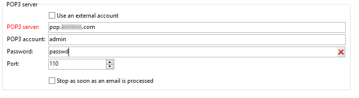

# Inkommande e-postmeddelanden{#inbound-emails}

Med aktiviteten **Inkommande e-post** kan du hämta och bearbeta e-postmeddelanden från en POP3-postserver.

På den första fliken i aktiviteten **Inkommande e-post** kan du ange parametrarna för POP3-servern och ange det skript som ska köras när varje meddelande tas emot. På den andra fliken kan du tilldela aktiviteten ett schema och på den tredje fliken definieras aktivitetens förfallovillkor.

1. **[!UICONTROL Inbound Emails]**

   * **[!UICONTROL Use an external account]**

      När det här alternativet är aktiverat kan du välja ett externt POP3-konto i stället för att ange anslutningsparametrarna. I **[!UICONTROL External account]** fältet anges det externa POP3-konto som ska användas för att ansluta till e-posttjänsten. Det här fältet är bara synligt om alternativet Använd ett externt konto är aktiverat.

      Om det här alternativet inte är markerat måste du ange följande parametrar:

      

      * **[!UICONTROL POP3 server]**

         Namn på POP3-servern.

      * **[!UICONTROL POP3 account]**

         Användarens namn.

      * **[!UICONTROL Password]**

         Lösenord för användarkonto.

      * **[!UICONTROL Port]**

         Portnummer för POP3-anslutning. Standardporten är 110.
   * **[!UICONTROL Stop as soon as email is processed]**

      Med det här alternativet kan du bearbeta e-postmeddelanden en i taget. Aktiviteten aktiverar endast övergången en gång och slutför sedan bearbetningen, vilket lämnar obearbetade meddelanden på servern.

1. **[!UICONTROL Script]**

   Skriptet låter dig bearbeta meddelandet och utföra olika åtgärder som är beroende av meddelandets innehåll. Skriptet körs för varje meddelande och kan avgöra vilken åtgärd som ska utföras för meddelanden (lämna eller ta bort meddelandet) och aktivering av den utgående övergången.

   Returkoden måste vara något av följande värden:

   * 1 - Tar bort meddelandet från servern och aktiverar den utgående övergången.
   * 2 - Lämnar meddelandet på servern och aktiverar den utgående övergången.
   * 3 - Tar bort meddelandet från servern.
   * 4 - Lämnar meddelandet på servern.
   Innehållet i meddelandet är tillgängligt från den globala **[!UICONTROL mailMessage]** variabeln.

1. **[!UICONTROL Schedule]**

   Om du vill definiera ett schema för aktiviteten klickar du på **[!UICONTROL Scheduling]** fliken och kontrollerar **[!UICONTROL Plan execution]**. Klicka på **[!UICONTROL Change]** knappen för att konfigurera schemat.

   Schemaläggningskonfigurationen är densamma som för schemaläggningsaktiviteten. Se [Schemaläggaren](../../workflow/using/scheduler.md).

1. **[!UICONTROL Expiration]**

   Du kan ange förfallotider på **[!UICONTROL Expiration]** fliken.

   

   Konfigurationen är densamma som för schemaläggningsaktiviteten. Se [Förfallodatum](../../workflow/using/defining-approvals.md).

