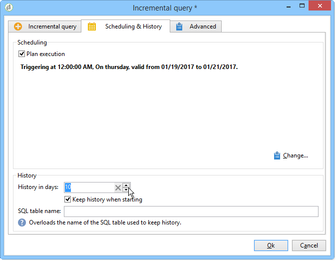

# Inkrementell fråga{#incremental-query}

Med en stegvis fråga kan du regelbundet välja ett mål baserat på ett villkor, samtidigt som du utesluter de personer som redan är målinriktade för det här kriteriet.

Populationen som redan är mål lagras i minnet efter arbetsflödesinstans och efter aktivitet, vilket innebär att två arbetsflöden som startas från samma mall inte delar samma logg. Två uppgifter som baseras på samma inkrementella fråga för samma arbetsflödesinstans använder däremot samma logg.

Frågan definieras på samma sätt som för vanliga frågor, men körningen är schemalagd.

**Relaterade ämnen:**

* [Användningsfall: Kvartalslistuppdatering med inkrementell fråga](../../workflow/using/quarterly-list-update.md)
* [Skapa en fråga](../../workflow/using/query.md#creating-a-query)

>[!CAUTION]
>
>Om resultatet av en inkrementell fråga är lika med **0** under en av dess körningar pausas arbetsflödet tills frågan körs nästa gång. De övergångar och aktiviteter som följer efter den stegvisa frågan bearbetas därför inte före nästa körning.

Så här gör du:

1. Välj **[!UICONTROL Scheduling & History]** alternativet på **[!UICONTROL Schedule execution]** fliken. Aktiviteten förblir aktiv när den har skapats och aktiveras endast vid de tidpunkter som anges i schemat för körning av frågan. Om alternativet är inaktiverat körs frågan omedelbart **och på en gång**.
1. Klicka på knappen **[!UICONTROL Change]**. 

   I **[!UICONTROL Schedule editing wizard]** fönstret kan du konfigurera typ av frekvens, återkommande händelser och händelsegiltighetsperiod.

   

1. Klicka **[!UICONTROL Finish]** för att spara schemat.

   

1. I det nedre avsnittet på **[!UICONTROL Scheduling & History]** fliken kan du välja hur många dagar som ska tas med i historiken.

   

   * **[!UICONTROL History in days]**

      Mottagare som redan är målinriktade kan loggas i högst ett antal dagar från den dag då de var målinriktade. Om värdet är noll rensas mottagarna aldrig från loggen.

   * **[!UICONTROL Keep history when starting]**

      Med det här alternativet kan du inte rensa loggen när aktiviteten är aktiverad.

   * **[!UICONTROL SQL table name]**

      Med den här parametern kan du överlagra SQL-standardtabellen som innehåller historikdata.

## Utdataparametrar {#output-parameters}

* tableName
* schema
* recCount

Den här uppsättningen med tre värden identifierar den population som frågan riktar sig till. **[!UICONTROL tableName]** är namnet på tabellen som registrerar målidentifierarna, **[!UICONTROL schema]** är populationens schema (vanligtvis nms:mottagare) och **[!UICONTROL recCount]** är antalet element i tabellen.
