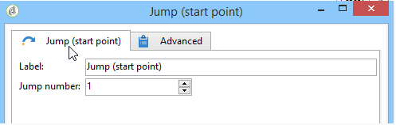

# Hoppa (startpunkt och slutpunkt){#jump-start-point-and-end-point}

**[!UICONTROL Jump]** grafiska objekt av typen -typ används för att förbättra läsbarheten för komplexa diagram, särskilt sådana med korsningsövergångar.

Hoppar är övergångar utan pilar: De går från en aktivitet till en annan, som i följande exempel.

För varje övergång av typen&quot;startpunkt&quot; måste en övergång av typen&quot;slutpunkt&quot; placeras.

Du kan infoga flera start- och slutpunktshopp i samma arbetsflöde. De identifieras med ett tal som måste anges i parametrarna:

Om du vill förbättra diagrammets läsbarhet kan du ändra bilden som är kopplad till hopp så att det relaterade numret visas. Se [Hantera aktivitetsbilder](../../workflow/using/managing-activity-images.md).
