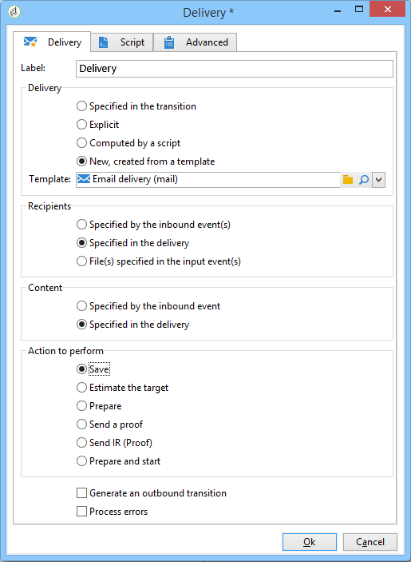

# Läser in leveransinnehåll{#loading-delivery-content}

Om ditt leveransinnehåll är tillgängligt i en HTML-fil som finns på Amazon S3-, FTP- eller SFTP-servrar kan du enkelt läsa in innehållet i Adobe Campaign-leveranser.

Så här gör du:

1. Om du inte redan har definierat en anslutning mellan Adobe Campaign och den (S)FTP-server som är värd för innehållsfilerna skapar du ett nytt externt S3-, FTP- eller SFTP-konto i **[!UICONTROL Administration]** > **[!UICONTROL Platform]** > **[!UICONTROL External Accounts]**. I det här externa kontot anger du den adress och de autentiseringsuppgifter som används för att upprätta anslutningen till S3- eller (S)FTP-servern.

   Här är ett exempel på ett externt S3-konto:

   

1. Skapa ett nytt arbetsflöde, till exempel från **[!UICONTROL Profiles and Targets]** > **[!UICONTROL Jobs]** > **[!UICONTROL Targeting workflows]**.
1. Lägg till en **[!UICONTROL File transfer]** aktivitet i arbetsflödet och konfigurera den genom att ange

   * Det externa konto som ska användas för att ansluta till S3- eller (S)FTP-servern.
   * Sökvägen till filen på S3- eller (S)FTP-servern.
   

1. Lägg till en **[!UICONTROL Delivery]** aktivitet och koppla den till den utgående övergången för **[!UICONTROL File transfer]** aktiviteten. Konfigurera den enligt följande:

   * Leverans: Beroende på dina behov kan det vara en specifik leverans som redan har skapats i systemet eller en ny leverans som baseras på en befintlig mall.
   * Mottagare: I det här exemplet anses målet vara angivet i själva leveransen.
   * Innehåll: Även om innehållet importeras i den tidigare aktiviteten väljer du **[!UICONTROL Specified in the delivery]**. Eftersom innehållet importeras direkt från en fil som finns på en fjärrserver har det ingen identifierare när det bearbetas av arbetsflödet och kan inte identifieras som om det kommer från den inkommande händelsen.
   * Åtgärd som ska utföras: Välj **[!UICONTROL Save]** om du vill spara leveransen och kunna komma åt den från **[!UICONTROL Campaign management]** > **[!UICONTROL Deliveries]** när arbetsflödet har körts.
   

1. Lägg till följande kommando på fliken **[!UICONTROL Script]** i **[!UICONTROL Delivery]** aktiviteten för att läsa in innehållet i den importerade filen i leveransen:

   ```
   delivery.content.md.source=loadFile(vars.filename)
   ```

   

1. Spara och kör arbetsflödet. En ny leverans med det inlästa innehållet skapas under **[!UICONTROL Campaign management]** > **[!UICONTROL Deliveries]**.

>[!NOTE]
>
>De bästa metoderna och felsökningarna för användning av SFTP-servrar beskrivs [på den här sidan](../../platform/using/sftp-server-usage.md).

