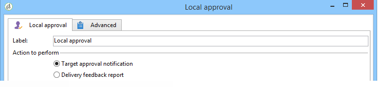

# Lokalt godkännande{#local-approval}

När den är integrerad i ett arbetsflöde för målinriktning kan du med den här aktiviteten **[!UICONTROL Local approval]** konfigurera en process för mottagarnas godkännande innan leveransen skickas.

>[!CAUTION]
>
>För att kunna använda den här aktiviteten måste du ha köpt modulen Distribuerad marknadsföring, som är ett kampanjalternativ. Kontrollera licensavtalet.

Ett exempel på **[!UICONTROL Local approval]** aktiviteten med en distributionsmall finns i [Använda den lokala godkännandeaktiviteten](../../workflow/using/using-the-local-approval-activity.md).

Börja med att ange en etikett för aktiviteten och **[!UICONTROL Action to execute]** fältet:

* Välj alternativet **[!UICONTROL Target approval notification]** att skicka ett e-postmeddelande till lokala arbetsledare före leveransen och be dem godkänna mottagarna som tilldelats dem.

   

* **Inkrementell fråga**: gör att du kan utföra en fråga och planera dess körning. Se avsnittet [Inkrementell fråga](../../workflow/using/incremental-query.md) .

   

## Meddelande om målgodkännande {#target-approval-notification}

I det här fallet placeras **[!UICONTROL Local approval]** aktiviteten mellan målgruppsanpassning uppströms och leverans:

De fält som ska anges vid ett meddelande om målgodkännande är:

* **[!UICONTROL Distribution context]**: markera alternativet **[!UICONTROL Specified in the transition]** om du använder en **[!UICONTROL Split]** typaktivitet för att begränsa målpopulationen. I det här fallet anges distributionsmallen i den delade aktiviteten. Om du inte begränsar målpopulationen väljer du **[!UICONTROL Explicit]** alternativet här och anger distributionsmallen i **[!UICONTROL Data distribution]** fältet.

   Mer information om hur du skapar en mall för datadistribution finns i [Begränsa antalet delmängdsposter per datadistribution](../../workflow/using/split.md#limiting-the-number-of-subset-records-per-data-distribution).

* **[!UICONTROL Approval management]**

   * Välj leveransmall och ämne som ska användas för e-postmeddelandet. En standardmall är tillgänglig: **[!UICONTROL Local approval notification]**. Du kan också lägga till en beskrivning som visas ovanför mottagarlistorna i godkännanderutorna och feedbackmeddelandena.
   * Ange det **[!UICONTROL Approval type]** som motsvarar godkännandedeadline (datum eller deadline från godkännandets början). På det här datumet startar arbetsflödet igen och de mottagare som inte har godkänts tas inte med i målsättningen. När meddelandena har skickats står aktiviteten i kö så att de lokala granskarna kan godkänna sina kontakter.

      >[!NOTE]
      >
      >Som standard förlängs aktiviteten i tre dagar när godkännandeprocessen startas.

      Du kan också lägga till en eller flera påminnelser för att informera lokala arbetsledare om att tidsgränsen närmar sig. Klicka på **[!UICONTROL Add a reminder]** länken om du vill göra det.

* **[!UICONTROL Complementary set]**: Med det här **[!UICONTROL Generate complement]** alternativet kan du skapa en andra uppsättning som innehåller alla ej godkända mål.

   >[!NOTE]
   >
   >Det här alternativet är inaktiverat som standard.

## Feedback-rapport {#delivery-feedback-report}

I det här fallet placeras **[!UICONTROL Local approval]** aktiviteten efter leveransen:

Följande fält måste anges om det finns en leveransfeedback-rapport:

* Välj **[!UICONTROL Specified in the transition]** alternativet om leveransen angavs under en tidigare aktivitet. Välj **[!UICONTROL Explicit]** att ange leveransen i den lokala godkännandeaktiviteten.
* Välj leveransmall och objekt för e-postmeddelandet. Det finns en standardmall: **[!UICONTROL Local approval notification]**.

## Exempel: Godkänna leverans av arbetsflöde {#example--approving-a-workflow-delivery}

I det här exemplet visas hur du ställer in en godkännandeprocess för en arbetsflödesleverans. Mer information om hur du skapar leveransarbetsflöden finns i [exemplet: sektion för leveransarbetsflöde](../../workflow/using/delivery.md#example--delivery-workflow) .

En operator kan godkänna en leverans på ett av två sätt: med webbsidan som är länkad i e-postmeddelandet eller via konsolen.

* Webbgodkännande

   Med e-postmeddelandet som skickas till operatorer i gruppen Administratör kan du godkänna leveransmålet. Meddelandet använder den definierade texten och JavaScript-uttrycket ersätts med det beräknade värdet (i det här fallet &quot;574&quot;)

   Klicka på länken och logga in på Adobe Campaign-konsolen för att godkänna leveransen.

   

   Gör ett val och klicka på **[!UICONTROL Submit]** knappen.

   

* Godkännande via konsolen

   I trädstrukturen innehåller noden en lista med uppgifter som ska godkännas av den operatör som är ansluten för tillfället. **[!UICONTROL Administration > Production > Objects created automatically > Approvals pending]** Listan ska innehålla en rad. Dubbelklicka på raden för att svara. Följande fönster visas:

Välj **Ja** och klicka sedan på **[!UICONTROL Approve]**. Du får ett meddelande om att svaret har registrerats.

Gå tillbaka till arbetsflödesfönstret: Efter tio sekunder visas diagrammet enligt följande:

Arbetsflödet har utfört **[!UICONTROL Delivery control]** uppgiften, vilket i det här fallet innebär att leveransen som skapades tidigare påbörjas. Arbetsflödet har slutförts utan fel.
