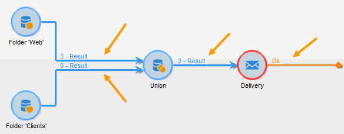
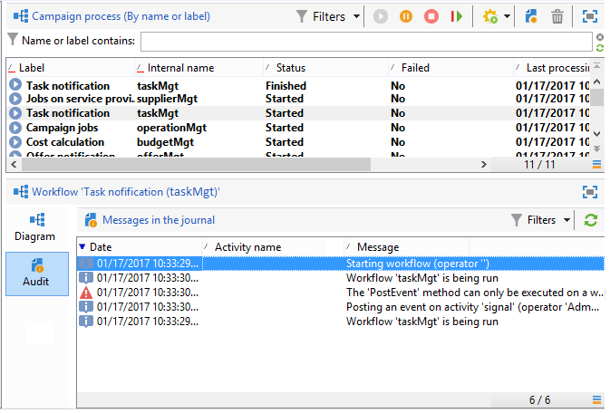
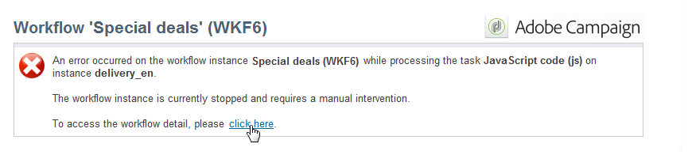
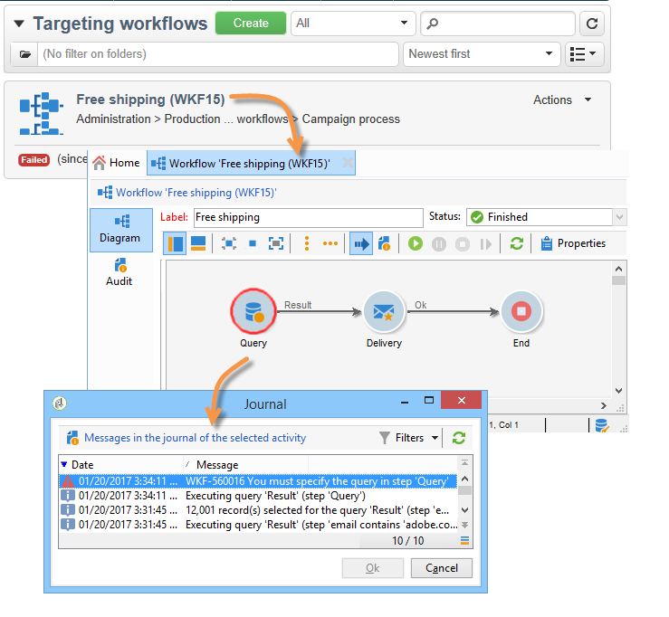

# Övervaka körning av arbetsflöde {#monitoring-workflow-execution}

I det här avsnittet finns information om hur du övervakar arbetsflödenas körning.

Det finns även ett användningsexempel om hur du skapar ett arbetsflöde där du kan övervaka statusen för en uppsättning arbetsflöden som är&quot;pausade&quot;,&quot;stoppade&quot; eller&quot;med fel&quot; i [det här avsnittet](../../workflow/using/supervising-workflows.md#supervising-workflows).

Administratörer av instansen kan dessutom använda **granskningsspåret** för att kontrollera aktiviteter och senaste ändringar av arbetsflöden, arbetsflödenas status. Mer information finns i det [dedikerade avsnittet](../../production/using/audit-trail.md).

Ytterligare sätt att övervaka olika Campaign-processer presenteras på [den här sidan](https://helpx.adobe.com/campaign/kb/acc-maintenance.html).

## Visa förlopp {#displaying-progress}

Du kan övervaka körningen genom att visa förloppet med lämplig ikon i verktygsfältet.

Med **[!UICONTROL Display progress information]** ikonen kan du visa status och aktivitetsresultatet i körningsfönstret.


När det här alternativet är markerat visas utförda aktiviteter i blått, väntande aktiviteter blinka, varningar visas i orange och fel i rött. Det här alternativet visar också resultatet av aktiviteter vid den utgående övergången, följt av resultatetiketten som definieras i aktivitetsegenskaperna och jobbens varaktighet om den överstiger en sekund



## Visa loggar {#displaying-logs}

Loggen innehåller historiken eller granskningsspåret för arbetsflödet. Den registrerar alla användaråtgärder, alla åtgärder som utförts och fel som påträffats. Du kan:

* Välj fliken **[!UICONTROL Tracking]** i detaljfältet. Den här listan innehåller alla arbetsflödesmeddelanden.

   

* Filtrera loggmeddelanden efter aktivitet. Det gör du genom att klicka **[!UICONTROL Display the tasks and the log]** på verktygsfältet ovanför diagrammet för att visa **[!UICONTROL Log]** - och **[!UICONTROL Tasks]** -flikarna under diagrammet. Välj en aktivitet om du vill visa alla relaterade meddelanden. Den här listan innehåller alla meddelanden när ingen aktivitet har valts.

   

   >[!NOTE]
   >
   >Klicka på bakgrunden i diagrammet för att avmarkera alla element.

* Visa endast meddelanden som är länkade till en viss uppgift. Det gör du genom att markera **[!UICONTROL Tasks]** fliken och sedan välja en aktivitet i diagrammet för att begränsa listan. Dubbelklicka på en uppgift för att visa informationen; den sista fliken i fönstret innehåller loggen.

   

   Med knappen **[!UICONTROL Details...]** kan du visa all ytterligare information om aktivitetskörning. Du kan till exempel visa valideringsoperatorn och, i tillämpliga fall, kommentaren som de angav vid godkännandet, som i följande exempel:

   

>[!NOTE]
>
>Loggen rensas inte när ett arbetsflöde startas om. Alla meddelanden sparas. Om du vill ignorera meddelanden från en tidigare körning måste du rensa historiken.

I loggen visas den kronologiska listan med körningsmeddelanden som rör arbetsflödesaktiviteter för målinriktning.

* Logg över en målinriktningskampanj

   När en målinriktningskampanj har körts klickar du på **[!UICONTROL Tracking]** fliken för att visa körningsspårningen.

   

   Alla kampanjmeddelanden visas: utförda kampanjer samt varningar och fel.

* Logg över en aktivitet

   Du kan också visa körningsloggen och information om varje aktivitet. Det finns två sätt att göra detta:

   1. Markera målaktiviteten och klicka på **[!UICONTROL Display the tasks and the log]** -ikonen.

      

      I diagrammets nedre del visas två flikar: Logg och uppgifter.

      Aktiviteter som väljs i diagrammet fungerar som filter i loggen och uppgiftslistan.

      

   1. Högerklicka på målaktiviteten och välj **[!UICONTROL Display logs]**.

      

      Loggen visas i ett separat fönster.

## Rensar loggarna {#purging-the-logs}

Arbetsflödeshistorik rensas inte automatiskt: alla meddelanden behålls som standard. Du kan rensa historiken via **[!UICONTROL File > Actions]** menyn eller genom att klicka på **[!UICONTROL Actions]** knappen i verktygsfältet ovanför listan. Välj **[!UICONTROL Purge history]**. De alternativ som är tillgängliga på **[!UICONTROL Actions]** menyn finns i verktygsfältsavsnittet [Åtgärder](../../workflow/using/starting-a-workflow.md) .


## Arbetstabeller och arbetsflödesschema {#worktables-and-workflow-schema}

Arbetsflödet konverterar arbetstabeller som kan ändras via vissa aktiviteter. Med Adobe Campaign kan ni, via datahanteringsaktiviteter, ändra, byta namn på och berika kolumnerna i arbetsflödestabellerna, till exempel för att anpassa dem till nomenklaturen beroende på kundens behov, för att samla in ytterligare information om medmottagaren av ett kontrakt, osv.

Det går också att skapa länkar mellan olika arbetsdimensioner och definiera dimensionsändringar. För varje kontrakt som registreras i databasen anger du t.ex. huvudinnehavaren och använder uppgifter om medägare i den ytterligare informationen.

Arbetstabellerna i arbetsflödet tas bort automatiskt när arbetsflödet försätts i viloläge. Om du vill behålla en arbetstabell sparar du den i en lista via **[!UICONTROL List update]** aktiviteten (se [Listuppdatering](../../workflow/using/list-update.md)).

## Hantera fel {#managing-errors}

När ett fel inträffar pausas arbetsflödet och aktiviteten körs när felet blinkar. I arbetsflödesöversikten (**[!UICONTROL Monitoring]** universum > **[!UICONTROL Workflows]** link) kan du endast visa arbetsflöden med fel, vilket visas nedan.


I Adobe Campaign Explorer visar arbetsflödeslistan en **[!UICONTROL Failed]** kolumn som standard.


När ett arbetsflöde är felaktigt meddelas de operatorer som tillhör arbetsflödesövervakningsgruppen via e-post, förutsatt att deras e-postadress anges i deras profil. Den här gruppen markeras i fältet **[!UICONTROL Supervisor(s)]** för arbetsflödesegenskaperna.


Meddelandeinnehållet är konfigurerat i **[!UICONTROL Workflow manager notification]** standardmallen: Den här mallen väljs på fliken **[!UICONTROL Execution]** i arbetsflödesegenskaperna. Meddelandet visar namnet på felarbetsflödet och den berörda uppgiften.

Exempel:



Med länken kan du komma åt Adobe Campaign-konsolen i webbläge och arbeta med felarbetsflödet när du har loggat in.


Du kan konfigurera arbetsflödet så att det inte pausar och fortsätter att köras om fel uppstår. Det gör du genom att redigera arbetsflödet **[!UICONTROL Properties]** och i **[!UICONTROL Error management]** avsnittet välja **[!UICONTROL Ignore]** alternativet i **[!UICONTROL In case of error]** fältet. Du kan sedan ange antalet efterföljande fel som kan ignoreras innan processen pausas.

I det här fallet avbryts felaktiviteten. Det här läget passar särskilt bra för arbetsflöden som är utformade för att försöka göra om kampanjen senare (periodiska åtgärder).


>[!NOTE]
>
>Du kan använda den här konfigurationen separat för varje aktivitet. Om du vill göra det redigerar du aktivitetsegenskaperna och väljer felhanteringsläget på **[!UICONTROL Advanced]** fliken.

Mer information om felsökning av arbetsflödenas utförande finns i det [dedikerade avsnittet](../../production/using/workflow-execution.md).

## Bearbetningsfel {#processing-errors}

När det gäller aktiviteter visar alternativet en specifik övergång som aktiveras om ett fel genereras. **[!UICONTROL Process errors]** I det här fallet försätts arbetsflödet inte i felläge och körningen fortsätter.

Fel som beaktas är filsystemfel (filen kunde inte flyttas, katalogen kunde inte nås osv.).

Det här alternativet bearbetar inte fel relaterade till aktivitetskonfigurationen, dvs. ogiltiga värden. Fel relaterade till felaktig konfiguration aktiverar inte den här övergången (katalogen finns inte, osv.).

Om ett arbetsflöde pausas (manuellt eller automatiskt efter ett fel) startar knappen om arbetsflödeskörningen där den stoppades **[!UICONTROL Start]** . Den felaktiga aktiviteten (eller den pausade aktiviteten) kommer att köras igen. De föregående aktiviteterna har inte körts om.

Om du vill köra alla arbetsflödesaktiviteter igen använder du **[!UICONTROL Restart]** knappen.

Om du ändrar aktiviteter som redan har körts beaktas inte ändringarna när arbetsflödeskörningen startas om.

Om du ändrar aktiviteter som inte har utförts beaktas de när arbetsflödeskörningen startas om.

Om du ändrar pausade aktiviteter kan ändringarna inte beaktas korrekt när arbetsflödet startas om.

Om det är möjligt rekommenderar vi att du startar om arbetsflödet när du har gjort ändringar.

## Instansövervakning {#instance-supervision}

På **[!UICONTROL Instance supervision]** sidan kan du visa serveraktiviteten för Adobe Campaign och visa en lista över arbetsflöden och leveranser med fel.

Gå till **[!UICONTROL Monitoring]** universum och klicka på **[!UICONTROL General view]** länken för att komma åt den här sidan.


Om du vill visa alla arbetsflöden klickar du på **[!UICONTROL Workflows]** länken. Använd listrutan för att visa arbetsflödena på plattformen baserat på deras tillstånd.


Klicka på länken i ett arbetsflöde med fel för att öppna det och visa loggen.



## Förhindra samtidiga körningar {#preventing-simultaneous-multiple-executions}

Ett arbetsflöde kan ha flera körningar samtidigt. I vissa fall bör du förhindra att detta händer.

Du kan till exempel ha en schemaläggare som utlöser arbetsflödeskörningen varje timme, men ibland tar körningen av hela arbetsflödet mer än en timme. Du kanske vill hoppa över körningen om arbetsflödet redan körs.

Om du har en signalaktivitet i början av arbetsflödet kanske du vill hoppa över signalen om arbetsflödet körs.

Den allmänna principen är följande:


Lösningen är att använda en instansvariabel. Förekomstvariabler delas av alla parallella körningar i arbetsflödena.

Här är ett enkelt testarbetsflöde:


Den **[!UICONTROL Scheduler]** utlöser en händelse varje minut. Följande **[!UICONTROL Test]** aktivitet kommer att testa **instansvariabeln isRunning** för att avgöra om körningen ska fortsätta eller inte:


>[!NOTE]
>
>**isRunning** är ett variabelnamn som valts för det här exemplet. Det här är inte en inbyggd variabel.

Aktiviteten direkt efter **[!UICONTROL Test]** i **yes** -förgreningen måste ange instansvariabeln i **initieringsskriptet**:

```
instance.vars.isRunning = true
```

Den sista aktiviteten i **yes** -grenen måste återställa variabeln till false i sitt **initieringsskript**:

```
instance.vars.isRunning = false
```

Observera att:

* Du kan kontrollera det aktuella värdet för instansvariabeln via fliken **Variabler** i **Egenskaper** för arbetsflödet.
* Instansvariabler återställs när du startar om ett arbetsflöde.
* I JavaScript är ett odefinierat värde false i ett test, vilket gör att instansvariabeln kan testas även innan den har initierats.
* Du kan övervaka aktiviteter som inte bearbetas på grund av den här mekanismen genom att lägga till en loggningsinstruktion i initieringsskriptet för &quot;nej&quot;-slutet.

   ```
   logInfo("Workflow already running, parallel execution not allowed.");
   ```

Ett användningsexempel presenteras i detta avsnitt: [Samordna datauppdateringar](../../workflow/using/coordinating-data-updates.md).

## Databasunderhåll {#database-maintenance}

I arbetsflöden används många arbetstabeller som förbrukar utrymme och gör att hela plattformen blir långsammare om den inte underhålls. Mer information om databasunderhåll finns i det här [avsnittet](../../production/using/tables-to-maintain.md) .

Med arbetsflödet för rensning **av** databas, som är tillgängligt via noden **Administration > Produktion > Tekniska arbetsflöden** , kan du ta bort föråldrade data för att undvika exponentiell tillväxt i databasen. Arbetsflödet utlöses automatiskt utan att användaren behöver göra något. Se det här [avsnittet](../../production/using/database-cleanup-workflow.md).

Du kan också skapa specifika tekniska arbetsflöden för att rensa bort onödiga datamängder. Se det här [avsnittet](../../production/using/application-objects.md) och den här [sidan](#purging-the-logs).

## Hantering av pausade arbetsflöden {#handling-of-paused-workflows}

Om ett arbetsflöde pausas rensas aldrig arbetsflödets arbetsregister som standard. Från och med bygge 880 stoppas automatiskt arbetsflöden som har pausats för länge och arbetsflödena töms. Detta beteende aktiveras enligt följande:

* Arbetsflöden som har pausats sedan mer än 7 dagar visas som en varning på kontrollpanelen (och övervaknings-API:t) och ett meddelande skickas till den övervakande gruppen.
* Samma sak händer varje vecka när det **[!UICONTROL cleanupPausedWorkflows]** tekniska arbetsflödet aktiveras. Mer information om arbetsflödet finns i [det här avsnittet](../../workflow/using/delivery.md).
* Efter fyra meddelanden (en månad i pausat läge som standard) stoppas arbetsflödet villkorslöst. En logg visas i arbetsflödet när det har stoppats. Tabellerna rensas vid nästa **[!UICONTROL cleanup]** körningsarbetsflöde

Dessa punkter kan konfigureras via alternativet NmsServer_PausedWorkflowPeriod.

Arbetsflödesansvariga meddelas. Den som skapade arbetsflödet och den sista användaren som ändrade det meddelas också. Administratörer får inte meddelanden.

## Filtrera arbetsflöden utifrån deras status {#filtering-workflows-status}

Med gränssnittet Campaign Classic kan du övervaka körningsstatusen för alla arbetsflöden på instansen med hjälp av fördefinierade **vyer**. Öppna **[!UICONTROL Administration]**//**[!UICONTROL Audit]**/**[!UICONTROL Workflows Status]**-noden för att komma åt dessa vyer.

Följande vyer är tillgängliga:

* **[!UICONTROL Running]**: visar alla arbetsflöden som körs.
* **[!UICONTROL Paused]**: visar alla pausade arbetsflöden.
* **[!UICONTROL Failed]**: visar alla misslyckade arbetsflöden.
* **[!UICONTROL Start Pending]**: visar alla arbetsflöden som väntar på att startas av operationMgt-processen. Den här vyn är endast tillgänglig med **marknadsföringskampanjpaketet**(se [Installera Campaign-standardpaket](../../installation/using/installing-campaign-standard-packages.md)).


Dessa vyer är som standard tillgängliga i **[!UICONTROL Audit]** mappen. Du kan dock återskapa dem på valfri plats i mappträdet. På så sätt blir de tillgängliga för standardanvändare utan administrationsbehörighet.

Så här gör du:

1. Högerklicka på den mapp där du vill lägga till vyn.
1. I **[!UICONTROL Add new folder]**/**[!UICONTROL Administration]** väljer du den vy som du vill lägga till.
1. När mappen har lagts till i trädet måste du konfigurera den som en vy, så att alla arbetsflöden visas, oavsett ursprungsmapp.Mer information om hur du konfigurerar vyer finns i [det här avsnittet](../../platform/using/access-management.md#adding-folders-and-creating-views).

Utöver dessa vyer kan du skapa filtermappar så att du kan filtrera listan med arbetsflöden utifrån deras körningsstatus. Så här gör du:

1. Öppna en mapp av arbetsflödestyp och välj sedan **[!UICONTROL Filters]** / **[!UICONTROL Advanced filter]** -menyn.
1. Konfigurera filtret så att arbetsflödets **[!UICONTROL @status]** fält motsvarar det läge du väljer.
1. Spara och namnge filtret. Den blir sedan direkt tillgänglig i filterlistan.


Mer information finns i följande avsnitt:

* [Skapa avancerade filter](../../platform/using/creating-filters.md#creating-an-advanced-filter)
* [Spara filter](../../platform/using/creating-filters.md#saving-a-filter)
