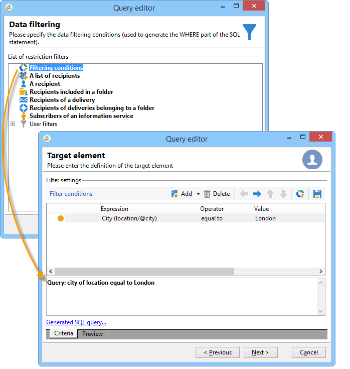

# Utföra aggregerad databearbetning {#performing-aggregate-computing}

I det här exemplet vill vi räkna antalet mottagare som bor i London enligt kön.

* Vilken tabell måste markeras?

   mottagartabellen (**nms:receive**)

* Vilka fält ska markeras i utdatakolumnen?

   Primärnyckel (med antal) och kön

* Vilka villkor baseras informationen på?

   Baserat på de mottagare som bor i London

Så här skapar du det här exemplet:

1. I **[!UICONTROL Data to extract]** definierar du ett antal för primärnyckeln (som i föregående exempel). Lägg till **[!UICONTROL Gender]** fältet i utdatakolumnen. Markera **[!UICONTROL Group]** alternativet i **[!UICONTROL Gender]** kolumnen. På så sätt grupperas mottagarna efter kön.

   

1. I **[!UICONTROL Sorting]** fönstret klickar du på **[!UICONTROL Next]**: ingen sortering behövs här.
1. Konfigurera datafiltrering. Här vill du begränsa urvalet till kontakter som bor i London.

   

   >[!NOTE]
   >
   >Värdena är skiftlägeskänsliga. Om värdet London anges i villkoret utan versal och om listan över mottagare innehåller ordet London med stor bokstav, misslyckas frågan.

1. I **[!UICONTROL Data formatting]** fönstret klickar du på **[!UICONTROL Next]**: ingen formatering krävs för det här exemplet.
1. Klicka på i förhandsgranskningsfönstret **[!UICONTROL Launch data preview]**.

   Det finns tre olika värden för varje sortering efter kön: **2** för hondjur, **1** för hanar och **0** när kön är okänd. I det här exemplet innehåller listan 10 kvinnor, 16 män och 2 personer vars kön inte är känd.

   
