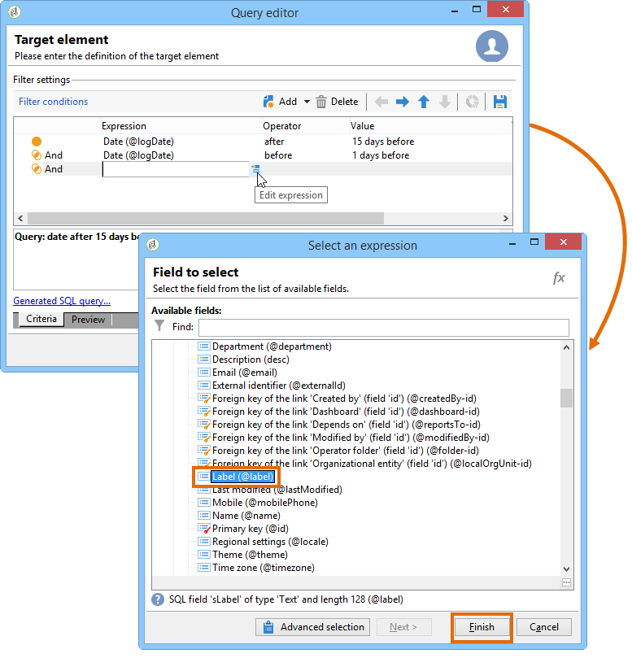

# Frågar leveransinformation {#querying-delivery-information}

## Antal klick för en viss leverans {#number-of-clicks-for-a-specific-delivery}

I det här exemplet försöker vi återställa antalet klick för en viss leverans. Dessa klick spelas in tack vare loggar för mottagarspårning som tagits under en viss period. Mottagaren identifieras via sin e-postadress. Den här frågan använder **[!UICONTROL Recipient tracking logs]** tabellen.

* Vilken tabell måste markeras?

   Loggspårningstabell för mottagare (**[!UICONTROL nms:trackingLogRcp]**)

* Fält som ska markeras för utdatakolumner?

   Primär nyckel (med antal) och e-post

* Vilka kriterier kommer informationen att filtreras baserat på?

   En viss period och ett element i leveransetiketten

Så här utför du det här exemplet:

1. Öppna **[!UICONTROL Generic query editor]** och markera **[!UICONTROL Recipient tracking logs]** schemat.

   

1. I **[!UICONTROL Data to extract]** fönstret vill vi skapa en sammanställning för att samla in information. Det gör du genom att lägga till primärnyckeln (som finns ovanför **[!UICONTROL Recipient tracking logs]** huvudelementet): Spårningsloggen utförs i det här **[!UICONTROL Primary key]** fältet. Det redigerade uttrycket kommer att vara **[!UICONTROL x=count(primary key)]**. Den länkar summan av olika spårningsloggar till en enda e-postadress.

   Så här gör du:

   * Klicka på **[!UICONTROL Add]** ikonen till höger om **[!UICONTROL Output columns]** fältet. I **[!UICONTROL Formula type]** fönstret markerar du **[!UICONTROL Edit the formula using an expression]** alternativet och klickar på **[!UICONTROL Next]**. Klicka på i **[!UICONTROL Field to select]** fönstret **[!UICONTROL Advanced selection]**.

      

   * Kör en process på sammanställningsfunktionen i **[!UICONTROL Formula type]** fönstret. Den här processen blir ett primärnyckelantal.

      Markera **[!UICONTROL Process on an aggregate function]** i **[!UICONTROL Aggregate]** avsnittet och klicka på **[!UICONTROL Count]**.

      

      Klicka **[!UICONTROL Next]**.

   * Markera **[!UICONTROL Primary key (@id)]** fältet. Utdatakolumnen är konfigurerad **[!UICONTROL count (primary key)]** .

      

1. Markera det andra fältet som ska visas i utdatakolumnen. Öppna **[!UICONTROL Available fields]** noden i **[!UICONTROL Recipient]** kolumnen och välj **[!UICONTROL Email]**. Markera **[!UICONTROL Group]** kryssrutan för **[!UICONTROL Yes]** att gruppera spårningsloggarna efter e-postadress: den här gruppen länkar varje logg till mottagaren.

   

1. Konfigurera kolumnsortering så att de mest aktiva mottagarna (med de flesta spårningsloggar) visas först. Markera **[!UICONTROL Yes]** i **[!UICONTROL Descending sort]** kolumnen.

   

1. Du måste sedan filtrera loggarna som intresserar dig, dvs. de som är yngre än två veckor och som avser försäljningsrelaterade leveranser.

   Så här gör du:

   * Konfigurera datafiltrering. Det gör du genom att markera **[!UICONTROL Filter conditions]** och sedan klicka **[!UICONTROL Next]**.

      

   * Återställ spårningsloggar under en viss period för en viss leverans. Tre filtervillkor krävs: Två datumvillkor för att fastställa söktiden mellan två veckor före dagens datum och dagen före dagens datum. och ett annat villkor som begränsar sökningen till en viss leverans.

      Konfigurera det datum som spårningsloggarna ska börja i **[!UICONTROL Target element]** fönstret. Klicka **[!UICONTROL Add]**. En villkorslinje visas. Redigera **[!UICONTROL Expression]** kolumnen genom att klicka på **[!UICONTROL Edit expression]** funktionen. Välj i **[!UICONTROL Field to select]** fönstret **[!UICONTROL Date (@logDate)]**.

      

      Välj **[!UICONTROL greater than]** operator. Klicka i **[!UICONTROL Value]** kolumnen **[!UICONTROL Edit expression]** och välj **[!UICONTROL Formula type]** i **[!UICONTROL Process on dates]** fönstret. Ange slutligen &quot;15&quot; i **[!UICONTROL Current date minus n days]** rutan.

      Klicka **[!UICONTROL Finish]**.

      

   * Om du vill välja slutdatum för spårningsloggssökning skapar du ett andra villkor genom att klicka på **[!UICONTROL Add]**. Välj **[!UICONTROL Expression]** igen i **[!UICONTROL Date (@logDate)]** kolumnen.

      Välj **[!UICONTROL less than]** operator. Klicka i **[!UICONTROL Value]** kolumnen **[!UICONTROL Edit expression]**. Gå till **[!UICONTROL Formula type]** fönstret och skriv &quot;1&quot; i **[!UICONTROL Current date minus n days]**.

      Klicka **[!UICONTROL Finish]**.

      

      Nu vill vi konfigurera det tredje filtervillkoret, dvs. den leveransetikett som vår fråga gäller.

   * Klicka på **[!UICONTROL Add]** funktionen för att skapa ett annat filtervillkor. Klicka i **[!UICONTROL Expression]** kolumnen **[!UICONTROL Edit expression]**. I **[!UICONTROL Field to select]** fönstret väljer du **[!UICONTROL Label]** i **[!UICONTROL Delivery]** noden.

      Klicka **[!UICONTROL Finish]**.

      

      Sök efter en leverans som innehåller ordet&quot;försäljning&quot;. Eftersom du inte kommer ihåg den exakta etiketten kan du välja **[!UICONTROL contains]** operator och ange&quot;försäljning&quot; i **[!UICONTROL Value]** kolumnen.

      

1. Klicka **[!UICONTROL Next]** tills du kommer till **[!UICONTROL Data preview]** fönstret: ingen formatering behövs här.
1. I **[!UICONTROL Data preview]** fönstret klickar du **[!UICONTROL Start the preview of the data]** för att visa antalet spårningsloggar för varje leveransmottagare.

   Resultatet visas i fallande ordning.

   

   Det högsta antalet loggar för en användare är 6 för den här leveransen. 5 olika användare öppnade e-postmeddelandet eller klickade på någon av länkarna i e-postmeddelandet.

## Mottagare som inte har öppnat någon leverans {#recipients-who-did-not-open-any-delivery}

I det här exemplet vill vi filtrera mottagare som inte har öppnat ett e-postmeddelande de senaste 7 dagarna.

Så här skapar du det här exemplet:

1. Dra och släpp en **[!UICONTROL Query]** aktivitet i ett arbetsflöde och öppna aktiviteten.
1. Klicka **[!UICONTROL Edit query]** och ange mål- och filtreringsdimensioner till **[!UICONTROL Recipients]**.

   

1. Markera **[!UICONTROL Filtering conditions]** och klicka sedan **[!UICONTROL Next]**.
1. Klicka på **[!UICONTROL Add]** knappen och välj **[!UICONTROL Tracking logs]**.
1. Ställ in **[!UICONTROL Operator]** uttrycket till **[!UICONTROL Tracking logs]** **[!UICONTROL Do not exist such as]**.

   

1. Lägg till ett annat uttryck. Välj **[!UICONTROL Type]** i **[!UICONTROL URL]** kategorin.
1. Ställ sedan in dess **[!UICONTROL Operator]** till **[!UICONTROL equal to]** och dess **[!UICONTROL Value]** till **[!UICONTROL Open]**.

   

1. Lägg till ytterligare ett uttryck och välj **[!UICONTROL Date]**. **[!UICONTROL Operator]** ska anges till **[!UICONTROL on or after]**.

   

1. Om du vill ange värdet för de senaste 7 dagarna klickar du på **[!UICONTROL Edit expression]** knappen i **[!UICONTROL Value]** fältet.
1. Välj **[!UICONTROL Function]** och lägg till det antal dagar du vill ha som mål i **[!UICONTROL Current date minus n days]** kategorin. Här vill vi rikta in oss på de senaste 7 dagarna.

   

Din utgående övergång kommer att innehålla mottagare som inte öppnat ett e-postmeddelande de senaste 7 dagarna.

Om du däremot vill filtrera mottagare som har öppnat minst ett e-postmeddelande bör frågan vara som följer. Observera att i det här fallet ska **[!UICONTROL Filtering dimension]** inställningen vara **[!UICONTROL Tracking logs (Recipients)]**.

## Mottagare som har öppnat en leverans {#recipients-who-have-opened-a-delivery}

I följande exempel visas hur man riktar sig till profiler som har öppnat en leverans de senaste två veckorna:

1. Om du vill ha målprofiler som har öppnat en leverans måste du använda spårningsloggar. De lagras i en länkad tabell: börja med att välja den här tabellen i listrutan i **[!UICONTROL Filtering dimension]** fältet, som visas nedan:

   

1. När det gäller filtreringsvillkor klickar du på **[!UICONTROL Edit expression]** ikonen för de villkor som visas i spårningsloggarnas underträdstruktur. Markera **[!UICONTROL Date]** fältet.

   

   Bekräfta valet genom **[!UICONTROL Finish]** att klicka.

   Om du bara vill återställa spårningsloggarna som är mindre än två veckor gamla väljer du **[!UICONTROL Greater than]** operatorn.

   

   Klicka sedan på **[!UICONTROL Edit expression]** ikonen i **[!UICONTROL Value]** kolumnen för att definiera beräkningsformeln som ska användas. Markera **[!UICONTROL Current date minus n days]** formeln och ange 15 i det relaterade fältet.

   

   Klicka på formelfönstrets **[!UICONTROL Finish]** knapp. I filtreringsfönstret klickar du på **[!UICONTROL Preview]** fliken för att kontrollera målinriktningskriterierna.

   

## Filtrera mottagarnas beteende efter en leverans {#filtering-recipients--behavior-folllowing-a-delivery}

I ett arbetsflöde kan du välja ett beteende efter en tidigare leverans i rutorna **[!UICONTROL Query]** och **[!UICONTROL Split]** . Detta val görs via **[!UICONTROL Delivery recipient]** filtret.

* Syfte med exemplet

   I ett leveransarbetsflöde finns det flera sätt att följa upp en första e-postkommunikation. Den här typen av åtgärd innebär att du använder **[!UICONTROL Split]** rutan.

* Kontext

   Sommarsportserbjudandet skickas ut. Fyra dagar efter leveransen skickas två andra leveranser. Ett av dem är &quot;vattensporterbjudande&quot;, det andra är en uppföljning av det första &quot;Sommarsportserbjudandet&quot;.

   Leveransen av&quot;vattensporterbjudandet&quot; skickas till mottagare som klickade på länken&quot;vattensporter&quot; vid första leveransen. Dessa klick visar att mottagaren är intresserad av ämnet. Det är rimligt att styra dem mot liknande erbjudanden. Mottagare som inte klickade i &quot;Sommarsportserbjudandet&quot; kommer dock att få samma innehåll igen.

I följande steg visas hur du konfigurerar **[!UICONTROL Split]** rutan genom att integrera två olika beteenden:

1. Infoga **[!UICONTROL Split]** rutan i arbetsflödet. I den här rutan delas mottagarna av den första leveransen upp i de två följande leveranserna. Uppdelningen görs utifrån de filtervillkor som är kopplade till mottagarens beteende under den första leveransen.

   

1. Öppna **[!UICONTROL Split]** lådan. Ange en etikett på **[!UICONTROL General]** fliken: Dela **baserat på beteende** , till exempel.

   

1. Definiera den första delade grenen på **[!UICONTROL Subsets]** fliken. Ange till exempel etiketten **Klickad** för den här grenen.
1. Välj **[!UICONTROL Add a filtering condition on the incoming population]** alternativet. Klicka **[!UICONTROL Edit]**.
1. Dubbelklicka på **[!UICONTROL Targeting and filtering dimension]** filtret i **[!UICONTROL Recipients of a delivery]** fönstret.

   

1. I **[!UICONTROL Target element]** fönstret väljer du det beteende som du vill använda för den här grenen: **[!UICONTROL Recipients having clicked (email)]**.

   Välj **[!UICONTROL Delivery specified by the transition]** alternativet nedan. Den här funktionen återställer automatiskt de personer som ska användas vid den första leveransen.

   Det här är erbjudandet om vattensporter.

   

1. Definiera den andra grenen. Den här grenen kommer att innehålla uppföljningsmejl med samma innehåll som den första leveransen. Gå till **[!UICONTROL Subsets]** fliken och klicka för **[!UICONTROL Add]** att skapa den.

   

1. En annan underflik visas. Ge den namnet&quot;**Klick** inte&quot;.
1. Klicka **[!UICONTROL Add a filtering condition for the incoming population]**. Klicka sedan på **[!UICONTROL Edit...]**.

   

1. Klicka **[!UICONTROL Delivery recipients]** i **[!UICONTROL Targeting and filtering dimension]** fönstret.
1. Markera **[!UICONTROL Target element]** beteendet i **[!UICONTROL Recipients who did not click (email)]** fönstret. Välj det **[!UICONTROL Delivery specified by the transition]** alternativ som visas för den sista grenen.

   Rutan är nu **[!UICONTROL Split]** helt konfigurerad.

   

Nedan finns en lista över de olika komponenter som konfigurerats som standard:

* **[!UICONTROL All recipients]**
* **[!UICONTROL Recipients of successfully sent messages,]**
* **[!UICONTROL Recipients who opened or clicked (email),]**
* **[!UICONTROL Recipients who clicked (email),]**
* **[!UICONTROL Recipients of a failed message,]**
* **[!UICONTROL Recipients who didn't open or click (email),]**
* **[!UICONTROL Recipients who didn't click (email).]**

   
