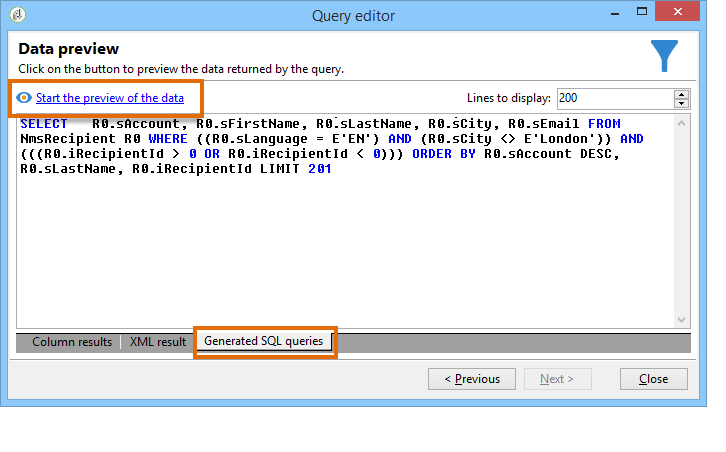

# Frågar mottagartabellen {#querying-recipient-table}

I det här exemplet vill vi återskapa namn och e-post för mottagare vars e-postdomän är orange.co.uk och som inte bor i London.

* Vilken tabell ska vi välja?

   mottagartabellen (nms:mottagare)

* Fält som ska markeras som utdatakolumner

   E-post, namn, ort och kontonummer

* Vilka filtervillkor har mottagarna?

   stad- och e-postdomän

* Är en sortering konfigurerad?

   Ja, baserat på **[!UICONTROL Account number]** och **[!UICONTROL Last name]**

Så här skapar du det här exemplet:

1. Klicka på **[!UICONTROL Tools > Generic query editor...]** och välj tabellen **Mottagare** (**nms:mottagare**). Klicka sedan på **[!UICONTROL Next]**.
1. Välj: **[!UICONTROL Last name]**, **[!UICONTROL First name]**, **[!UICONTROL Email]**, **[!UICONTROL City]** och **[!UICONTROL Account number]**. Dessa fält läggs till i **[!UICONTROL Output columns]**. Klicka sedan på **[!UICONTROL Next]**.

   

1. Sortera kolumnerna så att de visas i rätt ordning. Här vill vi sortera kontonummer i fallande ordning och namn i alfabetisk ordning. Klicka sedan på **[!UICONTROL Next]**.

   

1. Förfina sökningen i **[!UICONTROL Data filtering]** fönstret: välj **[!UICONTROL Filtering conditions]** och klicka **[!UICONTROL Next]**.
1. I **[!UICONTROL Target element]** fönstret kan du ange filterinställningarna.

   Definiera följande filtervillkor: mottagare med en e-postdomän som är lika med &quot;orange.co.uk&quot;. Det gör du genom att välja **E-postdomän (@email)** i **[!UICONTROL Expression]** -kolumnen, välja **lika med** i **[!UICONTROL Operator]** kolumnen och ange &quot;orange.co.uk&quot; i **[!UICONTROL Value]** -kolumnen.

   

1. Om det behövs klickar du på **[!UICONTROL Distribution of values]** knappen för att visa en distribution baserat på e-postdomänen för potentiella kunder. Det finns en procentandel tillgänglig för varje e-postdomän i databasen. Andra domäner än &quot;orange.co.uk&quot; visas tills filtret tillämpas.

   En sammanfattning av frågan visas längst ned i fönstret: E- **postdomänen är lika med orange.co.uk**.

1. Klicka på **[!UICONTROL Preview]** för att få en uppfattning om frågeresultatet: Endast e-postdomäner med namnet&quot;orange.co.uk&quot; visas.

   

1. Vi kommer nu att ändra frågan för att hitta kontakter som inte bor i London.

   Markera **[!UICONTROL City (location/@city)]** i **[!UICONTROL Expression]** kolumnen **[!UICONTROL different from]** som operator och ange **[!UICONTROL London]** i **[!UICONTROL Value]** kolumnen.

   

1. Du kommer nu till **[!UICONTROL Data formatting]** fönstret. Kontrollera kolumnordningen. Flytta kolumnen&quot;Ort&quot; uppåt under kolumnen&quot;Kontonummer&quot;.

   Avmarkera kolumnen Förnamn om du vill ta bort den från listan.

   

1. Klicka på i **[!UICONTROL Data preview]** fönstret **[!UICONTROL Start the preview of the data]**. Den här funktionen beräknar resultatet av frågan.

   På fliken **[!UICONTROL Column results]** visas frågeresultatet i kolumner.

   Resultatet visar alla mottagare med e-postdomänen&quot;orange.co.uk&quot; som inte bor i London. Kolumnen &quot;Förnamn&quot; visas inte eftersom den avmarkerades under föregående steg. Kontonummer sorteras i fallande ordning.

   

   På fliken **[!UICONTROL XML result]** visas resultatet i XML-format.

   

   På fliken **[!UICONTROL Generated QSL queries]** visas frågeresultatet i SQL-format.

   
