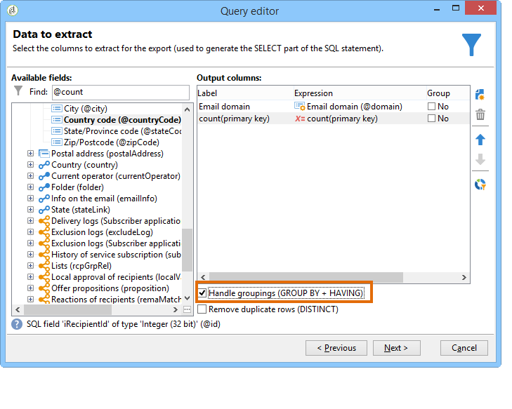

# Fråga med grupperingshantering {#querying-using-grouping-management}

I det här exemplet vill vi köra en fråga för att hitta alla e-postdomäner som är riktade över 30 gånger under tidigare leveranser.

* Vilken tabell måste markeras?

  Mottagartabellen (nms:recipient)

* Fält som ska markeras i utdatakolumner?

  E-postdomän och primärnyckel (med antal)

* Datagruppering?

  Baserat på en e-postdomän med ett antal primärnycklar över 30. Den här åtgärden utförs med alternativet **[!UICONTROL Group by + Having]**. Med **[!UICONTROL Group by + Having]** kan du gruppera data (&quot;gruppera efter&quot;) och göra en markering av det som grupperats (&quot;har&quot;).

Så här skapar du det här exemplet:

1. Öppna **[!UICONTROL Generic query editor]** och välj mottagartabellen (**nms:recipient**).

   

1. Markera fälten **[!UICONTROL Data to extract]** och **[!UICONTROL Email domain]** i fönstret **[!UICONTROL Primary key]**. Kör ett antal i fältet **[!UICONTROL Primary key]**.

   Mer information om antalet primärnycklar finns i [det här avsnittet](../../platform/using/about-queries-in-campaign.md).

1. Markera rutan **[!UICONTROL Handle groupings (GROUP BY + HAVING)]**.

   

1. Sortera e-postdomäner i fallande ordning i fönstret **[!UICONTROL Sorting]**. Det gör du genom att kontrollera **[!UICONTROL Yes]** i kolumnen **[!UICONTROL Descending sort]**. Klicka på **[!UICONTROL Next]**.

   

1. I **[!UICONTROL Data filtering]** väljer du **[!UICONTROL Filtering conditions]**. Gå till fönstret **[!UICONTROL Target elements]** och klicka på **[!UICONTROL Next]**.
1. I fönstret **[!UICONTROL Data grouping]** väljer du **[!UICONTROL Email domain]** genom att klicka på **[!UICONTROL Add]**.

   Det här fönstret för datagruppering visas bara om rutan **[!UICONTROL Handle groupings (GROUP BY + HAVING])** är markerad.

   

1. I fönstret **[!UICONTROL Grouping condition]** anger du ett antal primärnycklar som är större än 30 eftersom vi bara vill att e-postdomäner som är avsedda mer än 30 gånger ska returneras som resultat.

   Det här fönstret visas när rutan **[!UICONTROL Manage groupings (GROUP BY + HAVING)]** är markerad: det är här grupperingsresultatet filtreras (HAVING).

   

1. Klicka på **[!UICONTROL Data formatting]** i fönstret **[!UICONTROL Next]**: ingen formatering behövs här.
1. Klicka på **[!UICONTROL Launch data preview]** i förhandsgranskningsfönstret för data: här returneras tre olika e-postdomäner som är riktade över 30 gånger.

   
