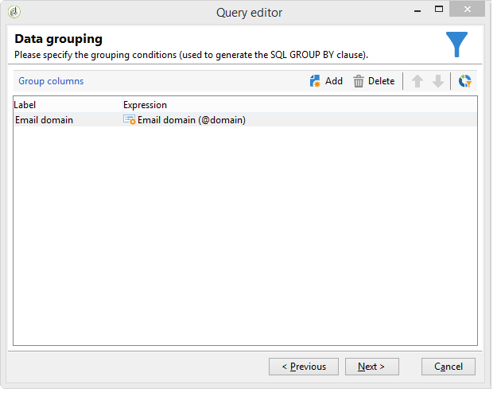

# Fråga med grupperingshantering {#querying-using-grouping-management}

I det här exemplet vill vi köra en fråga för att hitta alla e-postdomäner som är riktade över 30 gånger under tidigare leveranser.

* Vilken tabell måste markeras?

   mottagartabellen (nms:mottagare)

* Fält som ska markeras i utdatakolumner?

   E-postdomän och primärnyckel (med antal)

* Datagruppering?

   Baserat på en e-postdomän med ett antal primärnycklar över 30. Denna operation genomförs med **[!UICONTROL Group by + Having]** valmöjlighet. **[!UICONTROL Group by + Having]** I kan du gruppera data (&quot;gruppera efter&quot;) och göra en markering av grupperade data (&quot;ha&quot;).

Så här skapar du det här exemplet:

1. Öppna **[!UICONTROL Generic query editor]** och välj mottagartabellen (**nms:mottagare**).

   

1. I **[!UICONTROL Data to extract]** fönstret markerar du fälten **[!UICONTROL Email domain]** och **[!UICONTROL Primary key]** . Räkna med **[!UICONTROL Primary key]** fältet.

   Mer information om antalet primärnycklar finns i [det här avsnittet](../../platform/using/defining-filter-conditions.md#building-expressions).

1. Markera **[!UICONTROL Handle groupings (GROUP BY + HAVING)]** rutan.

   

1. Sortera e-postdomäner i fallande ordning i fönstret.. **[!UICONTROL Sorting]** Det gör du genom att markera **[!UICONTROL Yes]** i **[!UICONTROL Descending sort]** kolumnen. Klicka på **[!UICONTROL Next]**.

   

1. I **[!UICONTROL Data filtering]** väljer du **[!UICONTROL Filtering conditions]**. Gå till **[!UICONTROL Target elements]** fönstret och klicka **[!UICONTROL Next]**.
1. I **[!UICONTROL Data grouping]** fönstret markerar du **[!UICONTROL Email domain]** genom att klicka **[!UICONTROL Add]**.

   Det här fönstret för datagruppering visas bara om rutan **[!UICONTROL Handle groupings (GROUP BY + HAVING]**) är markerad.

   

1. I **[!UICONTROL Grouping condition]** fönstret anger du ett primärnyckelantal som är större än 30 eftersom vi bara vill att e-postdomäner som är avsedda mer än 30 gånger ska returneras som resultat.

   Fönstret visas när **[!UICONTROL Manage groupings (GROUP BY + HAVING)]** rutan har markerats: Det är här grupperingsresultatet filtreras (HAVING).

   

1. I **[!UICONTROL Data formatting]** fönstret klickar du på **[!UICONTROL Next]**: ingen formatering behövs här.
1. Klicka på **[!UICONTROL Launch data preview]**: Här returneras tre olika e-postdomäner som är riktade över 30 gånger.

   
