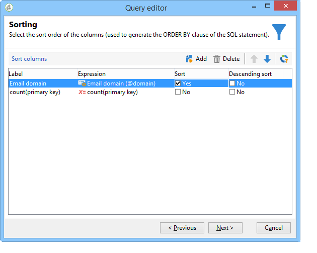
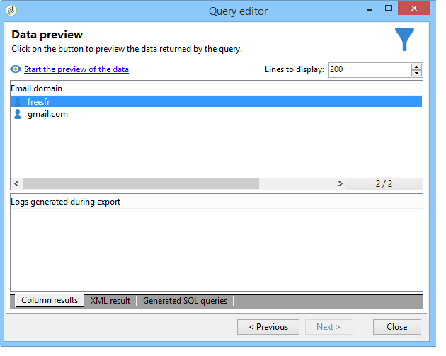

# Fråga med grupperingshantering {#querying-using-grouping-management}

I det här exemplet vill vi köra en fråga för att hitta alla e-postdomäner som är riktade över 30 gånger under tidigare leveranser.

* Vilken tabell måste markeras?

  mottagartabellen (nms:mottagare)

* Fält som ska markeras i utdatakolumner?

  E-postdomän och primärnyckel (med antal)

* Datagruppering?

  Baserat på en e-postdomän med ett antal primärnycklar över 30. Denna operation genomförs med **[!UICONTROL Group by + Having]** alternativ. **[!UICONTROL Group by + Having]** I kan du gruppera data (&quot;gruppera efter&quot;) och göra en markering av grupperade data (&quot;ha&quot;).

Så här skapar du det här exemplet:

1. Öppna **[!UICONTROL Generic query editor]** och välj mottagartabellen (**nms:mottagare**).

   

1. I **[!UICONTROL Data to extract]** väljer du **[!UICONTROL Email domain]** och **[!UICONTROL Primary key]** fält. Räkna med **[!UICONTROL Primary key]** fält.

   Mer information om antalet primärnycklar finns i [det här avsnittet](../../platform/using/defining-filter-conditions.md#building-expressions).

1. Kontrollera **[!UICONTROL Handle groupings (GROUP BY + HAVING)]** box.

   

1. I **[!UICONTROL Sorting]** -fönster, sortera e-postdomäner i fallande ordning. Om du vill göra det markerar du **[!UICONTROL Yes]** i **[!UICONTROL Descending sort]** kolumn. Klicka på **[!UICONTROL Next]**.

   

1. I **[!UICONTROL Data filtering]**, markera **[!UICONTROL Filtering conditions]**. Gå till **[!UICONTROL Target elements]** fönster och klicka **[!UICONTROL Next]**.
1. I **[!UICONTROL Data grouping]** väljer du **[!UICONTROL Email domain]** genom att klicka **[!UICONTROL Add]**.

   Det här fönstret för datagruppering visas bara om **[!UICONTROL Handle groupings (GROUP BY + HAVING]**) har markerats.

   

1. I **[!UICONTROL Grouping condition]** anger du ett primärnyckelantal som är större än 30 eftersom vi bara vill att e-postdomäner som är avsedda mer än 30 gånger ska returneras som resultat.

   Det här fönstret visas när **[!UICONTROL Manage groupings (GROUP BY + HAVING)]** -rutan har markerats: det är här grupperingsresultatet filtreras (HAVING).

   

1. I **[!UICONTROL Data formatting]** fönster, klicka **[!UICONTROL Next]**: ingen formatering behövs här.
1. Klicka på **[!UICONTROL Launch data preview]**: här returneras tre olika e-postdomäner som är riktade över 30 gånger.

   
