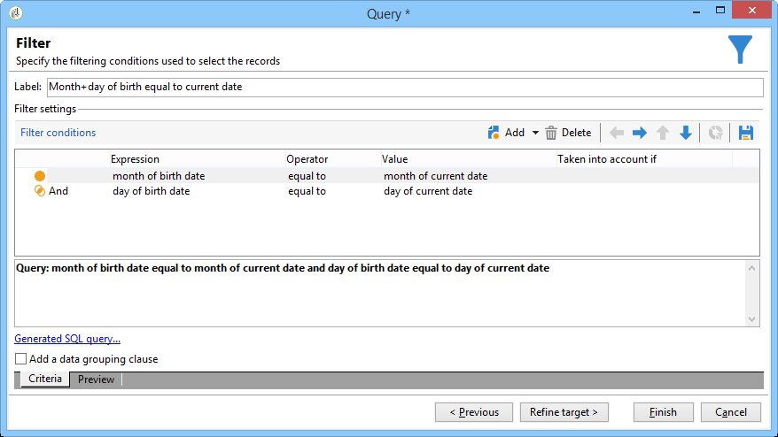

# Skicka ett födelsedagsmeddelande{#sending-a-birthday-email}

## Introduktion {#introduction}

I det här användningsexemplet visas hur du planerar att skicka ett återkommande e-postmeddelande till en lista över mottagare på dagen för deras födelsedag.

Vi har skapat följande arbetsflöde för målinriktning för att konfigurera det här användningsexemplet:


Det här arbetsflödet (daglig körning) markerar alla mottagare som har sin födelsedag det aktuella datumet.

Det här användningsexemplet finns också i form av en video. Mer information finns i videon [Skapa ett arbetsflöde](https://docs.campaign.adobe.com/doc/AC/en/Videos/Videos.html) .

Det gör du genom att skapa en kampanj och klicka på **[!UICONTROL Targeting and workflows]** fliken. Mer information finns i avsnittet [Skapa huvudmålet i ett arbetsflöde](../../campaign/using/marketing-campaign-deliveries.md#building-the-main-target-in-a-workflow) .

Följ sedan dessa steg:

## Schemalägga sändning {#configuring-the-scheduler}

1. Lägg först till en **schemaläggare** som utlöser sändning varje dag. I exemplet nedan skapas leveransen varje dag kl. 6.00.

   


## Identifiera mottagare vars födelsedag det är {#identifying-recipients-whose-birthday-it-is}

När du har konfigurerat aktiviteten så att arbetsflödet startar varje dag identifierar du alla mottagare vars födelsedatum är lika med det aktuella datumet. **[!UICONTROL Scheduler]**

Gör så här:

1. Dra och släpp en **[!UICONTROL Query]** aktivitet i arbetsflödet och dubbelklicka på den.
1. Klicka på länken **Redigera fråga** och välj **[!UICONTROL Filtering conditions]**.

   

1. Klicka på den första cellen i **[!UICONTROL Expression]** kolumnen och klicka **[!UICONTROL Edit expression]** för att öppna uttrycksredigeraren.

   

1. Klicka **[!UICONTROL Advanced selection]** för att välja filtreringsläge.

   

1. Markera **[!UICONTROL Edit the formula using an expression]** och klicka **[!UICONTROL Next]** för att visa uttrycksredigeraren.
1. Dubbelklicka i listan med funktioner **[!UICONTROL Day]** som du kommer åt via **[!UICONTROL Date]** noden. Den här funktionen returnerar talet som representerar dagen som motsvarar datumet som skickades som en parameter.

   

1. Dubbelklicka i listan med tillgängliga fält **[!UICONTROL Birth date]**. I den övre delen av redigeraren visas sedan följande formel:

   ```
   Day(@birthDate)
   ```

   Bekräfta genom **[!UICONTROL Finish]** att klicka.

1. I frågeredigeraren väljer du i den första cellen i **[!UICONTROL Operator]** kolumnen **[!UICONTROL equal to]**.

   

1. Klicka sedan på den första cellen i den andra kolumnen (**[!UICONTROL Value]**) och klicka på **[!UICONTROL Edit expression]** för att öppna uttrycksredigeraren.
1. Dubbelklicka i listan med funktioner **[!UICONTROL Day]** som du kommer åt via **[!UICONTROL Date]** noden.
1. Dubbelklicka på **[!UICONTROL GetDate]** funktionen för att hämta aktuellt datum.

   

   I den övre delen av redigeraren visas följande formel:

   ```
   Day(GetDate())
   ```

   Bekräfta genom **[!UICONTROL Finish]** att klicka.

1. Upprepa den här proceduren för att hämta födelsemånaden som motsvarar den aktuella månaden. Det gör du genom att klicka på **[!UICONTROL Add]** knappen och upprepa steg 3 till 10 och ersätta **[!UICONTROL Day]** med **[!UICONTROL Month]**.

   Den fullständiga frågan är följande:

   

Länka resultatet av **[!UICONTROL Query]** aktiviteten till en **[!UICONTROL Email delivery]** aktivitet för att skicka ett e-postmeddelande till listan över alla dina mottagare på deras födelsedag.

## Inklusive mottagare födda den 29 februari (valfritt) {#including-recipients-born-on-february-29th--optional-}

Om du vill inkludera alla mottagare som föddes den 29 februari visar det här användningsexemplet hur du planerar att skicka ett återkommande e-postmeddelande till en lista med mottagare för deras födelsedag, oavsett om det är ett skottår eller inte.

De viktigaste implementeringsstegen för det här användningsexemplet är:

* Välja mottagare
* Välj om det är ett skottår eller inte
* Välja mottagare födda den 29 februari

Vi har skapat följande arbetsflöde för målinriktning för att konfigurera det här användningsexemplet:


Om det aktuella året inte **är ett skottår** och arbetsflödet körs den 1 mars måste vi markera alla mottagare som skulle ha haft sin födelsedag i går (29 februari) och lägga till dem i mottagarlistan. I alla andra fall krävs ingen ytterligare åtgärd.

### Steg 1: Välja mottagare {#step-1--selecting-the-recipients}

När du har konfigurerat aktiviteten så att arbetsflödet startar varje dag, identifierar du alla mottagare vars årsdag är den aktuella dagen. **[!UICONTROL Scheduler]**

>[!NOTE]
>
>Om det aktuella året är ett skottår inkluderas automatiskt alla mottagare som är födda den 29 februari.



Väljer mottagare vars födelsedag motsvarar det aktuella datumet visas i avsnittet [Identifiera mottagare vars födelsedag det är](#identifying-recipients-whose-birthday-it-is) .

### Steg 2: Välj om det är ett skottår eller inte {#step-2--select-whether-or-not-it-is-a-leap-year}

Med hjälp av aktiviteten kan du kontrollera om det är ett skottår eller inte och om det aktuella datumet är den 1 mars. **[!UICONTROL Test]**

Om testet verifieras (året är inte ett skottår - det finns ingen 29 februari - och det aktuella datumet är den 1 mars) aktiveras övergången och de mottagare som är födda den 29 februari läggs till den första mars. **[!UICONTROL True]** Annars är övergången aktiverad och endast de mottagare som är födda på det aktuella datumet kommer att få leveransen. **[!UICONTROL False]**

Kopiera och klistra in koden nedan i **[!UICONTROL Initialization script]** avsnittet på **[!UICONTROL Advanced]** fliken.

```
function isLeapYear(iYear)
{
    if(iYear/4 == Math.floor(iYear/4))
    {
        if(iYear/100 != Math.floor(iYear/100))
        {
            // Divisible by 4 only -> Leap Year
            return 1;
        }
        else
        {
            if(iYear/400 == Math.floor(iYear/400))
            {
                // Divisible by 4, 100 and 400 -> Leap year
                return 1;
            }
        }
    }
    // all others: no leap year
    return 0;
}

// Return today's date and time
var currentTime = new Date()
// returns the month (from 0 to 11)
var month = currentTime.getMonth() + 1
// returns the day of the month (from 1 to 31)
var day = currentTime.getDate()
// returns the year (four digits)
var year = currentTime.getFullYear()

// is current year a leap year?
vars.currentIsALeapYear = isLeapYear(year);

// is current date the first of march?
if(month == 3 && day == 1) {
  // today is 1st of march
vars.firstOfMarch = 1;
}
```


Lägg till följande villkor i **[!UICONTROL Conditional forks]** avsnittet:

```
vars.currentIsALeapYear == 0 && vars.firstOfMarch == 1
```


### Steg 3: Markera alla mottagare som är födda den 29 februari {#step-3--select-any-recipients-born-on-february-29th}

Skapa en **[!UICONTROL Fork]** aktivitet och länka en av de utgående övergångarna till en **[!UICONTROL Query]** aktivitet.

I den här frågan väljer du alla mottagare vars födelsedatum är den 29 februari.


Kombinera resultaten med en **[!UICONTROL Union]** aktivitet.

Länka resultaten från de två **[!UICONTROL Test]** aktivitetsgrenarna till en **[!UICONTROL Email delivery]** aktivitet för att skicka ett e-postmeddelande till listan över alla dina mottagare på deras födelsedag, även till dem som är födda den 29 februari under ett år utan hopp.

## Skapa en återkommande leverans {#creating-a-recurring-delivery-in-a-targeting-workflow}

Lägg till en **återkommande leveransaktivitet** baserat på e-postmallen för födelsedag som du vill skicka.

>[!CAUTION]
>
>För att arbetsflödena ska kunna köras måste de tekniska arbetsflödena för kampanjprocessen startas. Mer information finns i avsnittet [Lista över arbetsflöden](../../workflow/using/campaign.md) för kampanjprocesser.
>
>Om godkännandestegen är aktiverade för kampanjen skickas leveranserna först när dessa steg har bekräftats. Mer information finns i avsnittet [Välja de processer som ska godkännas](../../campaign/using/marketing-campaign-approval.md#choosing-the-processes-to-be-approved) .


