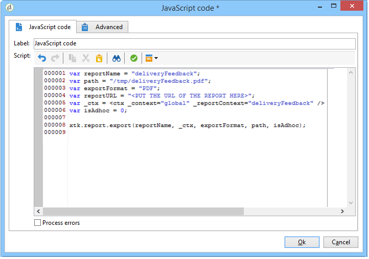

# Skicka en rapport till en lista{#sending-a-report-to-a-list}

Här finns information om hur du genererar en färdig månadsrapport **[!UICONTROL Tracking indicators]** i PDF-format och hur du skickar den till en lista med mottagare.


De viktigaste implementeringsstegen för det här användningsexemplet är:

* Skapa en lista över mottagare som ska ta emot leveransen (se: [Steg 1: Skapar mottagarlistan](#step-1--creating-the-recipient-list)).
* Skapa en leveransmall som gör att du kan generera en ny leverans varje gång arbetsflödet körs (se: [Steg 2: Skapar leveransmallen](#step-2--creating-the-delivery-template)).
* Skapa ett arbetsflöde som gör att du kan generera rapporten i PDF-format och skicka den till listan över mottagare (se: [Steg 3: Skapa arbetsflödet](#step-3--creating-the-workflow)).

## Steg 1: Skapa mottagarlistan {#step-1--creating-the-recipient-list}

Gå till **[!UICONTROL Profiles and targets]** universum, klicka på **[!UICONTROL Lists]** länken och sedan på **[!UICONTROL Create]** knappen. Välj **[!UICONTROL New list]** och skapa en ny mottagarlista för rapporten som ska skickas till.


Mer information om hur du skapar listor finns i det här [avsnittet](../../platform/using/creating-and-managing-lists.md).

## Steg 2: Skapa leveransmallen {#step-2--creating-the-delivery-template}

1. Gå till noden **[!UICONTROL Resources > Templates > Delivery templates]** i Adobe Campaign Explorer och duplicera mallen **[!UICONTROL Email delivery]** som är färdig.

   

   Mer information om hur du skapar en leveransmall finns i det här [avsnittet](../../delivery/using/about-templates.md).

1. Ange de olika mallparametrarna: label, target (the list of earlier eived), subject and content.

   

1. Varje gång arbetsflödet körs uppdateras **[!UICONTROL Tracking indicators]** rapporten (se [steg 3: Skapa arbetsflödet](#step-3--creating-the-workflow)). Om du vill inkludera den senaste versionen av rapporten i leveransen måste du lägga till en **[!UICONTROL Calculated attachment]**:

   Mer information om hur du skapar en beräknad bilaga finns i det här [avsnittet](../../delivery/using/attaching-files.md#creating-a-calculated-attachment).

   * Klicka på **[!UICONTROL Attachments]** länken, klicka **[!UICONTROL Add]** och välj sedan **[!UICONTROL Calculated attachment]**.

      

   * Gå till **[!UICONTROL Type]** fältet och välj det fjärde alternativet: **[!UICONTROL File name is computed during delivery of each message (it may then depend on the recipient profile)]**.

      

      Värdet som anges i **[!UICONTROL Label]** fältet visas inte i den slutliga leveransen.

   * Gå till redigeringszonen och ange filens åtkomstsökväg och namn.

      

      >[!CAUTION]
      >
      >Filen måste finnas på servern. Sökvägen och namnet måste vara identiska med de som anges i arbetsflödets **[!UICONTROL JavaScript code]** typaktivitet (se: [Steg 3: Skapa arbetsflödet](#step-3--creating-the-workflow)).

   * Markera **[!UICONTROL Advanced]** fliken och markera **[!UICONTROL Script the name of the file name displayed in the mails sent]**. Gå till redigeringszonen och ange det namn du vill ge den bifogade filen i den slutliga leveransen.

      

## Steg 3: Skapa arbetsflödet {#step-3--creating-the-workflow}

Följande arbetsflöde skapades för det här användningsfallet. Den har tre verksamheter:

* En **[!UICONTROL Scheduler]** typaktivitet som gör att du kan köra arbetsflödet en gång i månaden
* En **[!UICONTROL JavaScript code]** typaktivitet som gör att du kan generera rapporten i PDF-format,
* en **[!UICONTROL Delivery]** typaktivitet som använder den leveransmall som skapades tidigare.


1. Gå till **[!UICONTROL Administration > Production > Technical workflows]** noden och skapa ett nytt arbetsflöde.

   

1. Börja med att lägga till en **[!UICONTROL Scheduler]** typaktivitet och konfigurera den så att arbetsflödet körs den första måndagen i månaden.

   

   Mer information om hur du konfigurerar schemaläggaren finns i [Schemaläggaren](../../workflow/using/scheduler.md).

1. Lägg sedan till en **[!UICONTROL JavaScript code]** typaktivitet.

   

   Ange följande kod i redigeringszonen:

   ```
   var reportName = "deliveryFeedback";
   var path = "/tmp/deliveryFeedback.pdf";
   var exportFormat = "PDF";
   var reportURL = "<PUT THE URL OF THE REPORT HERE>";
   var _ctx = <ctx _context="global" _reportContext="deliveryFeedback" />
   var isAdhoc = 0;
   
   xtk.report.export(reportName, _ctx, exportFormat, path, isAdhoc);
   ```

   Följande variabler används:

   * **var reportName**: Ange rapportens interna namn med citattecken. I det här fallet är det interna namnet på **spårningsindikatorrapporten** &quot;deliveryFeedback&quot;.
   * **var path**: Ange filens sparningssökväg (&quot;tmp/files/&quot;), det namn du vill ge filen (&quot;deliveryFeedback&quot;) och filnamnstillägget (&quot;.pdf&quot;). I det här fallet har vi använt det interna namnet som filnamn. Värdena måste vara mellan dubbla citattecken och avgränsade med plustecknet (+).

      >[!CAUTION]
      >
      >Filen måste sparas på servern. Du måste ange samma sökväg och samma namn på fliken **[!UICONTROL General]** i redigeringsfönstret för den beräknade bilagan (se: [Steg 2: Skapar leveransmallen](#step-2--creating-the-delivery-template)).

   * **var exportFormat**: Ange filens exportformat (&quot;PDF&quot;).
   * **var _ctx** (kontext): I det här fallet använder vi rapporten i sitt globala sammanhang **[!UICONTROL Tracking indicators]** .

1. Slutför genom att lägga till en **[!UICONTROL Delivery]** typaktivitet med följande alternativ:

   * **[!UICONTROL Delivery]**: välj **[!UICONTROL New, created from a template]** och välj den leveransmall som skapades tidigare.
   * För **[!UICONTROL Recipients]** - och **[!UICONTROL Content]** -fälten väljer du **[!UICONTROL Specified in the delivery]**.
   * **[!UICONTROL Action to execute]**: välj **[!UICONTROL Prepare and start]**.
   * Avmarkera **[!UICONTROL Generate an outbound transition]** och **[!UICONTROL Process errors]**.
   

