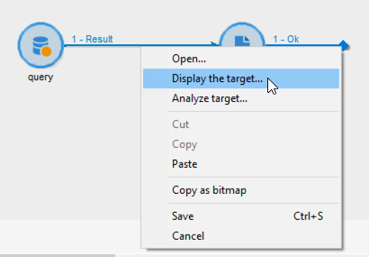

# Skicka personaliserade aviseringar till operatorer{#sending-personalized-alerts-to-operators}

I det här exemplet vill vi skicka en varning till en operator som ska innehålla namnet på profiler som öppnade ett nyhetsbrev men som inte klickade på länken som det innehåller.

Profilernas för- och efternamnsfält är kopplade till **[!UICONTROL Recipients]** måldimensionen, medan **[!UICONTROL Alert]** aktiviteten är kopplad till **[!UICONTROL Operator]** måldimensionen. Därför finns det inget tillgängligt fält mellan de två måldimensionerna för att utföra en avstämning och hämta för- och efternamnsfälten, och visa dem i aviseringsaktiviteten.

Processen är att skapa ett arbetsflöde enligt nedan:

1. Använd en **[!UICONTROL Query]** aktivitet för måldata.
1. Lägg till en **[!UICONTROL JavaScript code]** aktivitet i arbetsflödet för att spara ifyllningen från frågan till instansvariabeln.
1. Använd en **[!UICONTROL Test]** aktivitet för att kontrollera antalet populationer.
1. Använd en **[!UICONTROL Alert]** aktivitet för att skicka en varning till en operator, beroende på **[!UICONTROL Test]** aktivitetsresultatet.


## Spara populationen i instansvariabeln {#saving-the-population-to-the-instance-variable}

Lägg till koden nedan i **[!UICONTROL JavaScript code]** aktiviteten.

```
var query = xtk.queryDef.create(  
    <queryDef schema="temp:query" operation="select">  
      <select>  
       <node expr="[target/recipient.@firstName]"/>  
       <node expr="[target/recipient.@lastName]"/>  
      </select>  
     </queryDef>  
  );  
  var items = query.ExecuteQuery();
```

Kontrollera att JavaScript-koden motsvarar arbetsflödesinformationen:

* Taggen **[!UICONTROL queryDef schema]** ska motsvara namnet på måldimensionen som används i frågeaktiviteten.
* Taggen ska motsvara namnet på de fält som du vill hämta **[!UICONTROL node expr]** .


Följ stegen nedan för att hämta informationen:

1. Högerklicka på den utgående övergången från **[!UICONTROL Query]** aktiviteten och välj sedan **[!UICONTROL Display the target]**.

   

1. Högerklicka på listan och välj sedan **[!UICONTROL Configure list]**.

   

1. Frågemålets dimension och fältnamn visas i listan.

   

## Testning av populationsantal {#testing-the-population-count}

Lägg till koden nedan i **[!UICONTROL Test]** aktiviteten för att kontrollera om målpopulationen innehåller minst en profil.

```
var.recCount>0
```


## Konfigurera aviseringen {#setting-up-the-alert}

Nu när populationen har lagts till i instansvariabeln med de önskade fälten kan du lägga till dessa uppgifter i **[!UICONTROL Alert]** aktiviteten.

Gör detta genom att lägga till koden nedan på fliken **[!UICONTROL Source]** :

```
<ul>
<%
var items = new XML(instance.vars.items)
for each (var item in items){
%>
<li><%= item.target.@firstName %> <%= item.target.@lastName %></li>
<%
} %></ul>
```

>[!NOTE]
>
>Med **[!UICONTROL <%= item.target.recipient.@fieldName %>]** kommandot kan du lägga till ett av fälten som har sparats i instansvariabeln via **[!UICONTROL JavaScript code]** aktiviteten.\
>Du kan lägga till så många fält som du vill, så länge de har infogats i JavaScript-koden.


