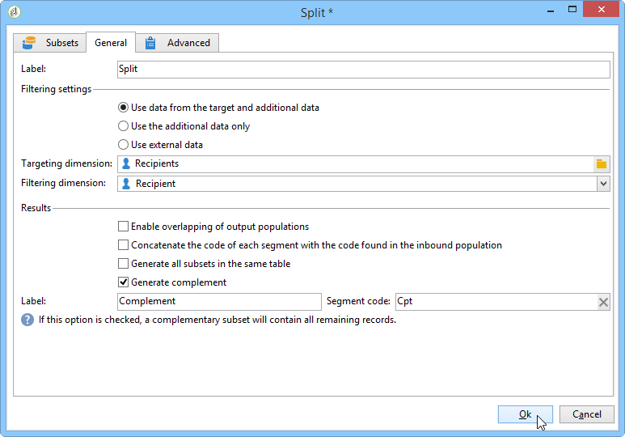

# Dela{#split}

Med en aktivitet av **Delad** typ kan du dela upp ett mål i flera deluppsättningar. Målet konstrueras med alla mottagna resultat: Alla tidigare aktiviteter måste därför ha avslutats för att denna aktivitet ska kunna utföras.

Denna aktivitet utlöser inte någon union av inkommande populationer. Om flera övergångar landar i en delad aktivitet rekommenderar vi att du infogar en aktivitet framför **[!UICONTROL Union]** den.

Ett exempel på den delade aktivitet som används finns i [Skapa delmängder med aktiviteten](../../workflow/using/targeting-data.md#creating-subsets-using-the-split-activity)Dela.

Ett exempel som illustrerar hur du använder Dela-aktiviteten för att segmentera målet i olika populationer med filtervillkor beskrivs i [det här avsnittet](../../workflow/using/cross-channel-delivery-workflow.md).

Ett exempel som visar hur du använder en förekomstvariabel i en delad aktivitet finns i [det här avsnittet](../../workflow/using/javascript-scripts-and-templates.md).

Om du vill konfigurera den här aktiviteten definierar du delmängdens innehåll och etikett på **[!UICONTROL Subsets]** fliken och väljer sedan måldimensionen på **[!UICONTROL General]** fliken.

## Skapa delmängder {#creating-subsets}

Så här skapar du en delmängd:

1. Klicka på etiketten i det matchande fältet och välj det filter som ska användas.
1. Om du vill filtrera den inkommande populationen markerar du **[!UICONTROL Add a filtering condition]** alternativet och klickar på **[!UICONTROL Edit...]** länken.

   Välj vilken typ av filter som ska användas på data som ska inkluderas i uppsättningen.

   Processen är densamma som för en aktivitet av **frågetyp**.

   >[!CAUTION]
   >
   >Du kan filtrera data i högst två externa databaser (FDA).

1. Du kan ange maximalt antal poster som ska extraheras från målet för att skapa delmängden. Det gör du genom att markera **[!UICONTROL Limit the selected records]** alternativet och klicka på **[!UICONTROL Edit...]** länken.

   Med en guide kan du välja valläge för poster i den här delmängden. Stegen finns i [Begränsa antalet delmängdsposter](#limiting-the-number-of-subset-records).

   

1. Om du vill kan du **lägga till andra delmängder** med hjälp av **[!UICONTROL Add]** knappen.

   

   >[!CAUTION]
   >
   >Om **[!UICONTROL Enable overlapping of output populations]** alternativet inte är markerat skapas delmängder i tabbordningen. Använd pilarna i fönstrets övre högra del för att flytta dem. Om den första delmängden återställer 70 % av den ursprungliga populationen kommer nästa delmängd endast att tillämpa sina urvalskriterier på de återstående 30 % och så vidare.

   För varje delmängd som skapas läggs en utgående övergång till i den delade aktiviteten.

   

   Du kan välja att generera en enskild utgående övergång (och identifiera uppsättningar med segmentkoden, till exempel): Om du vill göra det väljer du **[!UICONTROL Generate subsets in the same table]** alternativet på **[!UICONTROL General]** fliken.

   Om den är klar sparas segmentkoden för varje delmängd automatiskt i en extra kolumn. Den här kolumnen är tillgänglig i personaliseringsfälten på leveransnivå.

## Begränsa antalet delmängdsposter {#limiting-the-number-of-subset-records}

Om du inte vill använda hela populationen i en delmängd kan du begränsa antalet poster som den ska innehålla.

1. I redigeringsfönstret för delmängd markerar du **[!UICONTROL Limit the selected records]** alternativet och klickar på **[!UICONTROL Edit...]** länken.
1. Välj gränstyp för ditt val:

   * **[!UICONTROL Activate random sampling]**: det här alternativet tar ett slumpmässigt urval av posterna. Vilken typ av slumpmässigt urval som används beror på databasmotorn.
   * **[!UICONTROL Keep only the first records after sorting]**: Med det här alternativet kan du definiera en begränsning baserat på en eller flera sorteringsordningar. Om du väljer **[!UICONTROL Age]** fältet som sorteringskriterium och 100 som gräns behålls endast de yngsta 100 mottagarna.
   * **[!UICONTROL Keep the first ones after sorting (criteria, random)]**: Det här alternativet kombinerar de två föregående alternativen. Du kan definiera en begränsning baserat på en eller flera sorteringsordningar och sedan göra ett slumpmässigt urval på de första posterna om vissa poster har samma värden som de definierade villkoren.

      Om du t.ex. väljer **[!UICONTROL Age]** fältet som sorteringsvillkor och sedan anger gränsen 100, men de 2 000 yngsta mottagarna i databasen är alla 18, kommer 100 mottagare att väljas slumpmässigt bland dessa 2 000.
   

1. Om du vill definiera sorteringsvillkor kan du definiera kolumnerna och sorteringsordningen med ett extra steg.

   

1. Välj sedan metoden för databegränsning.

   

   Det finns flera sätt att göra detta:

   * **[!UICONTROL Size (in %)]**: en procentandel av posterna. Till exempel extraherar konfigurationen nedan 10 % av den totala populationen.

      Procentandelen gäller den inledande populationen, inte resultatet av aktiviteten.

   * **[!UICONTROL Size (as a % of the segment)]**: en procentandel av uppgifterna som endast avser delmängderna och inte den ursprungliga populationen.
   * **[!UICONTROL Maximum size]**: ett maximalt antal poster.
   * **[!UICONTROL By data grouping]**: Du kan ange en gräns för antalet poster beroende på värdena i ett angivet fält i den inkommande populationen. Mer information om detta finns i [Begränsa antalet delmängdsposter per datagrupp](#limiting-the-number-of-subset-records-by-data-grouping).
   * **[!UICONTROL By data grouping (in %)]**: Du kan ange en gräns för antalet poster beroende på värdena i ett angivet fält i den inkommande populationen med en procentsats. Mer information om detta finns i [Begränsa antalet delmängdsposter per datagrupp](#limiting-the-number-of-subset-records-by-data-grouping).
   * **[!UICONTROL By data distribution]**: Om grupperingsfälten har för många värden eller om du inte vill ange värdena igen för varje ny delad aktivitet, kan du konfigurera en **[!UICONTROL By data distribution]** begränsning (valfri modul för distribuerad marknadsföring) i Adobe Campaign. Mer information finns i [Begränsa antalet delmängdsposter per datadistribution](#limiting-the-number-of-subset-records-per-data-distribution).

1. Klicka **[!UICONTROL Finish]** för att godkänna urvalskriterierna för posten. Den definierade konfigurationen visas sedan i redigerarens mittersta fönster.

## Begränsa antalet delmängdsposter efter datagruppering {#limiting-the-number-of-subset-records-by-data-grouping}

Du kan begränsa antalet poster per datagrupp. Denna gräns kan göras med ett fast värde eller en procentsats.

Om du t.ex. markerar fältet som ett gruppfält kan du definiera en lista med poster för varje språk. **[!UICONTROL Language]**

1. När du har valt värden för databegränsning markerar du **[!UICONTROL By data grouping]** eller **[!UICONTROL By data grouping (as a %)]** och klickar **[!UICONTROL Next]**.

   

1. Markera sedan grupperingsfälten (till exempel **[!UICONTROL Language]** fältet) och klicka på **[!UICONTROL Next]**.

   

1. Slutligen anger du tröskelvärden för datagruppering (med hjälp av fasta värden eller procentandelar beroende på den tidigare valda grupperingsmetoden). Om du vill ange samma tröskelvärde för varje värde, till exempel om du vill ange antalet poster för varje språk till 10, väljer du **[!UICONTROL All data groupings are the same size]** alternativet. Om du vill ange en annan gräns för varje värde markerar du **[!UICONTROL Limitations by grouping value]** alternativet. Då kan du välja en annan begränsning för engelska, franska och så vidare.

   

1. Klicka **[!UICONTROL Finish]** för att godkänna begränsningen och återgå till att redigera delningsaktiviteten.

## Begränsa antalet delmängdsposter per datadistribution {#limiting-the-number-of-subset-records-per-data-distribution}

Om grupperingsfälten innehåller för många värden eller om du vill undvika att återställa värden för varje ny delad aktivitet, kan du skapa en begränsning per datadistribution i Adobe Campaign. När du väljer datagränsvärden (mer information om det här ämnet finns i avsnittet [Skapa delmängder](#creating-subsets) ) väljer du **[!UICONTROL By data distribution]** alternativet och väljer en mall i listrutan. Nedan visas hur du skapar en mall för datadistribution.

Ett exempel på **[!UICONTROL Local approval]** aktiviteten med en distributionsmall finns i [Använda den lokala godkännandeaktiviteten](../../workflow/using/using-the-local-approval-activity.md).

>[!CAUTION]
>
>Om du vill använda den här funktionen måste du köpa modulen Distribuerad marknadsföring, som är ett kampanjalternativ. Kontrollera licensavtalet.

Med mallen för datadistribution kan du begränsa antalet poster med hjälp av en lista med grupperingsvärden. Så här skapar du en mall för datadistribution:

1. Om du vill skapa en mall för datadistribution går du till **[!UICONTROL Resources > Campaign management > Data distribution]** noden och klickar på **[!UICONTROL New]**.

   

1. På fliken **[!UICONTROL General]** kan du ange etiketten och körningskontexten för distributionen (måldimension, distributionsfält).

   

   Följande fält måste anges:

   * **[!UICONTROL Label]**: distributionsmallens etikett.
   * **[!UICONTROL Targeting dimension]**: Ange måldimensionen som datafördelningen ska tillämpas på, till **[!UICONTROL Recipient]** exempel. Det här schemat måste alltid vara kompatibelt med de data som används i målarbetsflödet.
   * **[!UICONTROL Distribution field]**: markera ett fält via måldimensionen. Om du till exempel markerar **[!UICONTROL Email domain]** fältet kommer listan över mottagare att delas upp efter domän.
   * **[!UICONTROL Distribution type]**: Välj hur målets begränsningsvärde ska brytas ned på **[!UICONTROL Distribution]** fliken: **[!UICONTROL Percentage]** eller **[!UICONTROL Set]**.
   * **[!UICONTROL Assignment type]**: välj tilldelningstypen för datadistribution. Du kan välja mellan tilldelning efter grupp eller operator eller tilldelning efter lokal enhet. Tilldelning av lokal enhet används i **Distribuerad marknadsföring**. Mer information finns i det här [avsnittet](../../campaign/using/about-distributed-marketing.md).
   * **[!UICONTROL Approval storage]**: Om du använder en **[!UICONTROL Local approval]** aktivitet i målarbetsflödet (se [Lokalt godkännande](../../workflow/using/local-approval.md)), anger du det schema som godkännanderesultaten ska lagras i. Du måste ange ett lagringsschema per målschema. Om du använder **[!UICONTROL Recipients]** målschemat anger du **[!UICONTROL Local approval of recipients]** standardlagringsschemat.

      Om en enkel begränsning är per datagrupp utan lokalt godkännande behöver du inte ange **[!UICONTROL Approvals storage]** fältet.

1. Om du använder en **[!UICONTROL Local approval]** aktivitet (se [Lokalt godkännande](../../workflow/using/local-approval.md)) anger du **[!UICONTROL Advanced settings]** för distributionsmallen:

   

   Följande fält måste anges:

   * **[!UICONTROL Approve targeted messages]**: Markera det här alternativet om du vill att alla mottagare ska vara förmarkerade i listan över mottagare som ska godkännas. Om alternativet inte är markerat markeras ingen mottagare i förväg.

      >[!NOTE]
      >
      >Det här alternativet är markerat som standard.

      

   * **[!UICONTROL Delivery label]**: I kan du definiera ett uttryck som visar leveransetiketten i returmeddelandet. Standarduttrycket innehåller information om leveransens standardetikett (beräkningssträng). Du kan ändra det här uttrycket.

      

   * **[!UICONTROL Grouping field]**: I det här fältet kan du definiera den gruppering som används för att visa mottagare i godkännande- och returmeddelanden.

      

   * **[!UICONTROL Web Interface]**: Med kan du länka ett webbprogram till mottagarlistan. I meddelandet för godkännande och retur kan varje mottagare klickas och länkas till det valda webbprogrammet. I **[!UICONTROL Parameters]** fältet (till exempel **[!UICONTROL recipientId]**) kan du konfigurera den extra parametern som ska användas i URL:en och webbprogrammet.

      

1. På fliken **[!UICONTROL Breakdown]** kan du definiera en lista med distributionsvärden.

   

   * **[!UICONTROL Value]**: ange fördelningsvärdena.
   * **[!UICONTROL Percentage / Set]**: Ange postens gräns (fast eller procentuell) som är kopplad till varje värde.

      Den här kolumnen definieras av **[!UICONTROL Distribution type]** fältet på **[!UICONTROL General]** fliken.

   * **[!UICONTROL Label]**: Ange den etikett som är länkad till varje värde.
   * **[!UICONTROL Group or operator]**: Om du använder en **[!UICONTROL Local approval]** aktivitet (se [Lokalt godkännande](../../workflow/using/local-approval.md)) väljer du den operator eller grupp av operatorer som tilldelats varje distributionsvärde.

      Om en enkel begränsning är per datagrupp utan lokalt godkännande behöver du inte ange **[!UICONTROL Group or operator]** fältet.

      >[!CAUTION]
      >
      >Se till att operatorerna har tilldelats rätt behörighet.

   * **[!UICONTROL Local entity]**: välj den lokala entitet som tilldelats varje distributionsvärde. Lokala enheter används i **distribuerad marknadsföring**. Mer information finns i det här [avsnittet](../../campaign/using/about-distributed-marketing.md).

## Filtreringsparametrar {#filtering-parameters}

Klicka på **[!UICONTROL General]** fliken för att ange aktivitetsetiketten. Välj mål- och filterdimensionerna för den här delningen. Om det behövs kan du ändra de här dimensionerna för en viss delmängd.

Markera alternativet **[!UICONTROL Generate complement]** om du vill utnyttja den återstående populationen. Komplementet är det inkommande målet minus kombinationen av delmängderna. En ytterligare utgående övergång läggs sedan till i aktiviteten enligt följande:

För att det här alternativet ska fungera på rätt sätt måste inkommande data ha en primärnyckel.

Om data till exempel läses direkt från en extern databas som Netezza (som inte stöder begreppet index) via en **[!UICONTROL Data loading (RDBMS)]** aktivitet, blir det komplement som genereras av **[!UICONTROL Split]** aktiviteten felaktigt.

Du kan undvika detta genom att dra och släppa en **[!UICONTROL Enrichment]** aktivitet precis före **[!UICONTROL Split]** aktiviteten. I **[!UICONTROL Enrichment]** aktiviteten kontrollerar du **[!UICONTROL Keep all additional data from the main set]** och anger de kolumner som du vill använda för att konfigurera filtren för **[!UICONTROL Split]** aktiviteten i ytterligare data. Data från den inkommande övergången av aktiviteten lagras sedan lokalt i en temporär tabell på Adobe Campaign-servern och komplementet kan genereras korrekt. **[!UICONTROL Split]**

Med det här **[!UICONTROL Enable overlapping of output populations]** alternativet kan du hantera populationer som tillhör flera deluppsättningar:

* När rutan inte är markerad ser delningsaktiviteten till att en mottagare inte kan finnas i flera utdataövergångar, även om den uppfyller villkoren för flera delmängder. De kommer att vara i målet för den första fliken med matchande villkor.
* När rutan är markerad kan mottagarna hittas i flera delmängder om de uppfyller filtervillkoren. Adobe Campaign rekommenderar att du använder exklusiva kriterier.

## Indataparametrar {#input-parameters}

* tableName
* schema

Varje inkommande händelse måste ange ett mål som definieras av dessa parametrar.

## Utdataparametrar {#output-parameters}

* tableName
* schema
* recCount

Den här uppsättningen med tre värden identifierar det mål som är resultatet av uteslutningen. **[!UICONTROL tableName]** är namnet på tabellen som registrerar målidentifierarna, **[!UICONTROL schema]** är populationens schema (vanligtvis nms:mottagare) och **[!UICONTROL recCount]** är antalet element i tabellen.

Övergången som är associerad med komplementet har samma parametrar.
