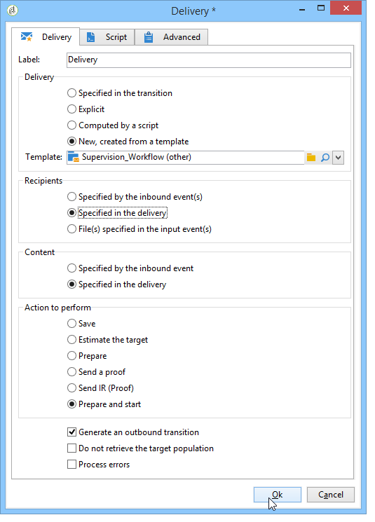

# Arbetsflöden för övervakning{#supervising-workflows}

Här beskrivs hur du skapar ett arbetsflöde där du kan övervaka statusen för en uppsättning arbetsflöden som är&quot;pausade&quot;,&quot;stoppade&quot; eller&quot;med fel&quot;.

Syftet är att

* Använd ett arbetsflöde för att övervaka en grupp arbetsflöden.
* Skicka ett meddelande till en ansvarig via en leveransaktivitet.

Om du vill övervaka statusen för en uppsättning arbetsflöden måste du följa dessa steg:

1. Skapa övervakningsarbetsflödet.
1. Skriv JavaScript för att avgöra om arbetsflöden pausas, stoppas eller innehåller fel.
1. Skapa **[!UICONTROL Test]** aktiviteten.
1. Förbered leveransmallen.

>[!NOTE]
>
>Utöver arbetsflödet kan du med hjälp av **heatmap** -kartan förCampaign-arbetsflöden analysera arbetsflöden som körs för närvarande. Mer information finns i det [dedikerade avsnittet](../../workflow/using/heatmap.md).
>
>Mer information om hur du **övervakar arbetsflödenas körning** finns i [det här avsnittet](../../workflow/using/monitoring-workflow-execution.md).

## Steg 1: Skapa övervakningsarbetsflödet {#step-1--creating-the-monitoring-workflow}

Mappen för arbetsflöde som vi ska övervaka är mappen **&quot;CustomWorkflows&quot;** som lagras i noden **Administration > Produktion > Tekniska arbetsflöden** . Den här mappen innehåller en uppsättning affärsarbetsflöden.

Arbetsflödet **för** övervakning lagras i roten av mappen för tekniska arbetsflöden. Etiketten som används är **&quot;Övervakning&quot;**.

I följande schema visas aktivitetssekvensen:


Det här arbetsflödet består av:

* en **&quot;Start&quot;** -aktivitet.
* en **&quot;JavaScript-kodsaktivitet&quot;** som ansvarar för att analysera mappen för affärsarbetsflöden.
* en **&quot;Testaktivitet&quot;** som skickar en leverans till den ansvarige eller startar om arbetsflödet.
* en **&quot;Leveransaktivitet&quot;** som ansvarar för meddelandelayouten.
* en **&quot;Vänta&quot;** -aktivitet som styr ledtider mellan arbetsflödesiterationer.

## Steg 2: Skriva JavaScript {#step-2--writing-the-javascript}

Den första delen av JavaScript-koden sammanfaller med en **fråga (queryDef)** som gör att du kan identifiera arbetsflödena med statusen &quot;pause&quot; (@state == 13), &quot;error&quot; (@failed == 1) eller &quot;stopped&quot; (@state == 20).

Det **interna namnet** på arbetsflödesmappen som ska övervakas anges i följande villkor:

```
<condition boolOperator="AND" expr="[folder/@name] = 'Folder20'" internalId="1"/>
```

```
var strError = "";
var strPaused = "";
var strStop = "";

var queryWkfError = xtk.queryDef.create(
  <queryDef schema="xtk:workflow" operation="select">
    <select>
      <node expr="@internalName"/>
      <node expr="@state"/>
      <node expr="@label"/>
      <node expr="@failed"/>
      <node expr="@state"/>   
    </select>
    <where id="12837805386">
      <condition boolOperator="AND" expr="[folder/@name] = 'Folder20'" internalId="1"/>
        <condition boolOperator="AND" internalId="2">
          <condition boolOperator="OR" expr="@state = 20" internalId="3"/>
          <condition expr="@state = 13" internalId="4"/>
        </condition>  
    </where>
  </queryDef>
);
var ndWkfError = queryWkfError.ExecuteQuery(); 
```

I den andra delen av JavaScript-koden kan du **visa ett meddelande för varje arbetsflöde** baserat på den status som återställts under frågan.

>[!NOTE]
>
>Strängarna som skapas måste läsas in i arbetsflödets händelsevariabler.

```
for each ( var wkf in ndWkfError.workflow ) 
{
  if ( wkf.@state == 13 )  // Status 13 = paused
  {
    if ( wkf.@failed == 1 )
      strError += "<li>Workflow '" + wkf.@internalName + "' with the label '" + wkf.@label + "'</li>";
    else
      strPaused += "<li>Workflow '" + wkf.@internalName + "' with the label '" + wkf.@label + "'</li>";
  }
  
  if ( wkf.@state == 20 )  // Status 20 = stop
    strStop += "<li>Workflow '" + wkf.@internalName + "' with the label '" + wkf.@label + "'</li>";
}

vars.strWorkflowError = strError;
vars.strWorkflowPaused = strPaused;
vars.strWorkflowStop = strStop;
```

## Steg 3: Skapa aktiviteten Test {#step-3--creating-the--test--activity}

Med aktiviteten Testa kan du avgöra om en leverans behöver skickas eller om övervakningsarbetsflödet behöver köra en annan cykel baserat på aktiviteten Vänta.

En leverans skickas till den ansvarige **om minst en av de tre händelsemodellerna &quot;vars.strWorkflowError&quot;, &quot;vars.strWorkflowPaused&quot; eller &quot;vars.strWorkflowStop&quot; inte är void.**


Vänta-aktiviteten kan konfigureras för att starta om övervakningsarbetsflödet med regelbundna intervall. I det här fallet är väntetiden **inställd på en timme**.


## Steg 4: Förbereder leveransen {#step-4--preparing-the-delivery}

Aktiviteten&quot;Leverans&quot; baseras på en **leveransmall** som lagras i noden **Resurser > Mallar > Leveransmallar** .

Den här mallen måste innehålla:

* **e-postadressen till den ansvarige**.
* **HTML-innehåll** för att infoga anpassad text.

   

   De tre deklarerade variablerna (WF_Stop, WF_Paused, WF_Error) matchar de tre arbetsflödeshändelsevariablerna.

   Dessa variabler måste deklareras på fliken **Variabler** i leveransmallens egenskaper.

   Om du vill återställa **innehållet i arbetsflödeshändelsevariablerna** måste du deklarera de variabler som är specifika för leveransen som ska initieras med värden som returneras av JavaScript-koden.

   Leveransmallen har följande innehåll:

   

När mallen har skapats och godkänts måste du konfigurera aktiviteten **Leverans** till:

* länka aktiviteten &quot;Leverans&quot; till leveransmallen som skapades tidigare.
* länka arbetsflödets händelsevariabler till de som är specifika för leveransmallen.

Dubbelklicka på aktiviteten **Leverans** och välj följande alternativ:

* Leverans: Välj **Nytt, skapat från en mall** och välj den leveransmall som skapades tidigare.
* För fälten **Mottagare och Innehåll** väljer du **Angivet i leveransen**.
* Åtgärd som ska köras: välj **Förbered och starta**.
* Avmarkera alternativet **Processfel** .

   

* Gå till fliken **Skript** i aktiviteten **Leverans** och lägg till tre **teckensträngstypvariabler** via menyn för anpassningsfältet.

   

   

   De tre deklarerade variablerna är:

   ```
   delivery.variables._var[0].stringValue = vars.strWorkflowError;
   delivery.variables._var[1].stringValue = vars.strWorkflowPaused;
   delivery.variables._var[2].stringValue = vars.strWorkflowStop; 
   ```

När övervakningsarbetsflödet har startats skickas följande sammanfattning till mottagaren:


