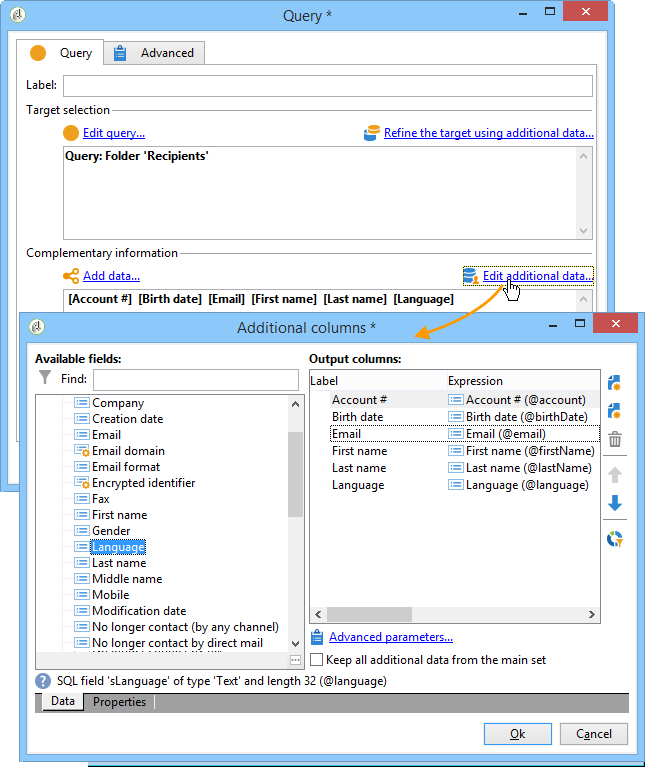
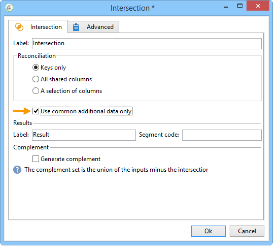
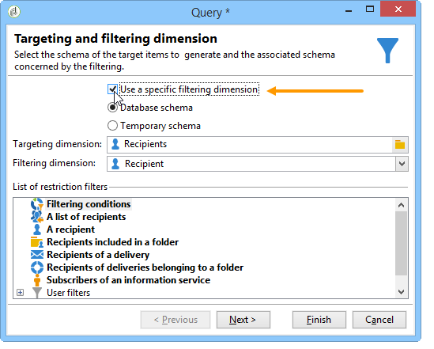
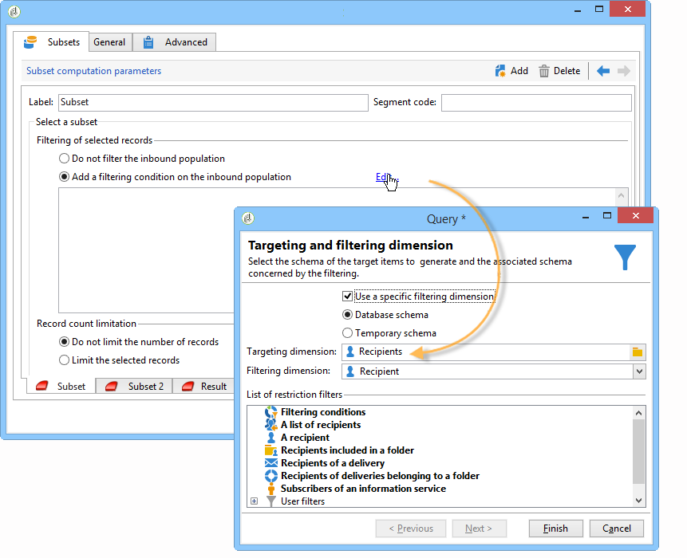
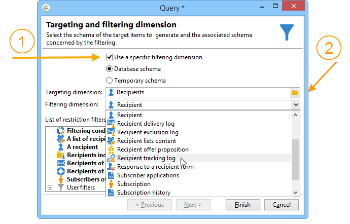

# Måldata{#targeting-data}

## Skapa frågor {#creating-queries}

### Markera data {#selecting-data}

Med en **[!UICONTROL Query]** aktivitet kan du välja grundläggande data för att skapa målpopulationen. Mer information finns i [Skapa en fråga](../../workflow/using/query.md#creating-a-query).

Du kan även använda följande aktiviteter för att fråga efter och finjustera data från databasen: [Inkrementell fråga](../../workflow/using/incremental-query.md), [Läslista](../../workflow/using/read-list.md).

Det är möjligt att samla in ytterligare data som ska vidarebefordras och behandlas under arbetsflödets hela livscykel. Mer information finns i [Lägga till data](../../workflow/using/query.md#adding-data) och [Redigera ytterligare data](#editing-additional-data).

### Redigera ytterligare data {#editing-additional-data}

När ytterligare data har lagts till kan du redigera dem eller använda dem för att förfina det mål som definierats i frågeaktiviteten.

Med **[!UICONTROL Edit additional data...]** länken kan du visa tillagda data och ändra dem eller lägga till dem.

Om du vill lägga till data i de tidigare definierade utdatakolumnerna markerar du dem i listan med tillgängliga fält. Om du vill skapa en ny utdatakolumn klickar du på **[!UICONTROL Add]** ikonen, markerar fältet och klickar på **[!UICONTROL Edit expression]**.

Definiera ett beräkningssätt för det fält som ska läggas till, t.ex. en mängd.

Med **[!UICONTROL Add a sub-item]** alternativet kan du bifoga beräknade data till samlingen. På så sätt kan du välja ytterligare data från samlingen eller definiera aggregeringsberäkningar för samlingselement.

Underelementen representeras i underträdet till den samling som de mappas till.

Samlingar visas på **[!UICONTROL Collections]** underfliken. Du kan filtrera de samlade elementen genom att klicka på **[!UICONTROL Detail]** ikonen för den valda samlingen. Med filterguiden kan du välja insamlade data och ange de filtreringsvillkor som ska tillämpas på data i samlingen.

### Förfina målet med ytterligare data {#refining-the-target-using-additional-data}

Med de ytterligare data som samlas in kan du förfina datafiltreringen i databasen. Det gör du genom att klicka på **[!UICONTROL Refine the target using additional data...]** länken: på så sätt kan du överfiltrera på tillagda data.

### Homogenisera data {#homogenizing-data}

I **[!UICONTROL Union]** - eller **[!UICONTROL Intersection]** typaktiviteter kan du välja att bara behålla delade ytterligare data för att hålla data konsekventa. I det här fallet kommer den temporära utdatatabellen för den här aktiviteten endast att innehålla de ytterligare data som finns i alla inkommande uppsättningar.

### Avstämning med ytterligare data {#reconciliation-with-additional-data}

Under datavstämningsfaserna (**[!UICONTROL Union]**, **[!UICONTROL Intersection]** etc.) aktiviteter) kan du välja vilka kolumner som ska användas för datavstämning från de andra kolumnerna. Det gör du genom att konfigurera en avstämning för ett urval kolumner och ange huvuduppsättningen. Markera sedan kolumnerna i fönstrets nedre kolumn, så som visas i följande exempel:

### Skapa delmängder {#creating-subsets}

Med den här **[!UICONTROL Split]** aktiviteten kan du skapa delmängder utifrån villkor som definierats via extraheringsfrågor. När du redigerar ett filtervillkor för populationen för varje delmängd får du sedan tillgång till standardfrågeaktiviteten som gör att du kan definiera målsegmenteringsvillkoren.

Du kan dela upp ett mål i flera delmängder genom att endast använda ytterligare data som filtreringsvillkor, eller utöver måldata. Du kan också använda externa data om du har köpt alternativet **Federated Data Access** .

Mer information finns i [Skapa delmängder med aktiviteten](#creating-subsets-using-the-split-activity)Dela.

## Segmentera data {#segmenting-data}

### Kombinera flera mål (unionen) {#combining-several-targets--union-}

Med unionsaktiviteten kan du kombinera resultatet av flera aktiviteter i en övergång. Satser behöver inte nödvändigtvis vara homogena.

Följande datavstämningsalternativ är tillgängliga:

* **[!UICONTROL Keys only]**

   Detta alternativ kan användas om indatapulserna är homogena.

* **[!UICONTROL All columns in common]**

   Med det här alternativet kan du stämma av data baserat på alla kolumner som är gemensamma för målets olika populationer.

   Adobe Campaign identifierar kolumner utifrån deras namn. Tröskelvärdet accepteras: En &quot;E-post&quot;-kolumn kan till exempel tolkas som identisk med en &#39;@email&#39;-kolumn.

* **[!UICONTROL A selection of columns]**

   Välj det här alternativet om du vill definiera en lista över kolumner som datavstämning ska tillämpas på.

   Börja med att markera huvuduppsättningen (den som innehåller källdata) och sedan de kolumner som ska användas för kopplingen.

   

   >[!CAUTION]
   >
   >Under datavstämning dedupliceras inte populationer.

   Du kan begränsa populationsstorleken till ett visst antal poster. Om du vill göra det klickar du på lämpligt alternativ och anger antalet poster som ska sparas.

   Ange även prioriteten för inkommande populationer: I fönstrets nedre del visas de inkommande övergångarna för unionsaktiviteten och du kan sortera dem med de blå pilarna till höger om fönstret.

   Posterna hämtas först från populationen i den första ingående övergången i listan och sedan, om det maximala antalet inte har uppnåtts, tas de från populationen i den andra ingående övergången osv.

   

### Extrahera leddata (skärning) {#extracting-joint-data--intersection-}

Med skärningspunkten kan du bara återställa de linjer som delas av populationerna av inkommande övergångar. Denna aktivitet ska konfigureras som unionsaktiviteten.

Dessutom är det möjligt att endast behålla ett urval kolumner, eller bara de kolumner som delas av den inkommande populationen.

Skärningsaktiviteten beskrivs i avsnittet [Skärningspunkt](../../workflow/using/intersection.md) .

### Utesluta en population (Uteslutning) {#excluding-a-population--exclusion-}

Med exkluderingsaktiviteten kan du utesluta element i ett mål från en annan målpopulation. Den här aktivitetens målgruppsdimension kommer att vara huvuduppsättningens.

Om det behövs kan du ändra inkommande tabeller. För att utesluta ett mål från en annan dimension måste detta mål återställas till samma måldimension som huvudmålet. Det gör du genom att klicka på **[!UICONTROL Add]** knappen och ange villkoren för dimensionsändring.

Datavstämning utförs antingen via en identifierare, en axel som ändras eller en koppling. Ett exempel finns i [Använda data från en lista: Läs listan](../../workflow/using/importing-data.md#using-data-from-a-list--read-list).

### Skapa delmängder med aktiviteten Dela {#creating-subsets-using-the-split-activity}

Aktiviteten är en standardaktivitet som gör att du kan skapa så många uppsättningar som behövs via en eller flera filterdimensioner, samt generera antingen en utdataövergång per delmängd eller en unik övergång. **[!UICONTROL Split]**

Ytterligare data som förmedlas av den inkommande övergången kan användas i filtreringsvillkoren.

För att konfigurera det måste du först välja villkor:

1. Dra och släpp en **[!UICONTROL Split]** aktivitet i arbetsflödet.
1. Välj önskat alternativ på **[!UICONTROL General]** fliken: **[!UICONTROL Use data from the target and additional data]**, **[!UICONTROL Use the additional data only]** eller **[!UICONTROL Use external data]**.
1. Om du väljer **[!UICONTROL Use data from the target and additional data]** alternativet kan du använda alla data som överförs av den inkommande övergången med måldimensionen.

   

   När delmängder skapas används de ovannämnda filterparametrarna.

   Om du vill definiera filtreringsvillkor väljer du **[!UICONTROL Add a filtering condition on the inbound population]** alternativet och klickar på **[!UICONTROL Edit...]** länken. Ange sedan filtervillkoren för att skapa den här delmängden.

   

   Ett exempel som visar hur du använder filtervillkor i aktiviteten för att segmentera målet i olika populationer beskrivs i **[!UICONTROL Split]** det här avsnittet .

   I **[!UICONTROL Label]** fältet kan du ge den nyskapade delmängden ett namn som matchar den utgående övergången.

   Du kan också tilldela en segmentkod till delmängden för att identifiera den och använda den för att ange målpopulationen.

   Om det behövs kan du ändra målinriktnings- och filtreringsdimensionerna individuellt för varje delmängd som du vill skapa. Om du vill göra det redigerar du delmängdens filtreringsvillkor och markerar **[!UICONTROL Use a specific filtering dimension]** alternativet.

   

1. Om du väljer det här **[!UICONTROL Use the additional data only]** alternativet erbjuds endast ytterligare data för delmängdsfiltrering.

   

1. Om alternativet **Federated Data Access** är aktiverat **[!UICONTROL Use external data]** kan du bearbeta data i en extern databas som redan är konfigurerad eller skapa en ny anslutning till en databas.

   

   Mer information finns i det här [avsnittet](../../platform/using/accessing-an-external-database.md).

Sedan måste vi lägga till nya delmängder:

1. Klicka på **[!UICONTROL Add]** knappen och definiera filtervillkoren.

   

1. Definiera filterdimensionen på aktivitetens flik (se ovan).Den gäller som standard för alla delmängder. **[!UICONTROL General]**

   

1. Om det behövs kan du ändra filtreringsdimensionen för varje delmängd individuellt. Detta gör att du kan skapa en uppsättning för alla Gold-kortinnehavare, en för alla mottagare som klickade i det senaste nyhetsbrevet och en tredjedel för personer mellan 18 och 25 år som gjorde ett köp i butiken de senaste 30 dagarna, alla med samma delade aktivitet. Det gör du genom att markera **[!UICONTROL Use a specific filtering dimension]** alternativet och välja datafiltreringssammanhanget.

   

   >[!NOTE]
   >
   >Om du har skaffat alternativet **Federated Data Access** kan du skapa delmängder baserat på informationen i en extern bas. Det gör du genom att välja schemat för den externa tabellen i **[!UICONTROL Targeting dimension]** fältet. Mer information finns i [Åtkomst till en extern databas (FDA)](../../workflow/using/accessing-an-external-database--fda-.md).

När deluppsättningar har skapats visar den delade aktiviteten som standard så många utdataövergångar som det finns deluppsättningar:

Du kan gruppera alla dessa delmängder i en enda utdataövergång. I det här fallet visas länken till respektive delmängd i segmentkoden. Markera **[!UICONTROL Generate all subsets in the same table]** alternativet om du vill göra det.

Du kan till exempel placera en enda leveransaktivitet och anpassa leveransinnehållet baserat på segmentkoden för varje mottagaruppsättning:

Deluppsättningar kan också skapas med hjälp av **[!UICONTROL Cells]** aktiviteten. Mer information finns i avsnittet [Celler](../../workflow/using/cells.md) .

### Använda måldata {#using-targeted-data}

När data har identifierats och beretts kan de användas i följande sammanhang:

* Du kan uppdatera data i databasen efter dataändringar i de olika arbetsflödesstegen.

   Mer information finns i [Uppdatera data](../../workflow/using/update-data.md).

* Du kan även uppdatera innehållet i befintliga listor.

   Mer information finns i [Listuppdatering](../../workflow/using/list-update.md).

* Du kan förbereda eller starta leveranser direkt i arbetsflödet.

   Mer information finns i [Leverans](../../workflow/using/delivery.md), [Leveranskontroll](../../workflow/using/delivery-control.md) och [Kontinuerlig leverans](../../workflow/using/continuous-delivery.md).

## Datahantering {#data-management}

I Adobe Campaign kombinerar datahanteringen en uppsättning aktiviteter för att lösa komplexa målgruppsproblem genom att erbjuda mer effektiva och flexibla verktyg. På så sätt kan ni implementera en konsekvent hantering av all kommunikation med en kontakt genom att använda information som hör till deras kontrakt, prenumerationer, reaktivitet av leveranser osv. Med datahantering kan du följa datalivscykeln under segmenteringsåtgärder, särskilt:

* Förenkla och optimera målgruppsprocesserna genom att inkludera data som inte är modellerade i datamappningen (skapa nya tabeller: lokalt tillägg till varje målarbetsflöde beroende på konfiguration).
* Behålla och överföra buffertberäkningar, särskilt under målkonstruktionsfaserna eller för databasadministration.
* Åtkomst till externa baser (valfritt): heterogena databaser som beaktas under målinriktningsprocessen.

För att genomföra dessa åtgärder erbjuder Adobe Campaign följande:

* Datainsamling: [Filöverföring](../../workflow/using/file-transfer.md), [datainläsning (fil)](../../workflow/using/data-loading--file-.md), [datainläsning (RDBMS)](../../workflow/using/data-loading--rdbms-.md), [Uppdatera data](../../workflow/using/update-data.md). Detta första steg i datainsamlingen förbereder data så att de kan behandlas i andra aktiviteter. Flera parametrar måste övervakas för att arbetsflödet ska fungera korrekt och ge de förväntade resultaten. När du till exempel importerar data måste primärnyckeln (Pkey) för dessa data vara unik för varje post.
* Målinriktade aktiviteter har förbättrats med datahanteringsalternativ: [Fråga](../../workflow/using/query.md), [Förening](../../workflow/using/union.md), [Skärning](../../workflow/using/intersection.md), [Dela](../../workflow/using/split.md). På så sätt kan du konfigurera en union eller en skärning mellan data från flera olika måldimensioner, så länge datavstämning är möjligt.
* Dataomvandlingsaktiviteter: [Berikning](../../workflow/using/enrichment.md), [Ändra dimension](../../workflow/using/change-dimension.md).

>[!CAUTION]
>
>När två arbetsflöden är länkade innebär det inte att alla data som är länkade till dem tas bort om du tar bort ett källtabellselement.
>  
>Om du till exempel tar bort en mottagare via ett arbetsflöde tas inte hela mottagarens leveranshistorik bort. Om du tar bort en mottagare direkt i mappen Mottagare tas alla data som är länkade till den här mottagaren bort.

### Förbättra och ändra data {#enriching-and-modifying-data}

Förutom måldimensionen kan du med filtreringsdimensionen ange vilken typ av insamlade data som ska användas. Se [Målinriktning och filtrering](../../workflow/using/building-a-workflow.md#targeting-and-filtering-dimensions).

Identifierade och insamlade data kan berikas, aggregeras och ändras för att optimera målkonstruktionen. För att göra detta använder du följande, förutom de databehandlingsaktiviteter som beskrivs i avsnittet [Segmenteringsdata](#segmenting-data) :

* Med den här **[!UICONTROL Enrichment]** aktiviteten kan du snabbt lägga till kolumner i ett schema samt lägga till information i vissa element. Den beskrivs i avsnittet [Berikning](../../workflow/using/enrichment.md) i aktivitetsdatabasen.
* Med den här **[!UICONTROL Edit schema]** aktiviteten kan du ändra strukturen för ett schema. Den beskrivs i avsnittet [Redigera schema](../../workflow/using/edit-schema.md) i aktivitetsdatabasen.
* Med den här **[!UICONTROL Change dimension]** aktiviteten kan du ändra måldimensionen under målkonstruktionscykeln. Den beskrivs i avsnittet [Ändra dimension](../../workflow/using/change-dimension.md) .

