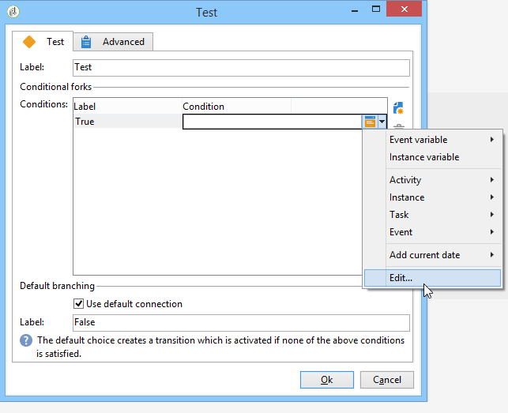

# Testa{#test}

En **Test**-typaktivitet aktiverar den första övergången som uppfyller villkoret som är kopplat till den. Om inget villkor är uppfyllt och om alternativet **[!UICONTROL Use the default fork]** är aktiverat aktiveras standardövergången.

Ett villkor är ett JavaScript-uttryck som måste utvärderas till true eller false. Om du vill ange uttrycket klickar du på ikonen till höger om namnet på villkoret och väljer sedan **[!UICONTROL Edit...]**.

Mer information om alla ytterligare JavaScript-funktioner och SOAP-metoder för programservern som är tillgängliga via JavaScript i arbetsflödet finns i [JSAPI-dokumentation](https://docs.adobe.com/content/help/en/campaign-classic/technicalresources/api/index.html).

Du kan också infoga variabler direkt från den här redigeraren. Mer information om hur du arbetar med variabler finns i [det här avsnittet](javascript-scripts-and-templates.md#variables).

Villkoren kan läggas till, tas bort eller ordnas i redigeringsfönstret för aktivitetsegenskapen, men kan också ändras från övergången.

Om resultatet av en beräkning ska återanvändas av olika villkor är det möjligt att beräkna det i aktivitetens initieringsskript. Resultatet måste lagras i en variabel av aktiviteten som ska användas av villkorsskripten (task.vars.xxx).
