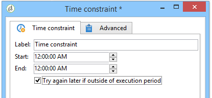

# Tidsbegränsning{#time-constraint}

Med en **tidsbegränsningsaktivitet** kan du skjuta upp körningen av en uppgift eller avbryta den.

Ange aktivitetens etikett och ange den tidsram under vilken arbetsflödesuppgiften ska pausas.

När alternativet är **[!UICONTROL Try again later if outside of execution period]** markerat kan du starta om aktiviteten utanför körtidsramen. Om du vill att arbetsflödesåtgärden ska överges för gott efter att den har avbrutits avmarkerar du det här alternativet.

