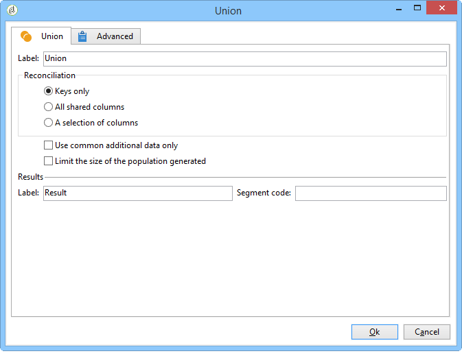

# Union{#union}

En union grupperar resultatet av flera inkommande aktiviteter i ett enda mål. Målet skapas med alla mottagna resultat: Alla tidigare aktiviteter måste därför avslutas för att unionen ska kunna genomföras.

>[!NOTE]
>
>Mer information om hur du konfigurerar och använder unionsaktiviteten finns i [Kombinera flera mål (unionen)](../../workflow/using/targeting-data.md#combining-several-targets--union-).

## Unionsexempel {#union-example}

I följande exempel har resultaten från två frågor kombinerats för att uppdatera listan. De två frågorna har mottagarna som mål. Resultaten är därför baserade på samma tabell.

1. Infoga en aktivitet av typen **[!UICONTROL Union]** -type direkt efter de två frågorna och före en aktivitet av typen update i listan, och öppna den sedan.
1. Du kan ange en etikett.
1. Välj **[!UICONTROL Keys only]** avstämningsmetoden eftersom populationen som är resultatet av frågor i det här exemplet innehåller konsekventa data.
1. Om du har lagt till ytterligare data för frågorna kan du bestämma dig för att bara behålla de data som delas.
1. Om du vill begränsa storleken på den slutliga populationen markerar du **[!UICONTROL Limit size of generated population]** rutan.

   Ange det slutliga talet genom att ange det maximala antalet mottagare och genom att välja frågan vars population ska prioriteras.

1. Godkänn unionsaktiviteten och konfigurera sedan listuppdateringsaktiviteten (se [Listuppdatering](../../workflow/using/list-update.md)).
1. Starta arbetsflödet. Antalet resultat visas och listan som definieras i listuppdateringsaktiviteten skapas eller uppdateras. Den här listan innehåller en uppsättning mottagare för båda frågorna eller, i tillämpliga fall, numret som definierades i föregående steg.

   

## Indataparametrar {#input-parameters}

* tableName
* schema

Varje inkommande händelse måste ange ett mål som definieras av dessa parametrar.

## Utdataparametrar {#output-parameters}

* tableName
* schema
* recCount

Den här uppsättningen med tre värden identifierar målet som uppstår från unionen. **[!UICONTROL tableName]** är namnet på tabellen som registrerar målidentifierarna, **[!UICONTROL schema]** är populationens schema (vanligtvis nms:mottagare) och **[!UICONTROL recCount]** är antalet element i tabellen.
