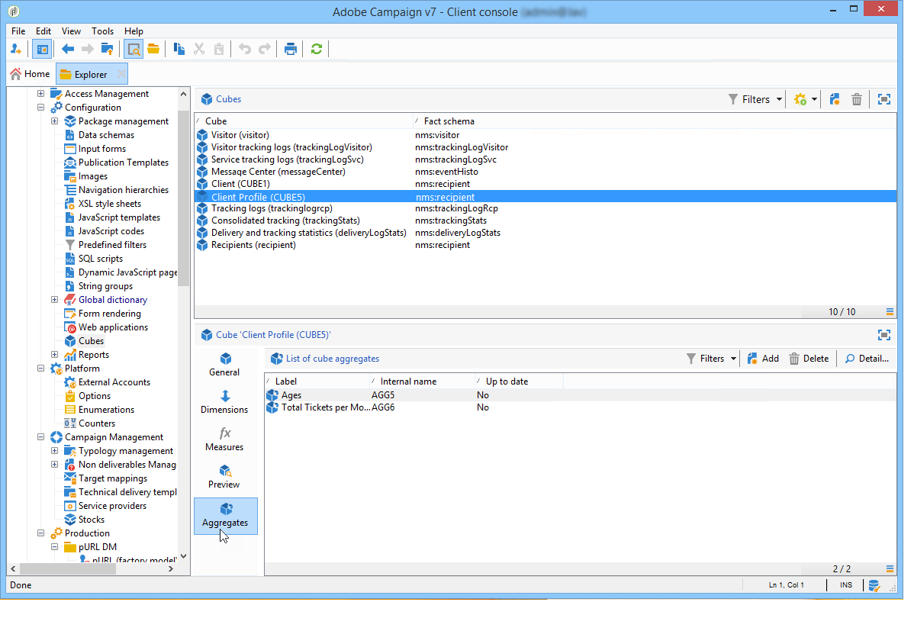

# Uppdatera aggregat{#update-aggregate}

Aggregat definieras på kubnivå för rapportering. A **[!UICONTROL Workflow]** -fliken är tillgänglig när du konfigurerar en mängd.

Aggregat är användbara när du hanterar stora datavolymer. De uppdateras automatiskt baserat på inställningarna som anges i den dedikerade arbetsflödesrutan, så att de data som samlats in senast kan integreras med indikatorerna

Aggregat definieras på den relevanta fliken för varje kub.

The **[!UICONTROL Update aggregate]** kan du välja vilket uppdateringsläge som ska användas: helt eller delvis.

Som standard utförs en fullständig uppdatering under varje beräkning. Om du vill aktivera en partiell uppdatering väljer du det relevanta alternativet och definierar uppdateringsvillkoren.

**God praxis**: a **[!UICONTROL Scheduler]** kan användas för att ange frekvensen för uppdateringar av beräkningar.

