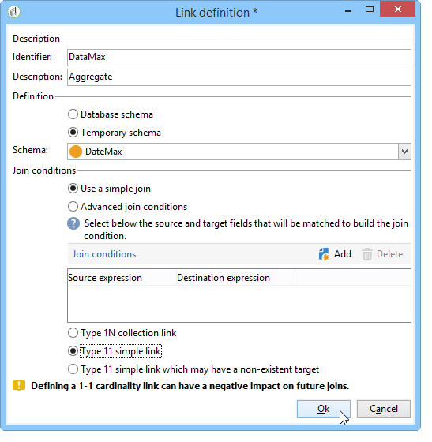

# Använda aggregat{#using-aggregates}

Här finns information om hur du automatiskt identifierar de sista mottagarna som har lagts till i databasen.

Med hjälp av följande process jämförs skapandedatumet för mottagarna i databasen med det senaste kända datumet då en mottagare skapades med en sammanställning. Alla mottagare som skapas samma dag markeras också.

Om du vill utföra filtret **Skapad = max (Skapad)** för mottagarna måste du köra ett arbetsflöde för att följa dessa steg:

1. Hämta databasmottagare med en enkel fråga. Mer information om det här steget finns i [Skapa en fråga](../../workflow/using/query.md#creating-a-query).
1. Beräkna det senaste kända datumet som en mottagare skapades med hjälp av resultatet som genererats från **max-** aggregeringsfunktionen (Skapad den).
1. Länka varje mottagare till aggregeringsfunktionens resultat i samma schema.
1. Filtrera mottagare med sammanställningen via det redigerade schemat.

## Steg 1: Beräkna sammanställningsresultatet {#step-1--calculating-the-aggregate-result}

1. Skapa en fråga. Här är målet att beräkna det senaste kända skapandedatumet från alla mottagare i databasen. Frågan innehåller därför inget filter.
1. Välj **[!UICONTROL Add data]**.
1. I de fönster som öppnas väljer du **[!UICONTROL Data linked to the filtering dimension]** sedan **[!UICONTROL Filtering dimension data]**.
1. I **[!UICONTROL Data to add]** fönstret lägger du till en kolumn som beräknar det maximala värdet för fältet **Skapad** i mottagartabellen. Du kan använda uttrycksredigeraren eller ange **max(@created)** direkt i ett fält i **[!UICONTROL Expression]** kolumnen. Klicka sedan på **[!UICONTROL Finish]** knappen.

   

1. Klicka **[!UICONTROL Edit additional data]** då **[!UICONTROL Advanced parameters...]**. Markera **[!UICONTROL Disable automatic adding of the primary keys of the targeting dimension]** alternativet.

   Med det här alternativet ser du till att alla mottagare inte visas som ett resultat och att data som läggs till explicit inte behålls. I det här fallet avser det det senaste datumet då en mottagare skapades.

   Låt alternativet vara **[!UICONTROL Remove duplicate rows (DISTINCT)]** markerat.

## Steg 2: Länka mottagarna och aggregeringsfunktionens resultat {#step-2--linking-the-recipients-and-the-aggregation-function-result}

Om du vill länka frågan som handlar med mottagare till frågan som utför beräkningen av aggregeringsfunktionen, måste du använda en schemaredigeringsaktivitet.

1. Definiera frågan för mottagare som en huvuduppsättning.
1. Lägg till en ny länk på **[!UICONTROL Links]** fliken och ange den information i fönstret som öppnas enligt följande:

   * Välj det tillfälliga schema som hör till sammanställningen. Data för det här schemat läggs till i medlemmarna i huvuduppsättningen.
   * Välj **[!UICONTROL Use a simple join]** om du vill länka det sammanställda resultatet till alla mottagare av huvuduppsättningen.
   * Slutligen anger du att länken är en **[!UICONTROL Type 11 simple link]**.
   

Sammanställningsresultatet är därför kopplat till alla mottagare.

## Steg 3: Filtrera mottagare med hjälp av sammanställningen. {#step-3--filtering-recipients-using-the-aggregate-}

När länken har upprättats utgör det sammanställda resultatet och mottagarna en del av samma tillfälliga schema. Det är därför möjligt att skapa ett filter i schemat för att jämföra det datum när mottagarna skapades och det senaste kända skapandedatumet, som representeras av aggregeringsfunktionen. Filtret utförs med en delad aktivitet.

1. På **[!UICONTROL General]** fliken väljer du **Mottagare** som måldimension och **Redigera schema** som filtreringsdimension (för att filtrera på den inkommande övergångsschemaaktiviteten).
1. Markera på **[!UICONTROL subsets]** fliken **[!UICONTROL Add a filtering condition on the inbound population]** och klicka sedan **[!UICONTROL Edit...]**.
1. Använd uttrycksredigeraren för att lägga till ett likhetskriterium mellan det datum då mottagarna skapades och det datum när de skapades som beräknas av sammanställningen.

   Datumtypsfälten i databasen sparas vanligtvis på millisekunder. Du måste därför utöka dessa för hela dagen för att undvika att ta emot mottagare som bara skapats för samma millisekund.

   Det gör du genom att använda funktionen **ToDate** , som finns i uttrycksredigeraren, som konverterar datum och timmar till enkla datum.

   De uttryck som ska användas för kriterierna är därför:

   * **[!UICONTROL Expression]**: `toDate([target/@created])`.
   * **[!UICONTROL Value]**: `toDate([datemax/expr####])`, där expr#### relaterar till den mängd som anges i sammanställningsfunktionens fråga.
   

Resultatet av den delade aktiviteten relaterar därmed till mottagarna som skapades samma dag som det senast kända skapandedatumet.

Du kan sedan lägga till andra aktiviteter, till exempel en listuppdatering eller leverans, för att förbättra arbetsflödet.
