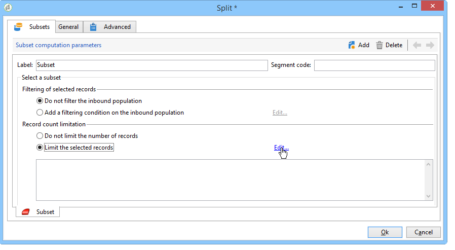

# Använda lokal godkännandeaktivitet{#using-the-local-approval-activity}

Med den **[!UICONTROL Local approval]** aktivitet som är integrerad i ett arbetsflöde för målanpassning kan du konfigurera en process för mottagarnas godkännande innan leveransen skickas.

>[!CAUTION]
>
>Om du vill använda den här funktionen måste du köpa modulen Distribuerad marknadsföring, som är ett kampanjalternativ. Kontrollera licensavtalet.

Vi har skapat följande arbetsflöde för målinriktning för att konfigurera det här användningsexemplet:

Huvudstegen i den lokala godkännandeprocessen är:

1. Den befolkning som blir resultatet av målinriktning kan begränsas tack vare en typaktivitet som använder en **[!UICONTROL Split]** datadistributionsmodell.

   

1. Aktiviteten **[!UICONTROL Local approval]** tar sedan över och skickar ett e-postmeddelande till varje lokal ansvarig. Aktiviteten förlängs tills varje lokal ansvarig godkänner mottagarna som tilldelats dem.

   

1. När tidsgränsen för godkännande har nåtts startar arbetsflödet igen. I det här exemplet startar **[!UICONTROL Delivery]** aktiviteten och leveransen skickas till de godkända målen.

   >[!NOTE]
   >
   >När tidsgränsen är nådd utesluts mottagare som inte har godkänts från målsättningen.

   

1. Några dagar senare skickar den andra **[!UICONTROL Local approval]** typaktiviteten ett e-postmeddelande till varje lokal ansvarig med en sammanfattning av de åtgärder som deras kontakter utför (klick, öppningar osv.).

   

## Steg 1: Skapa en mall för datadistribution {#step-1--creating-the-data-distribution-template-}

Med mallen för datadistribution kan du begränsa den population som blir resultatet av målgruppsanpassning baserat på datagruppering samtidigt som du kan tilldela varje värde till en lokal ansvarig. I det här exemplet har vi definierat **[!UICONTROL Email address domain]** fältet som ett distributionsfält och tilldelat en domän till varje lokal ansvarig

Mer information om hur du skapar en mall för datadistribution finns i [Begränsa antalet delmängdsposter per datadistribution](../../workflow/using/split.md#limiting-the-number-of-subset-records-per-data-distribution).

1. Om du vill skapa en mall för datadistribution går du till **[!UICONTROL Resources > Campaign management > Data distribution]** noden och klickar på **[!UICONTROL New]**.

   

1. Klicka på **[!UICONTROL General]** fliken.

   

1. Ange **[!UICONTROL Label]** och **[!UICONTROL Distribution context]**. I det här exemplet har vi valt målschemat och **[!UICONTROL Recipient]** **[!UICONTROL Email domain]** fältet som ett distributionsfält. Listan över mottagare kommer att delas upp efter domän.
1. I **[!UICONTROL Distribution type]** fältet väljer du hur målbegränsningsvärdet ska uttryckas på **[!UICONTROL Distribution]** fliken. Här har vi valt **[!UICONTROL Percentage]**.
1. I **[!UICONTROL Approval storage]** fältet anger du lagringsschemat för godkännandena som matchar målschemat som används. Här använder vi standardlagringsschemat: **[!UICONTROL Local approval of recipients]**.
1. Klicka sedan på **[!UICONTROL Advanced parameters]** länken.

   

1. Behåll alternativet markerat så att alla mottagare är förmarkerade i listan över mottagare som ska godkännas. **[!UICONTROL Approve the targeted messages]**
1. I **[!UICONTROL Delivery label]** fältet har vi lämnat standarduttrycket (leveransens beräkningssträng). Standardetiketten för leveransen används i feedbackmeddelandet.
1. I **[!UICONTROL Grouping field]** avsnittet har vi valt **[!UICONTROL Gender]** fältet som grupperingsfält för att visa mottagare i godkännanderutiner och feedback-meddelanden.
1. I **[!UICONTROL Edit targeted messages]** avsnittet har vi valt **[!UICONTROL Edit recipients]** webbprogrammet och **[!UICONTROL recipientId]** parametern. I meddelanden om godkännande och feedback kan mottagarna klickas och peka mot webbprogrammets URL. Den extra URL-parametern kommer att vara **[!UICONTROL recipientId]**.
1. Klicka sedan på **[!UICONTROL Distribution]** fliken. Ange följande fält för varje domän:

   

   * **[!UICONTROL Value]**: Ange värdet för domännamnet.
   * **[!UICONTROL Percentage / Fixed]**: för varje domän anger du max. antal mottagare som du vill skicka leveransen till. I det här exemplet vill vi begränsa leveransen till 10 % per domän.
   * **[!UICONTROL Label]**: Ange etiketten för domänen som ska visas i meddelanden om godkännande och feedback.
   * **[!UICONTROL Group or operator]**: Välj den operator eller grupp av operatorer som tilldelats domänen.

      >[!CAUTION]
      >
      >Se till att operatorerna har tilldelats rätt behörighet.

## Steg 2: Skapa målarbetsflöde {#step-2--creating-the-targeting-workflow}

Vi har skapat följande arbetsflöde för målinriktning för att konfigurera det här användningsexemplet:

Följande aktiviteter lades till:

* Två **[!UICONTROL Query]** verksamheter
* En **[!UICONTROL Intersection]** aktivitet,
* En **[!UICONTROL Split]** aktivitet,
* En **[!UICONTROL Local approval]** aktivitet,
* En **[!UICONTROL Delivery]** aktivitet,
* En **[!UICONTROL Wait]** aktivitet,
* En andra **[!UICONTROL Local approval]** aktivitet,
* En **[!UICONTROL End]** aktivitet.

### Frågor, skärning och delning {#queries--intersection-and-split}

Uppströms målgruppsanpassning består av två frågor, en skärningspunkt och en delning. Populationen som är ett resultat av målinriktning kan begränsas med hjälp av en **[!UICONTROL Split]** aktivitet med hjälp av en datamall för distribution.

Mer information om hur du konfigurerar en delad aktivitet finns i [Dela](../../workflow/using/split.md). Skapandet av en mall för datadistribution beskrivs i [Begränsa antalet delmängdsposter per datadistribution](../../workflow/using/split.md#limiting-the-number-of-subset-records-per-data-distribution).

Om du inte vill begränsa fyllningen från frågan behöver du inte använda aktiviteterna **[!UICONTROL Query]**, **[!UICONTROL Intersection]** och **[!UICONTROL Split]** . I det här fallet fyller du i datautdelningsmallen i den första **[!UICONTROL Local approval]** aktiviteten.

1. I **[!UICONTROL Record count limitation]** avsnittet markerar du **[!UICONTROL Limit the selected records]** alternativet och klickar på **[!UICONTROL Edit]** länken.

   

1. Markera **[!UICONTROL Keep only the first records after sorting]** alternativet och klicka på **[!UICONTROL Next]**.

   

1. I **[!UICONTROL Sort columns]** avsnittet lägger du till det fält som sorteringen ska användas på. Här har vi valt **[!UICONTROL Email]** fältet. Klicka **[!UICONTROL Next]**.

   

1. Välj **[!UICONTROL By data distribution]** alternativet och välj den distributionsmall som skapades tidigare (se [steg 1: Skapa mallen](#step-1--creating-the-data-distribution-template-)för datadistribution) och klicka på **[!UICONTROL Finish]**.

   

I distributionsmallen har vi valt att begränsa populationen till 10 % per grupperingsvärde, vilket sammanfaller med de värden som visas i arbetsflödet (340 som indata och 34 som utdata).

### Godkännandemeddelande {#approval-notification}

Med den här **[!UICONTROL Local approval]** aktiviteten kan du skicka ett meddelande till varje lokal ansvarig.

Mer information om hur du konfigurerar **[!UICONTROL Local approval]** aktiviteten finns i [Lokalt godkännande](../../workflow/using/local-approval.md).

Följande fält måste anges:

1. Välj **[!UICONTROL Action to execute]** alternativet i **[!UICONTROL Target approval notification]** avsnittet.
1. Välj **[!UICONTROL Distribution context]** alternativet i **[!UICONTROL Specified in the transition]** avsnittet.

   Om du inte vill begränsa målpopulationen väljer du **[!UICONTROL Explicit]** alternativet här och anger den distributionsmall som skapades tidigare i **[!UICONTROL Data distribution]** fältet.

1. I **[!UICONTROL Notification]** avsnittet väljer du leveransmall och ämne som ska användas för e-postmeddelandet. Här har vi valt standardmallen: **[!UICONTROL Local approval notification]**.
1. I **[!UICONTROL Approval schedule]** avsnittet har vi behållit standardtiden för godkännande (3 dagar) och lagt till en påminnelse. Leveransen upphör 3 dagar efter det att godkännandet har börjat. När tidsgränsen för godkännande har nåtts beaktas inte mottagare som inte har godkänts av målinriktningen.

E-postmeddelandet som skickas av aktiviteten till den lokala **[!UICONTROL Local approval]** arbetsledaren är följande:

### Vänta {#wait}

Med vänteaktiviteten kan du skjuta upp starten av den andra lokala godkännandeaktiviteten som skickar leveransfeedback-meddelandet. I **[!UICONTROL Duration]** fältet har vi angett **[!UICONTROL 5d]** värdet (5 dagar). De åtgärder som mottagarna utför i 5 dagar efter att leveransen har skickats kommer att ingå i feedbackmeddelandet.

### Feedback-meddelande {#feedback-notification}

Den andra **[!UICONTROL Local approval]** aktiviteten gör att du kan skicka feedback till varje lokal ansvarig.

Följande fält måste anges.

1. Välj **[!UICONTROL Action to execute]** i **[!UICONTROL Delivery feedback report]** avsnittet.
1. Välj **[!UICONTROL Delivery]** i **[!UICONTROL Specified in the transition]** avsnittet.
1. I **[!UICONTROL Notification]** avsnittet väljer du leveransmall och ämne som ska användas för e-postmeddelandet.

När tidsgränsen som konfigurerats i vänteaktiviteten har nåtts skickar den andra **[!UICONTROL Local approval]** typaktiviteten följande meddelande till varje lokal ansvarig:

### Administratörens godkännandespårning {#approval-tracking-by-the-administrator}

Varje gång den lokala godkännandeaktiviteten startar skapas en godkännandeuppgift. Administratören kan styra alla dessa godkännandeåtgärder.

Gå till målarbetsflödet för kampanjen och klicka på **[!UICONTROL Local approval tasks]** fliken.

Listan med lokala godkännandeuppgifter kan också nås via fliken **[!UICONTROL Approval tasks]** i mallen för datadistribution.

Markera den uppgift som du vill övervaka och klicka på **[!UICONTROL Detail]** -knappen. På fliken **[!UICONTROL General]** för den lokala godkännandeuppgiften kan du visa information om uppgiften. Om det behövs kan du ändra datumet för godkännande och påminnelsen.

På den här fliken visas följande information:

* aktivitetens etikett och dess ID
* den distributionsmall som används
* antalet riktade meddelanden
* det länkade arbetsflödet och kampanjen
* aktivitetsschemat

På fliken **[!UICONTROL Distribution]** för uppgiften kan du visa godkännandeloggarna, deras status, antalet meddelanden som angetts som mål, godkännandedatumet samt den operator som godkänt leveransen.

Välj en godkännandelogg och klicka på **[!UICONTROL Detail]** knappen för att visa mer information. På fliken **[!UICONTROL General]** i den lokala godkännandeloggen kan du visa allmän logginformation. Du kan också ändra godkännandestatusen.

På den här fliken visas följande information:

* den länkade godkännandeuppgiften
* godkännandestatus (**[!UICONTROL Approved]** eller **[!UICONTROL Pending]**)
* den distributionsmall som används
* den lokala ansvarige som godkänt och godkännandedatumet
* antalet riktade och godkända meddelanden

På fliken **[!UICONTROL Targeted]** i godkännandeloggen visas en lista över målmottagare och deras godkännandestatus. Du kan ändra den här statusen om det behövs.

