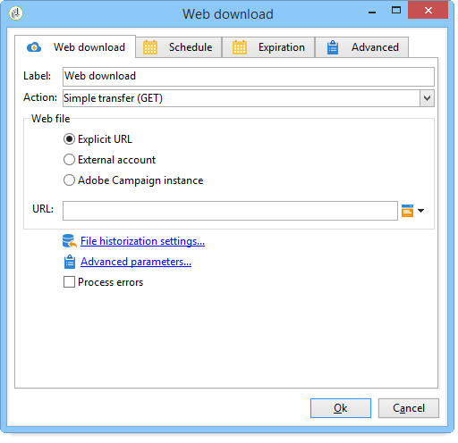

# Webbnedladdning{#web-download}

Nedladdningen **av** webben startar nedladdningen av en fil på en explicit URL, ett externt konto eller en Adobe Campaign-instans. HTTP-protokollet används. Det kan vara en GET- eller POST-nedladdning.

## Egenskaper {#properties}

1. **Välja webbfil**

   Om du vill ange vilken fil som ska laddas ned kan du ange fil-URL:en, använda det externa HTTP-kontot där filen lagras eller läsa in filen via en Adobe Campaign-instans. Tillgängliga parametrar beskrivs nedan:

   * Om du vill ange URL:en för filen som ska laddas ned direkt markerar du **[!UICONTROL Explicit URL]** alternativet och anger URL:en i lämpligt fält. Denna URL kan konstrueras med variabeldata.

      

   * Om du vill använda en **[!UICONTROL External account]** fil väljer du kontot i listrutan och anger vilken fil som ska hämtas.

      Externa konton konfigureras från noden **[!UICONTROL Administration > Platform > External accounts]** i Adobe Campaign-trädet. Kontoparametrarna kan redigeras via **[!UICONTROL Edit link]** -ikonen.

      

   * Om du vill hämta filen från Adobe Campaign-instansen väljer du **[!UICONTROL Adobe Campaign Instance]** alternativet.

      

1. **Filhistorik**

   Med **[!UICONTROL File historization settings...]** länken kan du ange lagringskatalogen för filen och tömningsfrekvensen för den här katalogen.

   

   Följande alternativ är tillgängliga:

   * **[!UICONTROL Use a default storage directory]**: filen alltid flyttas innan den bearbetas. Om det här alternativet är markerat flyttas filen till standardlagringskatalogen ( **vars** katalog finns i installationsmappen för Adobe Campaign). Om du vill ange en lagringskatalog avmarkerar du kryssrutan och anger sökvägen i **[!UICONTROL Storage directory]** fältet
   * **[!UICONTROL Number of files]**: Ange det maximala antalet filer som ska lagras i lagringskatalogen.
   * **[!UICONTROL Maximum size (in Mb)]**: Ange maximal lagringskatalogkapacitet (i megabyte).
   Varje fil sparas i 24 timmar innan den omfattas av de definierade reningsreglerna. Rensa sker precis innan aktiviteten startas och tar därför inte hänsyn till den aktuella arbetsflödesfilen.

   Filerna tas bort som en funktion av deras ålder (äldsta till nyaste). De äldsta filerna rensas tills båda tömningsreglerna verifieras. Om du definierar en gräns på 100 filer innebär det därför att lagringskatalogen alltid innehåller de 100 senaste filerna innan arbetsflödet påbörjas, samt de som bearbetas i arbetsflödet som pågår.

   Om du inte längre vill ange en gräns för alternativen **[!UICONTROL Number of files]** och **[!UICONTROL Maximum size (in Mb)]** anger du 0 som ett värde.

1. **Avancerade parametrar**

   Med hjälp av **[!UICONTROL Advanced parameters...]** länken kan du ange ytterligare alternativ som visas nedan:

   

   Alternativet **[!UICONTROL Process errors]** beskrivs närmare i [Bearbetningsfel](../../workflow/using/monitoring-workflow-execution.md#processing-errors).

## Utdataparametrar {#output-parameters}

* filnamn

   Den hämtade filens fullständiga namn.

