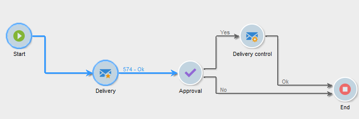

# Arbetsflödets livscykel {#workflow-life-cycle}

Arbetsflödescykeln består av tre huvudsteg.

* **Redigeras**

   Detta är den inledande designfasen: När ett nytt arbetsflöde skapas är dess status&quot;Redigeras&quot;. Arbetsflödet hanteras ännu inte av servern och kan ändras utan risk.

* **Startat**

   När den inledande designfasen är klar kan arbetsflödet startas. I den här fasen hanteras instansen av servern och de enskilda åtgärderna körs. Arbetsflödet kan fortfarande ändras med vissa försiktighetsåtgärder.

* **Slutförd**

   Ett arbetsflöde är&quot;Slutfört&quot; när det inte längre finns några pågående uppgifter eller när en operator uttryckligen har stoppat instansen.

Aktiviteterna **Start** och **Leverans** beskrivs till exempel medan aktiviteten **Godkännande** blinkar i arbetsflödet nedan.

Detta innebär att de två första aktiviteterna har slutförts och att godkännande pågår, dvs. det har skapats men ännu inte slutförts.

Tecknen **574 -OK** som visas ovanför övergången efter **leveransaktiviteten** innebär att leveransförberedelsen har 574 mottagare som mål och att åtgärden har slutförts. Den här informationen, som läggs till i övergångarna när de körs, beräknas av aktiviteterna som bearbetar data.

Arbetsflödet startas och väntar på att en operator som tillhör gruppen som anges i **godkännandeaktiviteten** ska fatta ett beslut. Operatörer som tillhör gruppen och som har en e-postadress eller ett mobiltelefonnummer meddelas.

Operatorhantering beskrivs i det här [avsnittet](../../platform/using/access-management.md).

Mer information om hur du övervakar arbetsflöden finns i [det här avsnittet](../../workflow/using/monitoring-workflow-execution.md).
