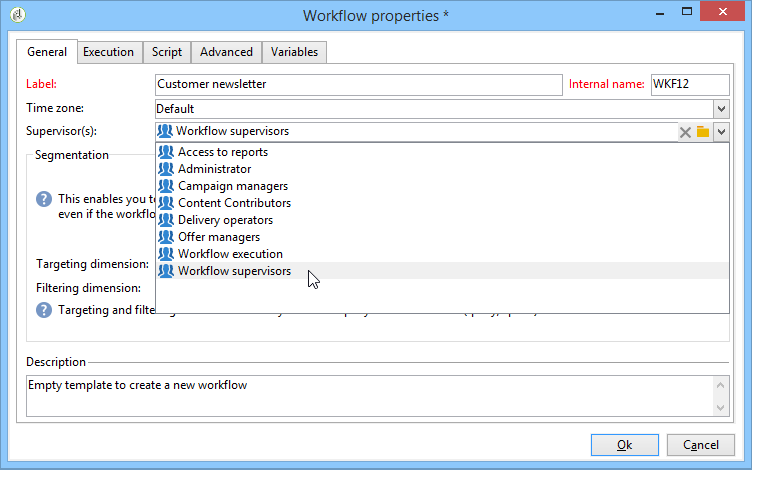

# Egenskaper för arbetsflöde{#workflow-properties}

## Fliken Körning {#execution-tab}

Fliken **[!UICONTROL Execution]** i **[!UICONTROL Properties]** fönstret i ett arbetsflöde är uppdelad i tre avsnitt:

### Schemaläggare {#scheduler}

Det här avsnittet visas bara i kampanjarbetsflöden.

* **[!UICONTROL Priority]**

   Arbetsflödesmotorn bearbetar de arbetsflöden som ska köras baserat på det prioritetskriterium som definieras i det här fältet. Alla arbetsflöden med en **[!UICONTROL Average]** prioritet körs till exempel före arbetsflöden med en **[!UICONTROL Low]** prioritet.

* **[!UICONTROL Schedule execution for a time of low activity]**

   Det här alternativet skjuter upp arbetsflödet från början till en period med mindre upptagen. Vissa arbetsflöden kan vara dyra när det gäller resurser för databasmotorn. Vi rekommenderar att du schemalägger körning under en tid med låg aktivitet (exempelvis på natten). Låga aktivitetsperioder definieras i det **[!UICONTROL Processes on campaigns]** tekniska arbetsflödet.

### Körning {#execution}

* **[!UICONTROL Default affinity]**

   Om installationen innehåller flera arbetsflödesservrar använder du det här fältet för att välja vilken dator arbetsflödet ska köras på. Om värdet som definieras i det här fältet inte finns på någon server, kommer arbetsflödet att förbli väntande.

   Se det här [avsnittet](../../installation/using/configuring-campaign-server.md#high-availability-workflows-and-affinities).

* **[!UICONTROL History in days]**

   I arbetstabellerna i databasen finns en historik över körningar (uppgifter, händelser, loggar). Här kan du ange hur många dagar som ska arkiveras för det här arbetsflödet: rensningsprocessen tar bort de äldsta arkiven en gång om dagen. Om värdet i det här fältet är noll tas arkivet aldrig bort.

* **[!UICONTROL Log SQL queries in the journal]**

   Den här funktionen är reserverad för avancerade användare. Det gäller arbetsflöden som innehåller riktade aktiviteter (fråga, union, skärning osv.). När det här alternativet är markerat visas de SQL-frågor som skickas till databasen under arbetsflödeskörningen i Adobe Campaign: Detta innebär att du kan analysera dem för att optimera frågor eller diagnostisera problem.

   Frågor visas på en **[!UICONTROL SQL logs]** flik som läggs till i arbetsflödet (förutom kampanjarbetsflöden) och i **[!UICONTROL Properties]** aktiviteten när alternativet är aktiverat. Fliken innehåller även **[!UICONTROL Audit]** SQL-frågor.

   

* **[!UICONTROL Execute in the engine]**

   Det här alternativet får endast användas för felsökning och aldrig i produktion. När det är aktiverat prioriteras arbetsflödet och alla andra arbetsflöden stoppas tills det är klart.

### Felhantering {#error-management}

* **[!UICONTROL Troubleshooting]**

   I det här fältet kan du definiera de åtgärder som ska vidtas om en arbetsflödesuppgift innehåller fel. Det finns två möjliga alternativ:

   * **[!UICONTROL Stop the process]**: arbetsflödet pausas automatiskt. arbetsflödets status ändras till **[!UICONTROL Failed]**. När problemet är löst startar du om arbetsflödet med **[!UICONTROL Start]** - eller **[!UICONTROL Restart]** knapparna.
   * **[!UICONTROL Ignore]**: statusen för den uppgift som utlöste felet ändras till **[!UICONTROL Failed]**, men arbetsflödet behåller **[!UICONTROL Started]** statusen. Den här konfigurationen är relevant för återkommande uppgifter: om grenen innehåller en schemaläggare startar den normalt nästa gång arbetsflödet körs.

* **[!UICONTROL Consecutive errors]**

   Det här fältet blir tillgängligt när **[!UICONTROL Ignore]** värdet är markerat i **[!UICONTROL In case of errors]** fältet. Du kan ange antalet fel som kan ignoreras innan processen stoppas. När det här numret har nåtts ändras arbetsflödets status till **[!UICONTROL Failed]**. Om värdet för det här fältet är 0 stoppas aldrig arbetsflödet oavsett antalet fel.

* **[!UICONTROL Template]**

   I det här fältet kan du välja den meddelandemall som ska skickas till arbetsflödets ansvariga när dess status ändras till **[!UICONTROL Failed]**.

   De berörda operatörerna meddelas via e-post, om det finns en e-postadress i deras profil. Om du vill definiera arbetsflödesansvariga går du till **[!UICONTROL Supervisor(s)]** fältet för egenskaperna (**[!UICONTROL General]** flik).

   

   Standardmallen innehåller en länk för att komma åt Adobe Campaign-konsolen via webben, så att mottagaren kan arbeta med problemet när han eller hon är inloggad. **[!UICONTROL Notification to a workflow supervisor]**

   Om du vill skapa en personlig mall går du till **[!UICONTROL Administration>Campaign management>Technical deliveries and templates]**.

